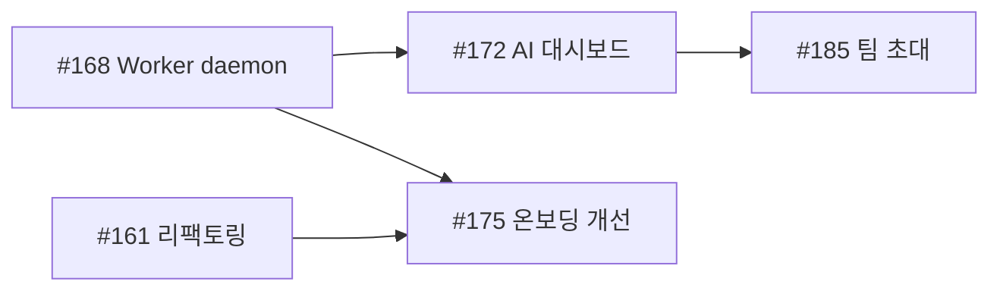
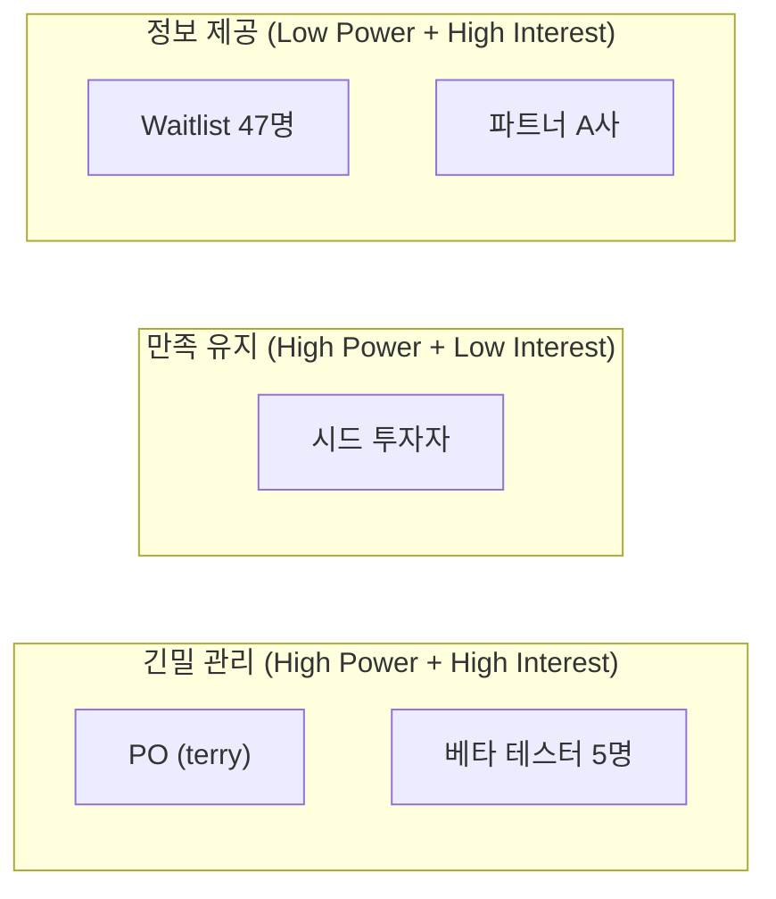
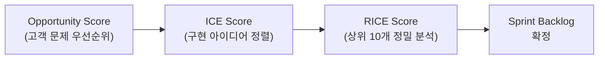

# 실행 및 관리 (Execution)

## 카테고리 소개

전략을 세우는 것만으로는 제품이 만들어지지 않습니다. **실행 및 관리**는 전략 수립 이후 실제로 제품을 개발하고, 출시하고, 개선하는 핵심 단계를 다룹니다.

비개발자 PO(Product Owner)에게 이 카테고리가 특히 중요한 이유는, AI 코딩 에이전트에게 작업을 지시할 때 **무엇을 만들어야 하는지(PRD)**, **어떤 순서로 만들어야 하는지(우선순위/스프린트)**, **어떻게 검증해야 하는지(테스트 시나리오)** 를 명확하게 전달해야 하기 때문입니다. 이 카테고리의 15개 스킬은 "생각을 구조화된 문서로 바꾸는 도구"로서, 전략과 개발 사이의 다리 역할을 합니다.

SprintX PO 가이드에서는 Phase 2(실행 계획 + 데이터 수집)와 Phase 3(격주 반복 루프)에서 이 카테고리의 스킬을 집중적으로 사용합니다.

## 이 카테고리의 스킬 한눈에 보기

| 스킬명 | 한 줄 설명 | 난이도 | 예상 소요 시간 |
|--------|-----------|--------|--------------|
| PRD 작성 (create-prd) | 8섹션 템플릿으로 제품 요구사항 문서 작성 | 초급 | 30~60분 |
| OKR 브레인스토밍 (brainstorm-okrs) | 회사 전략에 정렬된 팀 OKR 3세트 생성 | 초급 | 20~30분 |
| 결과 기반 로드맵 (outcome-roadmap) | 기능 나열형 로드맵을 결과 중심으로 전환 | 중급 | 30~45분 |
| 스프린트 계획 (sprint-plan) | 팀 역량 추정, 스토리 선택, 의존성 매핑 | 중급 | 30~45분 |
| 스프린트 회고 (retro) | 구조화된 회고 진행 및 액션 아이템 도출 | 초급 | 20~30분 |
| 릴리스 노트 (release-notes) | 기술 티켓을 사용자 친화적 릴리스 노트로 변환 | 초급 | 15~20분 |
| 사전 위험 분석 (pre-mortem) | 출시 전 실패 시나리오 분석 및 대응 계획 수립 | 중급 | 30~45분 |
| 이해관계자 맵 (stakeholder-map) | Power x Interest 그리드로 이해관계자 분류 및 커뮤니케이션 계획 | 중급 | 20~30분 |
| 회의록 요약 (summarize-meeting) | 회의 녹취/메모를 구조화된 요약으로 변환 | 초급 | 10~15분 |
| 사용자 스토리 (user-stories) | 3C + INVEST 기준으로 사용자 스토리 작성 | 초급 | 20~30분 |
| Job 스토리 (job-stories) | JTBD 기반 "When-I want-So I can" 형식 스토리 작성 | 중급 | 20~30분 |
| WWA 백로그 (wwas) | Why-What-Acceptance 형식의 백로그 아이템 작성 | 중급 | 20~30분 |
| 테스트 시나리오 (test-scenarios) | 사용자 스토리에서 QA 테스트 시나리오 자동 생성 | 중급 | 20~30분 |
| 더미 데이터셋 (dummy-dataset) | 테스트용 현실적 더미 데이터 생성 (CSV/JSON/SQL/Python) | 초급 | 10~20분 |
| 우선순위 프레임워크 (prioritization-frameworks) | RICE, ICE 등 9개 프레임워크 가이드 및 적용 | 중급 | 30~45분 |

## 추천 실행 순서

이 카테고리의 스킬은 제품 개발 생명주기를 따라 자연스럽게 흐릅니다. 아래 순서는 SprintX PO 가이드의 Phase 2~3에 맞춰 설계되었습니다.

### 1단계: 계획 수립 (Phase 2 초반)
1. **prioritization-frameworks** -- 백로그 25개 이슈를 RICE/ICE로 재정렬
2. **brainstorm-okrs** -- Q2 2026 OKR 설정으로 방향 확인
3. **pre-mortem** -- 실패 시나리오 3~5개를 미리 분석
4. **outcome-roadmap** -- 기능 목록을 결과 기반 로드맵으로 전환

### 2단계: 개발 핸드오프 (Phase 2 후반)
5. **create-prd** -- 최우선 기능 1~2개에 대해 PRD 작성
6. **user-stories** 또는 **job-stories** 또는 **wwas** -- PRD를 개발 가능한 단위로 분해
7. **test-scenarios** -- 사용자 스토리에서 QA 시나리오 파생
8. **dummy-dataset** -- 프로토타이핑/테스트용 데이터 생성

### 3단계: 스프린트 실행 (Phase 3 반복)
9. **sprint-plan** -- 격주 스프린트 계획
10. **retro** -- 격주 스프린트 회고

### 4단계: 출시 및 소통 (수시)
11. **release-notes** -- 기능 배포 후 사용자 공지
12. **summarize-meeting** -- 사용자 인터뷰/회의 정리
13. **stakeholder-map** -- 이해관계자 관리 (필요 시)

## 관련 카테고리

- **전략 (Product Strategy)**: 실행의 전제가 되는 전략 캔버스, 가치 제안, 가격 전략 등. 실행 전에 전략 카테고리의 스킬을 먼저 사용합니다.
- **시장 조사 (Market Research)**: 경쟁 분석, 시장 세그먼트, 고객 여정 맵 등. 우선순위 결정과 PRD 작성의 입력이 됩니다.
- **제품 발견 (Product Discovery)**: 실험 브레인스토밍 등. pre-mortem과 outcome-roadmap의 근거가 됩니다.
- **GTM (Go-to-Market)**: GTM 전략, Beachhead 세그먼트 등. release-notes와 stakeholder-map이 GTM 실행을 지원합니다.
- **PM 도구함 (PM Toolkit)**: 문법 체크, 개인정보 처리방침 등. 실행 산출물의 품질 검수에 활용합니다.

---

## 스킬 상세

### 1. PRD 작성 (create-prd)

> **난이도**: 초급 | **소요 시간**: 30~60분 | **명령어**: `/pm-execution:create-prd`

8개 섹션 템플릿으로 AI 에이전트에게 전달할 제품 요구사항 문서를 작성한다.

#### 실행 전 체크리스트
- [ ] 우선순위가 확정된 기능 1~2개 선정 완료
- [ ] 해당 기능의 대상 사용자 세그먼트 파악
- [ ] 성공 지표(측정 가능한 지표) 초안 보유
- [ ] 경쟁 분석 또는 사용자 인터뷰 결과 참고 가능

#### Step-by-Step 실행 가이드

**Step 1 — 명령어 실행**
```
/pm-execution:create-prd SprintX AI 실행 대시보드
```

**Step 2 — Claude의 질문과 답변 가이드**

---
**질문 1: 제품/기능 개요**
> Claude: "어떤 제품 또는 기능에 대한 PRD를 작성할까요? 한 문장으로 설명해주세요."

**답변 예시:**
```
SprintX의 AI 실행 대시보드 — PO가 AI 에이전트에게 위임한 Task의
진행 상황을 한눈에 모니터링하고 결과를 검토하는 화면
```
**팁:** 기능명 + 핵심 사용자 행동 + 목적을 포함하면 AI가 더 정확한 PRD를 생성합니다.

---
**질문 2: 배경과 문제 정의**
> Claude: "이 기능을 만드는 배경은 무엇인가요? 현재 어떤 문제가 있고, 왜 지금 해결해야 하나요?"

**답변 예시:**
```
현재 PO는 AI 에이전트가 수행한 Task 결과를 각 이슈 페이지에
개별 접속해서 확인해야 합니다. 하루 평균 15~20개 Task를 검토하는데
이동 시간만 30분 이상 소요됩니다. Phase 3 스프린트가 시작되는
4월 전에 해결하지 않으면 AI 에이전트 활용도가 떨어집니다.
```

---
**질문 3: 목표와 성공 지표**
> Claude: "이 기능이 성공했다는 것을 어떻게 측정할 건가요? OKR 형식으로 말씀해주셔도 됩니다."

**답변 예시:**
```
Objective: PO가 AI 에이전트 작업을 효율적으로 관리할 수 있다
Key Results:
- Task 검토 시간 30분 → 10분 이하 단축 (4월 말 측정)
- 대시보드 일일 활성 사용 비율 80% 이상
- 검토 후 승인/반려 결정 평균 2분 이내
```

---
**질문 4: 대상 사용자와 제약 조건**
> Claude: "누가 이 기능을 사용하나요? 사용 환경이나 제약 조건이 있나요?"

**답변 예시:**
```
주 사용자: 1인 PO (비개발자), 하루 2~3회 대시보드 접근
환경: 웹 브라우저 (Chrome 우선), 모바일 뷰 최소 지원
제약: AI 에이전트 API 응답 지연 가능 (최대 30초), 동시 Task 최대 10개
```

---
**질문 5: 핵심 기능과 UX**
> Claude: "이 기능의 핵심 사용 시나리오를 단계별로 설명해주세요."

**답변 예시:**
```
1. PO가 대시보드 접속 → 진행 중 Task 목록 확인 (상태별 필터)
2. Task 카드 클릭 → AI 실행 로그, 결과물, 소요 시간 확인
3. 결과 검토 후 "승인" 또는 "재실행 요청" 클릭
4. 재실행 요청 시 피드백 메모 입력 → AI 에이전트에 전달
```

---
**질문 6: 경쟁 우위와 가치 제안**
> Claude: "기존 방식 대비 이 기능이 제공하는 차별화된 가치는 무엇인가요?"

**답변 예시:**
```
기존: 이슈 페이지 개별 접속, 수동 상태 확인
차별화: 단일 화면에서 모든 AI Task 상태 실시간 확인 + 1-click 승인
경쟁 우위: SprintX 고유의 AI 에이전트 로그 시각화 (다른 PM 도구 없음)
```

---
**질문 7: 범위 확정 (In/Out of Scope)**
> Claude: "이번 버전에서 포함할 것과 포함하지 않을 것을 구분해주세요."

**답변 예시:**
```
In Scope: Task 목록/상태/로그 확인, 승인/재실행 요청, 기본 필터
Out of Scope: 팀 협업 기능, 모바일 앱, AI 에이전트 직접 설정
```

---
**질문 8: 출시 계획**
> Claude: "어떻게 단계적으로 출시할 계획인가요?"

**답변 예시:**
```
Phase 1 (3월 말): 읽기 전용 대시보드 — Task 목록과 상태만 표시
Phase 2 (4월 초): 승인/재실행 액션 추가
Phase 3 (4월 말): 필터, 정렬, 알림 기능
```

---

**Step 3 — 산출물 검토**

생성된 PRD에서 반드시 확인할 항목:
- Summary 2~3문장이 기능 전체를 포괄하는지
- Key Results가 측정 가능한 숫자를 포함하는지
- Out of Scope가 명확히 경계를 그었는지

#### 산출물 실제 예시

```markdown
# PRD: SprintX AI 실행 대시보드

## 1. Summary
SprintX PO가 AI 에이전트에 위임한 Task를 단일 화면에서
모니터링·검토·승인할 수 있는 실시간 대시보드.
Task 검토 시간을 30분에서 10분 이내로 단축하는 것이 목표.

## 2. Contacts
- PO: terry@sprintx.io (의사결정권자)
- AI 에이전트 담당: claude-agent (구현 주체)

## 3. Background
현재 AI 에이전트 Task 결과 확인에 하루 30분 이상 소요.
Phase 3(4월) 스프린트 전 해결 필요. 미해결 시 에이전트 활용률 저하.

## 4. Objective
**O**: PO가 AI 에이전트 작업을 효율적으로 관리한다
**KR1**: Task 검토 시간 30분 → 10분 이하 (4월 말)
**KR2**: 대시보드 일일 활성 사용 80% 이상
**KR3**: 검토 후 결정 시간 평균 2분 이내

## 5. Market Segment
1인 PO + AI 에이전트 구조의 초기 SprintX 사용자.
비개발자, 하루 2~3회 대시보드 접근, 웹 브라우저 사용.

## 6. Value Proposition
- Customer Job: AI 에이전트 작업 결과를 빠르게 검토하고 승인
- Gain: 단일 화면에서 모든 Task 현황 파악, 클릭 한 번에 승인
- Pain Relief: 이슈 페이지 개별 접속 불필요, 수동 상태 확인 제거

## 7. Solution
**핵심 기능**: Task 목록(상태 필터), 실행 로그 뷰어, 승인/재실행 액션
**UX**: 카드형 Task 목록 → 상세 드로어 → 승인 버튼
**기술 가정**: AI 에이전트 webhook 연동, 최대 30초 폴링

## 8. Release
- Phase 1 (3월 말): 읽기 전용 대시보드
- Phase 2 (4월 초): 승인/재실행 액션
- Phase 3 (4월 말): 필터, 정렬, 알림
```

#### 다음 단계
- **user-stories**: PRD의 Solution 섹션을 개발 가능한 스토리 단위로 분해
- **pre-mortem**: PRD 기반 출시 위험 사전 분석
- **test-scenarios**: 인수 조건에서 QA 시나리오 파생

---

### 2. OKR 브레인스토밍 (brainstorm-okrs)

> **난이도**: 초급 | **소요 시간**: 20~30분 | **명령어**: `/pm-execution:brainstorm-okrs`

회사 전략에 정렬된 팀 OKR 3개 대안 세트를 생성하고 전략적 토론을 촉발한다.

#### 실행 전 체크리스트
- [ ] 회사/제품의 현재 분기 전략 방향 파악
- [ ] 이전 분기 OKR 결과와 달성률 보유
- [ ] North Star Metric 또는 핵심 KPI 파악
- [ ] 팀 규모와 주요 역할 파악

#### Step-by-Step 실행 가이드

**Step 1 — 명령어 실행**
```
/pm-execution:brainstorm-okrs SprintX Q2 2026 제품팀
```

**Step 2 — Claude의 질문과 답변 가이드**

---
**질문 1: 회사/제품 전략**
> Claude: "현재 분기 회사 또는 제품의 핵심 전략 방향을 알려주세요."

**답변 예시:**
```
SprintX Q2 전략: Beachhead 세그먼트(1인 PO + AI 에이전트 팀)에서
첫 10명 외부 유료 사용자 확보. Product-Market Fit 탐색 단계.
NSM: "AI 에이전트에게 위임된 Task 완료 수"
```

---
**질문 2: 이전 분기 성과**
> Claude: "지난 분기 OKR 달성률과 주요 인사이트를 공유해주세요."

**답변 예시:**
```
Q1 2026 결과:
- O: SprintX 내부 검증 완료 → 달성 (Alpha 릴리스 완료)
- KR1: 내부 테스트 5회 → 달성 (7회)
- KR2: 핵심 기능 구현 80% → 미달 (65%, AI 에이전트 연동 지연)
인사이트: AI 에이전트 연동이 예상보다 복잡. Q2는 연동 완성에 집중.
```

---
**질문 3: 제약 조건**
> Claude: "Q2에 알려진 제약 조건이나 리스크가 있나요?"

**답변 예시:**
```
리소스: 1인 PO + AI 에이전트 (외부 개발자 없음)
기술: Worker daemon(#168) 미완성 — AI 실행 핵심 기능 차단
시장: Beachhead 세그먼트 검증 아직 진행 중
```

---
**질문 4: 핵심 성공 지표**
> Claude: "Q2 말에 '성공했다'고 판단할 수 있는 핵심 지표 3가지를 꼽는다면?"

**답변 예시:**
```
1. 외부 유료 사용자 10명 이상 확보
2. 사용자당 주간 AI Task 위임 5회 이상
3. 온보딩 완료율 70% 이상
```

---

**Step 3 — 산출물 검토**

생성된 3개 OKR 세트에서 확인:
- Key Results가 output(기능 출시)이 아닌 outcome(측정 지표)인지
- 각 KR이 분기 내 측정 가능한지
- 세트 간 전략적 차이(성장 vs 안정 vs 실험)가 명확한지

#### 산출물 실제 예시

```markdown
## SprintX Q2 2026 OKR 옵션

### 옵션 A: 사용자 확보 집중
**Objective**: 첫 외부 유료 사용자 10명과 함께 PMF 신호를 발견한다
- KR1: Beachhead 세그먼트에서 유료 전환 10명 달성
- KR2: 주간 AI Task 위임 횟수 사용자당 평균 5회 이상
- KR3: NPS 40 이상 (첫 인터뷰 코호트 기준)

### 옵션 B: 제품 완성도 집중
**Objective**: AI 실행 엔진을 완성하여 핵심 가치를 전달 가능하게 한다
- KR1: Worker daemon(#168) 구현 완료 및 안정적 운영 (에러율 1% 미만)
- KR2: 온보딩 완료율 70% 달성
- KR3: 사용자 1명당 평균 Task 완료 시간 30분 → 10분 단축

### 옵션 C: 학습 집중
**Objective**: Beachhead 세그먼트의 실제 니즈를 검증하고 방향을 확정한다
- KR1: 잠재 사용자 인터뷰 20건 완료
- KR2: "AI 에이전트에게 위임하고 싶은 Job" 상위 5개 검증
- KR3: 검증된 니즈 기반 Q3 로드맵 확정

---
**권장**: 옵션 A + B 혼합 (사용자 확보 + 핵심 기능 완성 병행)
```

#### 다음 단계
- **outcome-roadmap**: 확정된 OKR에 정렬된 결과 기반 로드맵 작성
- **prioritization-frameworks**: OKR 달성에 기여도 높은 백로그 항목 선별

---

### 3. 결과 기반 로드맵 변환 (outcome-roadmap)

> **난이도**: 중급 | **소요 시간**: 30~45분 | **명령어**: `/pm-execution:outcome-roadmap`

기능 나열형 로드맵을 "사용자가 얻는 결과" 중심으로 재구성하여 전략적 의사결정을 지원한다.

#### 실행 전 체크리스트
- [ ] 기존 로드맵 또는 백로그 항목 목록 준비
- [ ] Q2~Q3 OKR 확정 완료
- [ ] 우선순위 프레임워크 적용 결과 보유
- [ ] 주요 기술 의존성 파악 (블로킹 이슈 등)

#### Step-by-Step 실행 가이드

**Step 1 — 명령어 실행**
```
/pm-execution:outcome-roadmap SprintX 2026 Q2-Q3 로드맵 (#161~#185 이슈 기반)
```

**Step 2 — Claude의 질문과 답변 가이드**

---
**질문 1: 현재 로드맵 또는 백로그 입력**
> Claude: "현재 로드맵이나 백로그 항목을 공유해주세요. 기능 목록, 에픽, 이슈 제목 등 어떤 형태든 괜찮습니다."

**답변 예시:**
```
Q2 예정 이슈 (우선순위 순):
#168: Worker daemon 구현
#172: AI 실행 대시보드
#175: 온보딩 플로우 개선
#161: Goal-Task 계층 구조 리팩토링
#180: 릴리스 노트 자동 생성
#185: 팀 초대 기능
```

---
**질문 2: 전략적 맥락**
> Claude: "이 로드맵이 달성하려는 Q2 목표는 무엇인가요?"

**답변 예시:**
```
Q2 목표: 첫 10명 외부 유료 사용자가 AI 에이전트로 실제 프로젝트를 관리
핵심 제약: Worker daemon 없이는 AI 실행 불가 → 최우선 완료 필요
Beachhead: 1인 PO가 AI 에이전트 팀을 운영하는 스타트업
```

---
**질문 3: 각 기능의 "그래서 뭐?" 연결**
> Claude: "각 기능이 사용자에게 어떤 결과를 만드나요? 모르는 것은 '미정'으로 표시해도 됩니다."

**답변 예시:**
```
#168 Worker daemon → AI가 실제로 Task를 자율 실행 가능해짐
#172 AI 대시보드 → PO가 Task 검토 시간 30분 → 10분 단축
#175 온보딩 개선 → 신규 사용자가 15분 내 첫 Task 위임 경험
#161 리팩토링 → AI 에이전트 오류율 감소 (미정: 몇 % 개선?)
```

---
**질문 4: 의존성과 리스크**
> Claude: "항목 간 의존성이나 알려진 리스크가 있나요?"

**답변 예시:**
```
의존성:
- #172 대시보드는 #168 Worker daemon 완료 후 의미 있음
- #175 온보딩은 #161 리팩토링 후 안정성 확보 필요
리스크:
- #168이 지연되면 Q2 전체 AI 실행 가치 제안 불가
```

---

**Step 3 — 산출물 검토**

변환 결과에서 확인:
- 각 결과 문장이 측정 가능한 지표를 포함하는지
- 의존성이 시각적으로 명확한지
- "왜 이 순서인가"를 이해관계자에게 설명할 수 있는지

#### 산출물 실제 예시

```markdown
## SprintX 2026 Q2-Q3 결과 기반 로드맵

### Q2 (4월~6월): AI 실행 엔진 완성 및 첫 사용자 확보

**결과 1**: PO가 AI 에이전트에게 Task를 위임하고 자율 실행된다
- 구현: #168 Worker daemon, #161 Goal-Task 리팩토링
- 측정: AI Task 자율 완료율 80% 이상

**결과 2**: 신규 사용자가 15분 내 첫 AI Task 위임을 경험한다
- 구현: #175 온보딩 플로우 개선
- 측정: 온보딩 완료율 70%, TTV(Time to Value) 15분 이내

**결과 3**: PO가 AI 작업 결과를 10분 이내에 검토·승인한다
- 구현: #172 AI 실행 대시보드
- 측정: 일평균 검토 시간 10분 이내, 대시보드 DAU 80%

### Q3 (7월~9월): 팀 협업 확장 및 유료 전환

**결과 4**: 팀이 SprintX에서 AI 에이전트와 협업한다
- 구현: #185 팀 초대 기능
- 측정: 팀당 평균 멤버 3명 이상

### 의존성 맵

```

#### 다음 단계
- **create-prd**: 로드맵 최우선 결과(Worker daemon)의 PRD 작성
- **sprint-plan**: 분기 결과를 스프린트 단위로 분해

---

### 4. 스프린트 계획 (sprint-plan)

> **난이도**: 중급 | **소요 시간**: 30~45분 | **명령어**: `/pm-execution:sprint-plan`

팀 역량과 백로그를 기반으로 달성 가능한 스프린트 목표와 커밋 스토리를 확정한다.

#### 실행 전 체크리스트
- [ ] 직전 스프린트 velocity 데이터 보유 (완료 story points)
- [ ] 우선순위가 정렬된 백로그 준비
- [ ] 스프린트 기간과 팀 가용 일수 파악
- [ ] 블로킹 이슈 또는 기술 의존성 파악

#### Step-by-Step 실행 가이드

**Step 1 — 명령어 실행**
```
/pm-execution:sprint-plan SprintX Sprint 5 (2026-03-18 ~ 2026-03-31)
```

**Step 2 — Claude의 질문과 답변 가이드**

---
**질문 1: 팀 구성과 역량**
> Claude: "이번 스프린트의 팀 구성과 가용 역량을 알려주세요."

**답변 예시:**
```
팀: 1인 PO + AI 에이전트 (풀타임)
PO 가용: 70% (나머지 30%는 사용자 인터뷰, 이해관계자 소통)
AI 에이전트: 병렬 Task 최대 3개 동시 처리 가능
직전 Sprint 4 velocity: 25 points (커밋 35 → 완료 25)
이번 목표 커밋: 28 points (velocity + 10% 보수적 증가)
```

---
**질문 2: 스프린트 목표**
> Claude: "이번 스프린트가 끝났을 때 달성하고 싶은 하나의 목표 문장은?"

**답변 예시:**
```
Beachhead 세그먼트 사용자가 SprintX에 접속하여
첫 Goal을 만들고 AI 에이전트에게 Task를 위임할 수 있다.
```

---
**질문 3: 후보 스토리 목록**
> Claude: "이번 스프린트에 고려 중인 백로그 항목과 추정치를 공유해주세요."

**답변 예시:**
```
[스프린트 후보]
US-01: 온보딩 플로우 1단계 개선 — 8pt
US-02: Goal 생성 UX 개선 — 5pt
US-03: AI Task 위임 버튼 추가 — 3pt
US-04: Worker daemon 기본 구현(#168) — 13pt
US-05: 대시보드 프로토타입 — 8pt
US-06: 버그 수정 배치 — 3pt
```

---
**질문 4: 의존성과 우선순위 제약**
> Claude: "스토리 간 의존성이나 반드시 포함해야 하는 항목이 있나요?"

**답변 예시:**
```
반드시: US-04 Worker daemon (Q2 전체 블로커)
의존성: US-03은 US-04 완료 후 테스트 가능
제외: US-05 대시보드는 US-04 없이는 의미 없음 → 다음 스프린트
```

---
**질문 5: 리스크와 버퍼**
> Claude: "예상치 못한 작업이나 리스크 요인이 있나요?"

**답변 예시:**
```
리스크: Worker daemon이 예상보다 복잡할 경우 13pt → 20pt 가능
버퍼: 전체 역량의 15% (약 4pt)를 버그/기술부채용으로 확보
```

---

**Step 3 — 산출물 검토**

확인 항목:
- Sprint Goal이 단일 문장으로 명확한지
- 커밋 포인트가 velocity 기준 달성 가능한지
- 버퍼 15~20%가 확보되어 있는지
- 의존성 순서가 계획에 반영되어 있는지

#### 산출물 실제 예시

```markdown
## Sprint 5 계획 (2026-03-18 ~ 2026-03-31)

**Sprint Goal**: Beachhead 사용자가 SprintX에서 첫 Goal을 만들고
AI 에이전트에게 Task를 위임할 수 있다.

**역량 요약**
- Velocity (Sprint 4): 25pt
- 이번 커밋 목표: 28pt (버퍼 4pt 포함)

**커밋 스토리**

| # | 스토리 | 포인트 | 담당 | 의존성 |
|---|--------|--------|------|--------|
| US-01 | 온보딩 플로우 1단계 개선 | 8pt | PO 리뷰 | 없음 |
| US-02 | Goal 생성 UX 개선 | 5pt | AI 에이전트 | US-01 후 |
| US-04 | Worker daemon 기본 구현 | 13pt | AI 에이전트 | 없음 |
| US-06 | 버그 수정 배치 | 3pt | AI 에이전트 | 없음 |
| **합계** | | **29pt** | | |

**제외 항목 (이유)**
- US-03: US-04 완료 전 테스트 불가 → Sprint 6
- US-05: US-04 없이 의미 없음 → Sprint 6

**리스크 대응**
- US-04 지연 시: US-01/02/06만으로 Sprint Goal 부분 달성 선언
- Worker daemon 범위 초과 시: "기본 구현"으로 범위 축소 후 Sprint 6 완성

**Definition of Ready 확인**
- [x] US-01: 인수 조건 명확, 추정 완료, 블로커 없음
- [x] US-02: 인수 조건 명확, 추정 완료, US-01 의존성 명시
- [x] US-04: PRD 작성 완료, 기술 스펙 확정, 추정 완료
```

#### 다음 단계
- **retro**: 스프린트 종료 후 회고로 다음 계획 개선
- **test-scenarios**: 커밋된 스토리의 QA 시나리오 생성

---

### 5. 스프린트 회고 (retro)

> **난이도**: 초급 | **소요 시간**: 20~30분 | **명령어**: `/pm-execution:retro`

스프린트 데이터와 팀 피드백을 구조화된 회고로 정리하고 실행 가능한 액션 아이템을 도출한다.

#### 실행 전 체크리스트
- [ ] Sprint 완료 데이터 (커밋 vs 완료 포인트, Goal 달성 여부)
- [ ] 이전 회고 액션 아이템 이행 현황
- [ ] 스프린트 중 발생한 이슈나 의사결정 기록
- [ ] 사용자 피드백 또는 인터뷰 인사이트 (있을 경우)

#### Step-by-Step 실행 가이드

**Step 1 — 명령어 실행**
```
/pm-execution:retro SprintX Sprint 4 회고 (2026-03-04 ~ 2026-03-17)
```

**Step 2 — Claude의 질문과 답변 가이드**

---
**질문 1: 스프린트 성과 데이터**
> Claude: "이번 스프린트의 수치 결과를 공유해주세요."

**답변 예시:**
```
Sprint Goal: 부분 달성
- Goal: "사용자가 Goal-Task 계층으로 프로젝트를 구조화할 수 있다"
- 달성 여부: 70% (Goal 생성은 완료, Task 계층 연결 미완)

Velocity:
- 커밋: 35pt (8개 스토리)
- 완료: 25pt (5개 스토리)
- 미완: 10pt (Worker daemon 일부, 대시보드 프로토타입)
```

---
**질문 2: 잘된 것 (Liked / Continue)**
> Claude: "이번 스프린트에서 잘 됐다고 느낀 것은 무엇인가요?"

**답변 예시:**
```
- AI 에이전트가 Goal 생성 UI를 예상보다 빠르게 구현 (8pt → 4일)
- 사용자 인터뷰 2건 실시, 온보딩 개선 인사이트 획득
- 매일 오전 15분 Task 리뷰 루틴 정착
```

---
**질문 3: 개선할 것 (Lacked / Stop)**
> Claude: "이번 스프린트에서 아쉬웠던 점이나 반복하지 말아야 할 것은?"

**답변 예시:**
```
- Worker daemon 추정 오류: 13pt 커밋했으나 실제 20pt 소요
- 스프린트 중반에 새 이슈 추가 (scope creep) → 집중력 분산
- AI 에이전트 결과물 리뷰 기준이 불명확해 재작업 2회 발생
```

---
**질문 4: 이전 액션 아이템 이행 현황**
> Claude: "지난 회고에서 나온 액션 아이템은 어떻게 됐나요?"

**답변 예시:**
```
Sprint 3 액션 아이템:
1. 스토리 인수 조건 사전 작성 → 완료 (Sprint 4에 적용)
2. AI 에이전트 작업 배치 크기 제한 → 미완 (방법 미확정)
3. 사용자 인터뷰 주 1회 루틴 → 완료 (2회 실시)
```

---

**Step 3 — 산출물 검토**

확인 항목:
- 액션 아이템이 2~3개로 제한되어 있는지
- 각 액션에 담당자와 기한이 명시되어 있는지
- 패턴(반복되는 문제)이 식별되었는지

#### 산출물 실제 예시

```markdown
## Sprint 4 Retrospective
**날짜**: 2026-03-17 | **형식**: Start / Stop / Continue

### Sprint 성과
- Goal: 부분 달성 (70%)
- Velocity: 커밋 35pt → 완료 25pt (71%)
- 완료: Goal 생성 UI, 온보딩 Step 1, 버그 수정 배치
- 미완: Worker daemon(13pt 중 7pt), 대시보드 프로토타입

### Continue (계속할 것)
- 매일 오전 15분 AI Task 리뷰 루틴
- 스토리 인수 조건 사전 작성
- 주 1회 사용자 인터뷰

### Stop (멈출 것)
- 스프린트 중반 새 이슈 추가 (scope creep)
- AI 에이전트 결과물 리뷰 기준 없이 진행

### Start (시작할 것)
- Worker daemon처럼 복잡한 이슈는 스파이크(탐색) 스토리로 분리
- AI 에이전트 결과물 리뷰 체크리스트 작성

### 이전 액션 아이템 이행
| 액션 | 상태 |
|------|------|
| 스토리 인수 조건 사전 작성 | 완료 |
| AI 에이전트 작업 배치 크기 제한 | 미완 → 이월 |
| 사용자 인터뷰 주 1회 | 완료 |

### 이번 액션 아이템
| # | 액션 | 담당 | 기한 | 성공 기준 |
|---|------|------|------|----------|
| 1 | Worker daemon 스파이크 스토리 생성 및 2pt 추정 | PO | 3/21 | Sprint 5 백로그에 포함 |
| 2 | AI 에이전트 결과물 리뷰 체크리스트 초안 작성 | PO | 3/19 | 5개 이상 항목, 팀 합의 |

### 패턴 분석
Sprint 3, 4 연속으로 Worker daemon 관련 추정 오류 발생.
복잡도 높은 기술 이슈에 대한 스파이크 스토리 제도화 필요.
```

#### 다음 단계
- **sprint-plan**: 회고 인사이트를 Sprint 5 계획에 반영
- **brainstorm-okrs**: 분기 OKR 체크인 시 velocity 트렌드 공유

---

### 6. 릴리스 노트 작성 (release-notes)

> **난이도**: 초급 | **소요 시간**: 15~20분 | **명령어**: `/pm-execution:release-notes`

기술 티켓과 Git 로그를 사용자가 이해할 수 있는 혜택 중심 릴리스 노트로 변환한다.

#### 실행 전 체크리스트
- [ ] 이번 릴리스에 포함된 완료 이슈 목록 준비 (Linear/JIRA/GitHub)
- [ ] 버전 번호와 릴리스 날짜 확정
- [ ] 대상 독자 결정 (엔드 유저, 내부팀, 투자자 등)
- [ ] 이전 버전 릴리스 노트 참고 (톤 일관성)

#### Step-by-Step 실행 가이드

**Step 1 — 명령어 실행**
```
/pm-execution:release-notes SprintX v0.5.0
```

**Step 2 — Claude의 질문과 답변 가이드**

---
**질문 1: 완료 이슈 목록**
> Claude: "이번 릴리스에 포함된 이슈나 변경 사항 목록을 공유해주세요."

**답변 예시:**
```
완료 이슈 (Sprint 4, v0.5.0):
- #175: 온보딩 플로우 1단계 개선 (Goal 예시 추가)
- #161: Goal-Task 계층 구조 리팩토링 (성능 개선)
- BUG-023: 프로젝트 생성 후 빈 화면 표시 버그 수정
- BUG-024: AI Task 상태 새로고침 없이 업데이트 안 되는 문제 수정
- #172-partial: AI 대시보드 읽기 전용 뷰 (Phase 1)
```

---
**질문 2: 대상 독자와 톤**
> Claude: "릴리스 노트를 누가 읽나요? 어떤 톤이 적합한가요?"

**답변 예시:**
```
대상: Waitlist 등록자 + 베타 테스터 (비개발자 포함)
톤: 전문적이되 친근함, 기술 용어 최소화
형식: 이메일 + 인앱 공지 겸용
```

---
**질문 3: 하이라이트 항목**
> Claude: "이번 릴리스에서 가장 강조하고 싶은 변경 사항은 무엇인가요?"

**답변 예시:**
```
가장 중요: 온보딩 개선 — 신규 사용자가 SprintX를 처음 접할 때
Goal 예시가 생겨서 "어디서부터 시작하지?"라는 혼란이 줄어듦
두 번째: AI 대시보드 첫 공개 — 아직 읽기 전용이지만 로드맵 가시성 제공
```

---
**질문 4: 알려진 제한사항**
> Claude: "이번 버전의 알려진 제한사항이나 다음 버전에서 해결될 사항이 있나요?"

**답변 예시:**
```
알려진 제한:
- AI 대시보드는 현재 읽기 전용 (승인/재실행은 v0.6.0에서)
- Worker daemon 기반 자동 실행은 v0.6.0 예정
```

---

**Step 3 — 산출물 검토**

확인 항목:
- 모든 기술 용어가 사용자 혜택으로 번역되었는지
- "새로운 기능 / 개선 / 버그 수정" 카테고리 구분이 명확한지
- 알려진 제한사항이 투명하게 명시되었는지

#### 산출물 실제 예시

```markdown
# SprintX v0.5.0 업데이트 노트 (2026-03-17)

안녕하세요, SprintX 팀입니다.
이번 업데이트에서는 처음 SprintX를 시작하는 경험을 크게 개선했습니다.

## 새로운 기능

### AI 실행 현황 대시보드 (미리보기)
AI 에이전트에게 위임한 Task의 진행 상황을 한 화면에서 확인할 수 있습니다.
현재는 상태 조회만 가능하며, 다음 업데이트에서 승인/재실행 기능이 추가됩니다.

## 개선 사항

### 더 쉬워진 시작 경험
처음 SprintX에 접속하면 Goal 작성 예시를 보여줍니다.
"어디서부터 시작하지?" 없이 바로 첫 프로젝트를 만들 수 있습니다.

### 빠른 응답 속도
내부 구조 개선으로 Goal과 Task 간 이동이 눈에 띄게 빨라졌습니다.

## 버그 수정
- 프로젝트를 생성한 직후 빈 화면이 표시되던 문제를 수정했습니다.
- AI Task 상태가 새로고침 없이 업데이트되지 않던 문제를 수정했습니다.

## 다음 버전 예고 (v0.6.0)
- AI Task 승인 및 재실행 요청 기능
- Worker daemon 기반 자동 실행 (AI 에이전트가 더 자율적으로 작동합니다)
```

#### 다음 단계
- **stakeholder-map**: 이해관계자별로 릴리스 노트 메시지 맞춤화
- **sprint-plan**: 릴리스 노트의 "다음 버전 예고"를 다음 스프린트 커밋으로 확정

---

### 7. 사전 위험 분석 (pre-mortem)

> **난이도**: 중급 | **소요 시간**: 30~45분 | **명령어**: `/pm-execution:pre-mortem`

"출시가 실패했다고 가정"하고 역방향으로 위험을 분석하여 출시 전 대응 계획을 수립한다.

#### 실행 전 체크리스트
- [ ] PRD 또는 출시 계획 문서 준비
- [ ] 출시 목표일과 핵심 마일스톤 파악
- [ ] 기술적 의존성 목록 (블로킹 이슈 포함)
- [ ] 이전 유사 출시의 실패 사례 참고 (있을 경우)

#### Step-by-Step 실행 가이드

**Step 1 — 명령어 실행**
```
/pm-execution:pre-mortem SprintX AI 실행 엔진 출시 (목표: 2026-04-15)
```

**Step 2 — Claude의 질문과 답변 가이드**

---
**질문 1: 출시 목표와 맥락**
> Claude: "어떤 것을 언제 출시하려고 하나요? 핵심 가치 제안은 무엇인가요?"

**답변 예시:**
```
출시: SprintX AI 실행 엔진 — 4월 15일 베타 공개
핵심 가치: PO가 AI 에이전트에게 Task를 위임하면 자율 실행됨
전제 조건: Worker daemon(#168) 완료 + AI 대시보드(#172) 기본 기능
대상: Beachhead 세그먼트 첫 10명 외부 사용자
```

---
**질문 2: 실패 시나리오 브레인스토밍**
> Claude: "출시 2주 후 '완전히 실패했다'는 상황을 상상해보세요. 어떤 일이 일어났을까요? 가능한 많이 열거해주세요."

**답변 예시:**
```
기술적 실패:
- Worker daemon이 4월 15일까지 완성되지 않음
- AI 에이전트 API 비용이 예상보다 10배 높아 지속 불가
- Task 실행 성공률이 50% 미만으로 사용자 신뢰 상실

시장적 실패:
- Beachhead 세그먼트가 실제로 AI 위임을 원하지 않음
- 10명 외부 사용자 모집에 실패 (Waitlist 미전환)
- 사용자가 온보딩 중 이탈 (TTV 너무 길음)

운영적 실패:
- PO 혼자 모든 사용자 질문에 응대 불가 (지원 과부하)
- 베타 기간 중 데이터 손실 사고
```

---
**질문 3: Tigers / Paper Tigers / Elephants 분류**
> Claude: "열거한 실패 시나리오를 세 가지로 분류해볼게요. 각 항목이 실제 위협인지, 과장된 우려인지, 말하기 불편해서 피하는 주제인지 판단해주세요."

**답변 예시:**
```
Tigers (실제 위협):
- Worker daemon 미완성 → 핵심 가치 제안 불가 (출시 차단급)
- AI Task 성공률 50% 미만 → 사용자 이탈

Paper Tigers (과장된 우려):
- "경쟁사가 먼저 출시" → 현재 직접 경쟁자 없음, 6개월 리드

Elephants (말하기 불편한 우려):
- Beachhead 세그먼트 자체가 틀렸을 수도 있음 (검증 미완)
- 1인 PO가 10명 사용자를 동시에 지원할 수 없을 수도 있음
```

---
**질문 4: 대응 계획**
> Claude: "각 Tiger에 대한 구체적인 대응 방안을 만들어봅시다."

**답변 예시:**
```
Tiger 1 대응 (Worker daemon 미완성):
- 출시 차단 조건: 4월 8일까지 기본 기능 미완성 시 출시 연기
- 대안: "AI 어시스턴트 모드" (반자동)로 MVP 범위 축소

Tiger 2 대응 (성공률 50% 미만):
- 사전 임계값: 내부 테스트에서 80% 이상 달성 후 출시
- 모니터링: 출시 첫 주 매일 성공률 체크
```

---

**Step 3 — 산출물 검토**

확인 항목:
- 출시 차단급 Tiger가 명확히 식별되었는지
- 각 Tiger에 대응 계획과 담당자가 지정되었는지
- Elephant(말하기 불편한 우려)가 하나 이상 식별되었는지

#### 산출물 실제 예시

```markdown
## Pre-Mortem: SprintX AI 실행 엔진 출시 (2026-04-15)

**가정**: "2주 후인 4월 29일, 출시가 실패했다. 무슨 일이 있었는가?"

### Tigers (실제 위험)

**[출시 차단] Worker daemon 미완성**
- 리스크: Worker daemon(#168) 없이 AI 자율 실행 불가
- 확률: 중 (현재 진행률 50%)
- 대응: 4/8 마일스톤 — 미달성 시 출시 2주 연기, MVP 범위 축소

**[빠른 후속] AI Task 성공률 부족**
- 리스크: 성공률 80% 미만 시 사용자 신뢰 상실
- 확률: 중
- 대응: 내부 50회 테스트에서 85% 이상 달성 후 출시 승인

**[모니터링] API 비용 급증**
- 리스크: 사용량 증가 시 월 운영비 초과
- 확률: 낮음
- 대응: 사용자당 Task 한도 설정, 비용 알림 임계값 설정

### Paper Tigers (과장된 우려)
- "경쟁사 선점": 현재 직접 경쟁자 없음. 6개월 시장 리드 보유.
- "기술 부채로 시스템 다운": 326개 테스트로 회귀 방지 커버됨.

### Elephants (논의 필요)
- Beachhead 세그먼트 검증 미완: 10명 인터뷰 중 6명 완료. 4명 추가 필요.
- 1인 지원 한계: 동시 10명 사용자 질문 응대 시 SLA 불가. 응답 시간 기대치 사전 설정 필요.

### 출시 결정 체크리스트 (4월 8일 기준)
- [ ] Worker daemon 기본 기능 완료 + 성공률 85% 이상
- [ ] 온보딩 완료율 70% 이상 (내부 테스트 기준)
- [ ] Beachhead 인터뷰 10명 완료
- [ ] 지원 응답 시간 기대치 공지 준비
```

#### 다음 단계
- **outcome-roadmap**: Tiger 대응을 반영하여 로드맵 우선순위 조정
- **stakeholder-map**: Tiger 대응 담당자와 에스컬레이션 경로 확정

---

### 8. 이해관계자 맵 (stakeholder-map)

> **난이도**: 중급 | **소요 시간**: 20~30분 | **명령어**: `/pm-execution:stakeholder-map`

Power x Interest 그리드로 이해관계자를 분류하고 맞춤형 커뮤니케이션 계획을 수립한다.

#### 실행 전 체크리스트
- [ ] 프로젝트 또는 제품에 관련된 모든 관계자 목록 초안
- [ ] 각 관계자의 역할과 조직 내 영향력 파악
- [ ] 현재 소통 방식과 빈도 파악
- [ ] 출시 또는 주요 의사결정 일정 파악

#### Step-by-Step 실행 가이드

**Step 1 — 명령어 실행**
```
/pm-execution:stakeholder-map SprintX AI 실행 엔진 베타 출시
```

**Step 2 — Claude의 질문과 답변 가이드**

---
**질문 1: 이해관계자 목록**
> Claude: "이 프로젝트에 관련된 모든 사람이나 그룹을 나열해주세요. 내부/외부 모두 포함해주세요."

**답변 예시:**
```
내부:
- PO (terry): 제품 책임자, 의사결정권자
- AI 에이전트: 실질적 개발 주체

외부:
- 시드 투자자 (1명): 자금 제공, 월간 업데이트 기대
- Waitlist 등록자 (47명): 잠재 사용자, 베타 테스터 후보
- 베타 테스터 (5명): 실사용자, 피드백 제공
- 잠재 파트너 A사: 통합 논의 중
```

---
**질문 2: 각 이해관계자의 관심사**
> Claude: "각 이해관계자가 이 프로젝트에서 가장 관심 있는 것은 무엇인가요?"

**답변 예시:**
```
투자자: ARR 성장, PMF 신호, 지속 가능한 단위 경제
베타 테스터: 실제 작업 효율성 향상, 버그 없는 경험, 빠른 피드백 반영
Waitlist 등록자: 출시 날짜, 기능 미리 보기, 얼리어답터 혜택
파트너 A사: API 통합 가능성, 데이터 공유 조건
```

---
**질문 3: 현재 소통 현황**
> Claude: "현재 각 이해관계자와 어떻게 소통하고 있나요? 문제점이 있나요?"

**답변 예시:**
```
투자자: 월 1회 이메일 — 적절
베타 테스터: 불규칙 Slack — 개선 필요 (피드백 누락)
Waitlist: 월 1회 뉴스레터 — 너무 뜸함 (기대 관리 필요)
파트너 A사: 비정기 이메일 — 의사결정 지연
```

---

**Step 3 — 산출물 검토**

확인 항목:
- Power x Interest 사분면이 정확하게 분류되었는지
- "긴밀 관리" 이해관계자의 커뮤니케이션 빈도가 현실적인지
- 충돌하는 이해관계자 쌍이 식별되었는지

#### 산출물 실제 예시

```markdown
## SprintX 이해관계자 맵 (2026-03-17)

### Power x Interest 그리드



### 커뮤니케이션 계획

| 이해관계자 | 영향력 | 관심도 | 전략 | 빈도 | 채널 | 핵심 메시지 |
|-----------|--------|--------|------|------|------|------------|
| PO | High | High | 긴밀 관리 | 매일 | 내부 로그 | 진행 현황 + 의사결정 |
| 베타 테스터 | High | High | 긴밀 관리 | 주 2회 | Slack 그룹 | 신기능 + 피드백 요청 |
| 투자자 | High | Low | 만족 유지 | 월 1회 | 이메일 | KPI 지표 + 마일스톤 |
| Waitlist | Low | High | 정보 제공 | 격주 | 뉴스레터 | 출시 일정 + 미리보기 |
| 파트너 A사 | Low | High | 정보 제공 | 격주 | 이메일 | 통합 로드맵 업데이트 |

### 이해관계자별 핵심 관심사 및 리스크
- **투자자**: ARR 성장 신호 부재 시 추가 투자 불확실
- **베타 테스터**: 버그/UX 문제 시 이탈 → 빠른 피드백 루프 필수
- **Waitlist**: 출시 지연 시 구독 취소 → 기대 관리 이메일 준비
```

#### 다음 단계
- **release-notes**: 이해관계자 그룹별로 맞춤 릴리스 메시지 작성
- **pre-mortem**: Tiger 대응 담당자를 이해관계자 맵과 연결

---

### 9. 회의록 요약 (summarize-meeting)

> **난이도**: 초급 | **소요 시간**: 10~15분 | **명령어**: `/pm-execution:summarize-meeting`

회의 녹취록이나 메모를 결정 사항·액션 아이템 중심의 구조화된 요약으로 변환한다.

#### 실행 전 체크리스트
- [ ] 회의 녹취록, 음성 파일 텍스트 변환본, 또는 메모 준비
- [ ] 회의 날짜, 참석자, 회의 목적 파악
- [ ] 이전 회의 액션 아이템 목록 (이행 여부 확인용)

#### Step-by-Step 실행 가이드

**Step 1 — 명령어 실행**
```
/pm-execution:summarize-meeting 2026-03-10 SprintX 베타 테스터 인터뷰 #1
```

**Step 2 — Claude의 질문과 답변 가이드**

---
**질문 1: 회의 원본 자료 입력**
> Claude: "회의 녹취록, 메모, 또는 요약하고 싶은 내용을 붙여넣어 주세요."

**답변 예시 (녹취록 발췌):**
```
[PO] 오늘은 SprintX 온보딩 경험에 대해 여쭤보려고 합니다.
처음 접속했을 때 어떠셨나요?

[Lee, 베타 테스터] 처음엔 Goal이 뭔지 몰라서 좀 헤맸어요.
예시가 있으면 좋겠다 싶었어요.

[PO] AI 에이전트에게 Task를 위임하는 기능은 어떻게 쓰셨나요?

[Lee] 아, 그게 어디 있는지 한참 찾았어요. 버튼이 너무 작았어요.
그리고 위임하고 나서 결과를 어디서 보는지도 몰랐고요.

[PO] 앞으로도 계속 쓰실 것 같으세요?

[Lee] 네, 쓸 것 같아요. 근데 지금은 좀 불편해서...
위임 결과를 한 곳에서 볼 수 있으면 진짜 좋을 것 같아요.
```

---
**질문 2: 회의 유형과 출력 형식**
> Claude: "이 회의는 어떤 종류인가요? 요약을 어떻게 활용하실 건가요?"

**답변 예시:**
```
유형: 사용자 인터뷰 (1:1, 60분)
활용: PRD 및 백로그 업데이트 근거, 팀 공유용
강조: 인사이트와 인용문, 액션 아이템
```

---
**질문 3: 중요도 판단 기준**
> Claude: "이번 회의에서 특히 주목해야 할 주제나 기존 가설이 있나요?"

**답변 예시:**
```
검증하려는 가설:
- Goal-Task 계층 구조가 직관적인가?
- AI 위임 기능을 발견하고 사용할 수 있는가?
- AI 대시보드 필요성을 느끼는가?
```

---

**Step 3 — 산출물 검토**

확인 항목:
- "결정 사항"과 "논의 사항"이 명확히 구분되어 있는지
- 액션 아이템에 담당자와 기한이 있는지
- 사용자 인용문이 원문 그대로 보존되어 있는지

#### 산출물 실제 예시

```markdown
## 회의록 요약: SprintX 베타 테스터 인터뷰 #1

**날짜**: 2026-03-10 14:00~15:00
**참석자**: terry (PO), Lee (베타 테스터, 스타트업 1인 PO)
**목적**: 온보딩 경험 및 AI 위임 기능 사용성 검증

---

### 핵심 인사이트

1. **Goal 개념 진입 장벽**: 처음 접속 시 Goal이 무엇인지 몰라 헤맴. 예시 필요.
   > "처음엔 Goal이 뭔지 몰라서 좀 헤맸어요. 예시가 있으면 좋겠다 싶었어요."

2. **AI 위임 버튼 발견 어려움**: 위임 버튼이 너무 작아 찾는 데 시간 소요.
   > "어디 있는지 한참 찾았어요. 버튼이 너무 작았어요."

3. **AI 대시보드 니즈 확인**: 위임 결과를 한 곳에서 볼 수 있기를 원함.
   > "위임 결과를 한 곳에서 볼 수 있으면 진짜 좋을 것 같아요."

### 가설 검증 결과

| 가설 | 결과 |
|------|------|
| Goal-Task 계층 구조 직관적 | 부분 검증 (Task는 이해, Goal 개념 어려움) |
| AI 위임 기능 발견 가능 | 미검증 (발견에 어려움) |
| AI 대시보드 필요성 인식 | 검증됨 (강한 니즈 확인) |

### 결정 사항
- 온보딩 첫 화면에 Goal 작성 예시 3개 추가하기로 결정

### 액션 아이템

| 기한 | 담당 | 액션 |
|------|------|------|
| 3/14 | PO | AI 위임 버튼 크기 및 위치 개선안 초안 |
| 3/14 | PO | 온보딩 Goal 예시 3개 문안 작성 |
| 3/17 | AI 에이전트 | 온보딩 화면 개선 구현 (#175) |

### 미결 질문
- AI Task 실행 실패 시 사용자에게 어떻게 알릴 것인가?
- Goal 예시는 산업별로 달라야 하는가, 범용 예시가 낫는가?
```

#### 다음 단계
- **user-stories**: 인터뷰 인사이트를 스토리로 전환 ("AI 위임 버튼 개선")
- **create-prd**: 인사이트를 PRD Background 섹션에 반영

---

### 10. 사용자 스토리 작성 (user-stories)

> **난이도**: 초급 | **소요 시간**: 20~30분 | **명령어**: `/pm-execution:user-stories`

PRD를 "As a... I want... So that..." 형식의 개발 가능한 스토리 단위로 분해하고 INVEST 기준으로 검증한다.

#### 실행 전 체크리스트
- [ ] PRD 또는 기능 요구사항 준비
- [ ] 대상 사용자 페르소나 파악
- [ ] 디자인 시안 또는 와이어프레임 (있을 경우)
- [ ] 스프린트 velocity 기반 스토리 크기 기준 파악

#### Step-by-Step 실행 가이드

**Step 1 — 명령어 실행**
```
/pm-execution:user-stories SprintX "AI 실행 대시보드" --assumptions "1인 PO, 하루 2~3회 접근, 최대 10개 Task 동시 관리"
```

**Step 2 — Claude의 질문과 답변 가이드**

---
**질문 1: 기능 범위와 핵심 사용자**
> Claude: "사용자 스토리를 만들 기능의 범위와 핵심 사용자를 알려주세요."

**답변 예시:**
```
기능: AI 실행 대시보드 (PRD Phase 1 — 읽기 전용)
핵심 사용자: 1인 PO (비개발자, SprintX로 AI 에이전트 팀 운영)
범위: Task 목록 조회, 상태 필터, 실행 로그 확인
제외: 승인/재실행 액션 (Phase 2에서)
```

---
**질문 2: 핵심 사용자 시나리오**
> Claude: "사용자가 이 기능을 통해 완수하려는 핵심 시나리오 3~5개를 알려주세요."

**답변 예시:**
```
시나리오 1: 아침에 대시보드 열어서 어젯밤 AI가 완료한 Task 확인
시나리오 2: "진행 중" Task만 필터링해서 병목 파악
시나리오 3: 특정 Task 클릭하여 AI 실행 로그와 결과물 상세 확인
시나리오 4: 실패한 Task 확인 후 원인 파악
```

---
**질문 3: 인수 조건 수준**
> Claude: "각 스토리에 어느 수준의 인수 조건이 필요한가요? AI 에이전트에게 바로 전달할 수준인가요?"

**답변 예시:**
```
AI 에이전트에게 바로 전달할 수준 필요.
인수 조건은 테스트 가능한 구체적 조건으로 작성.
각 스토리는 2주 스프린트 내 완료 가능한 크기 (8pt 이하).
```

---
**질문 4: 엣지 케이스**
> Claude: "고려해야 할 예외 상황이나 엣지 케이스가 있나요?"

**답변 예시:**
```
- Task가 0개인 경우 (빈 상태 화면)
- AI 응답 지연 시 로딩 상태 표시
- 30개 이상 Task 시 페이지네이션
- 실패한 Task의 에러 메시지 표시
```

---

**Step 3 — 산출물 검토**

INVEST 체크리스트:
- **I**ndependent: 각 스토리가 다른 스토리 없이 독립 배포 가능한지
- **N**egotiable: 구현 방식이 열려 있는지 (HOW가 아닌 WHAT)
- **V**aluable: 사용자에게 직접 가치를 전달하는지
- **E**stimable: 추정 가능한 크기인지
- **S**mall: 1 스프린트 내 완료 가능한지
- **T**estable: 인수 조건으로 테스트 가능한지

#### 산출물 실제 예시

```markdown
## AI 실행 대시보드 사용자 스토리 세트

---

### US-DA-01: Task 목록 조회

**Description**
1인 PO로서, AI 에이전트에게 위임한 모든 Task의 목록과 현재
상태를 한 화면에서 볼 수 있기를 원한다.
AI 에이전트의 전체 작업 현황을 파악하기 위해.

**Acceptance Criteria**
1. 대시보드 접속 시 전체 Task 목록이 표시된다
2. 각 Task에는 제목, 상태(대기/진행중/완료/실패), 시작 시간이 표시된다
3. 최신 업데이트 순으로 정렬된다 (기본값)
4. Task가 없을 때 빈 상태 안내 메시지가 표시된다
5. 30개 초과 시 페이지네이션이 적용된다

**추정**: 5pt | **INVEST**: 통과

---

### US-DA-02: 상태 필터링

**Description**
1인 PO로서, Task 목록을 상태별(대기/진행중/완료/실패)로
필터링할 수 있기를 원한다.
관심 있는 Task에만 집중하기 위해.

**Acceptance Criteria**
1. 화면 상단에 상태별 필터 버튼이 표시된다 (전체/대기/진행중/완료/실패)
2. 필터 선택 시 해당 상태의 Task만 표시된다
3. 각 필터 버튼에 해당 상태의 Task 수가 뱃지로 표시된다
4. 필터 상태는 페이지 이동 후에도 유지된다

**추정**: 3pt | **INVEST**: 통과

---

### US-DA-03: Task 실행 로그 확인

**Description**
1인 PO로서, 특정 Task를 클릭하면 AI 에이전트의 실행 과정
로그와 결과물을 확인할 수 있기를 원한다.
AI가 어떻게 Task를 수행했는지 검토하기 위해.

**Acceptance Criteria**
1. Task 카드 클릭 시 상세 드로어/패널이 열린다
2. 실행 로그가 시간순으로 표시된다 (최신 순)
3. 최종 결과물 또는 출력값이 하단에 표시된다
4. 실패한 Task는 에러 메시지와 실패 단계가 표시된다
5. AI 응답 지연 시 로딩 스피너가 표시된다 (최대 30초)

**추정**: 8pt | **INVEST**: 통과
```

#### 다음 단계
- **test-scenarios**: 각 사용자 스토리의 인수 조건에서 QA 시나리오 파생
- **sprint-plan**: 스토리를 스프린트 커밋 목록에 포함

---

### 11. Job 스토리 작성 (job-stories)

> **난이도**: 중급 | **소요 시간**: 20~30분 | **명령어**: `/pm-execution:job-stories`

사용자 역할보다 상황과 동기에 초점을 맞춘 "When-I want-So I can" 형식으로 백로그 아이템을 작성한다.

#### 실행 전 체크리스트
- [ ] PRD 또는 기능 요구사항 준비
- [ ] 사용자가 이 기능을 사용하는 구체적 상황(context) 파악
- [ ] 사용자 인터뷰 또는 관찰 데이터 보유 (있을 경우)
- [ ] user-stories와 비교하여 어떤 형식이 더 적합한지 판단

#### Step-by-Step 실행 가이드

**Step 1 — 명령어 실행**
```
/pm-execution:job-stories SprintX "AI Task 결과 검토" --context "1인 PO가 AI 에이전트가 완료한 작업 결과를 아침에 검토하는 상황"
```

**Step 2 — Claude의 질문과 답변 가이드**

---
**질문 1: 핵심 상황(Context) 파악**
> Claude: "사용자가 이 기능을 필요로 하는 구체적인 상황을 3~5가지 알려주세요. '~할 때'로 시작하세요."

**답변 예시:**
```
상황 1: 아침에 업무를 시작하며 어젯밤 AI가 처리한 Task를 확인할 때
상황 2: 스프린트 중간에 어떤 Task가 막혔는지 파악해야 할 때
상황 3: 사용자 인터뷰 전에 완료된 기능 목록을 빠르게 확인할 때
상황 4: 투자자 업데이트 전에 이번 주 진행 현황을 정리할 때
```

---
**질문 2: 각 상황의 동기와 결과**
> Claude: "각 상황에서 사용자가 원하는 것(동기)과 그것을 통해 달성하려는 것(결과)은 무엇인가요?"

**답변 예시:**
```
상황 1:
- 동기: AI가 완료한 Task 결과물을 한눈에 보고 싶다
- 결과: 이메일/Slack 알림 없이도 전체 현황 파악 가능

상황 2:
- 동기: "진행 중"이지만 오래된 Task를 빠르게 식별하고 싶다
- 결과: 병목을 조기에 발견하여 스프린트 목표 달성

상황 3:
- 동기: 특정 기능의 구현 여부와 결과물을 빠르게 확인하고 싶다
- 결과: 인터뷰 중 "이 기능 있어요"를 자신 있게 데모
```

---
**질문 3: 인수 조건 수준**
> Claude: "각 Job 스토리에 어느 수준의 인수 조건이 필요한가요?"

**답변 예시:**
```
AI 에이전트에게 바로 전달할 수준.
각 조건은 "~이다" 또는 "~된다"로 끝나는 검증 가능한 문장.
주관적 표현("빠르게", "쉽게") 대신 구체적 기준 포함.
```

---
**질문 4: user-stories와의 선택 기준**
> Claude: "이 기능에 user-stories가 아닌 job-stories를 선택한 이유가 있나요?"

**답변 예시:**
```
SprintX PO는 역할(1인 PO)은 고정이지만 상황이 다양함.
같은 PO가 "아침 루틴", "스프린트 중간 점검", "투자자 업데이트 준비" 등
다른 상황에서 다른 니즈를 가짐.
상황별 다른 UX 패턴이 필요할 수 있어 Job 스토리가 더 적합.
```

---

**Step 3 — 산출물 검토**

확인 항목:
- "When" 상황이 관찰 가능한 현실적 시나리오인지
- "I want to" 동기가 사용자의 실제 언어에 가까운지
- "So I can" 결과가 측정 가능한 성과인지

#### 산출물 실제 예시

```markdown
## AI Task 결과 검토 Job 스토리 세트

---

### JS-01: 아침 업무 시작 시 AI 완료 Task 확인

**Description**
아침에 SprintX를 열어 업무를 시작할 때,
어젯밤 AI 에이전트가 처리한 Task 결과를 한눈에 보고 싶다.
별도 알림이나 이슈 페이지 탐색 없이 전체 현황을 파악하기 위해.

**Acceptance Criteria**
1. 대시보드 접속 시 "완료" 상태 Task가 최상단에 표시된다
2. 각 완료 Task에 완료 시각과 결과 요약 1줄이 표시된다
3. 지난 24시간 내 완료된 Task가 기본 필터로 설정된다
4. 클릭 없이 목록만으로 90%의 판단이 가능하도록 정보 밀도가 설계된다

**추정**: 5pt

---

### JS-02: 스프린트 중간 병목 파악

**Description**
스프린트 중반에 진행 상황을 점검할 때,
오랫동안 "진행 중" 상태로 멈춰 있는 Task를 빠르게 찾고 싶다.
병목을 조기에 발견하여 스프린트 목표를 지키기 위해.

**Acceptance Criteria**
1. "진행 중" Task 중 24시간 이상 업데이트 없는 항목에 경고 표시가 나타난다
2. 경고 Task는 목록 최상단에 표시된다 (시간 초과 순)
3. Task 상세에서 마지막 AI 활동 시간과 현재 단계가 표시된다
4. PO가 "재실행 요청"을 경고 배너에서 바로 할 수 있다

**추정**: 8pt

---

### JS-03: 데모 전 기능 완료 확인

**Description**
사용자 인터뷰나 투자자 미팅 전에 준비할 때,
특정 기능이 구현 완료되었는지와 결과물을 빠르게 확인하고 싶다.
"이 기능은 완성되었어요"를 자신 있게 시연하기 위해.

**Acceptance Criteria**
1. Task 검색 기능으로 기능명/이슈 번호로 빠르게 조회 가능하다
2. "완료" Task의 결과물(파일, 링크, 텍스트)이 클릭 한 번으로 접근된다
3. 완료 Task에 "데모 준비" 태그를 수동으로 붙일 수 있다
4. 태그된 Task만 필터링하는 "데모 뷰"를 제공한다

**추정**: 5pt
```

#### 다음 단계
- **test-scenarios**: Job 스토리의 인수 조건에서 QA 시나리오 파생
- **wwas**: 동일 기능을 전략적 맥락 중심으로 재작성이 필요할 때

---

### 12. Why-What-Acceptance 백로그 (wwas)

> **난이도**: 중급 | **소요 시간**: 20~30분 | **명령어**: `/pm-execution:wwas`

전략적 맥락(Why)을 포함한 백로그 아이템을 간결하게 작성하여 AI 에이전트가 더 나은 의사결정을 하도록 돕는다.

#### 실행 전 체크리스트
- [ ] 해당 기능이 OKR 또는 전략 목표와 어떻게 연결되는지 파악
- [ ] PRD 또는 사용자 스토리 초안 보유
- [ ] 디자인 시안 링크 (있을 경우)
- [ ] 핵심 가정과 제약 조건 파악

#### Step-by-Step 실행 가이드

**Step 1 — 명령어 실행**
```
/pm-execution:wwas SprintX "AI Task 결과 검토 대시보드" --assumptions "1인 PO, Beachhead 세그먼트 최적화, 모바일 대응 불필요"
```

**Step 2 — Claude의 질문과 답변 가이드**

---
**질문 1: Why — 전략적 맥락**
> Claude: "이 기능을 만드는 전략적 이유는 무엇인가요? OKR이나 NSM과 어떻게 연결되나요?"

**답변 예시:**
```
Why:
- Q2 KR: "Task 검토 시간 30분 → 10분 이하"에 직접 기여
- NSM인 "AI 에이전트에게 위임된 Task 완료 수" 증가를 위해
  PO가 효율적으로 Task를 모니터링하고 재실행할 수 있어야 함
- Beachhead 사용자(1인 PO + AI팀)의 핵심 일상 워크플로우
```

---
**질문 2: What — 기능 설명 (대화를 위한 리마인더 수준)**
> Claude: "이 기능이 무엇인지 1~2문단으로 설명해주세요. 상세 스펙이 아닌 방향 설명으로 충분합니다."

**답변 예시:**
```
What:
AI 에이전트에게 위임한 Task의 상태와 결과를 한 화면에서
확인할 수 있는 대시보드. 목록 조회, 상태 필터, 실행 로그 확인이
핵심. 디자인: [Figma 링크 - 와이어프레임 초안].
Phase 1은 읽기 전용 (승인/재실행은 Phase 2).
```

---
**질문 3: 가정과 제약**
> Claude: "이 기능 구현에서 팀이 공유해야 할 가정이나 제약 조건이 있나요?"

**답변 예시:**
```
가정:
- AI 에이전트가 Task 상태를 webhook으로 실시간 전달 가능
- 동시 Task 최대 10개 (초기 단계)
- 데스크톱 웹 우선, 모바일 대응 불필요 (Phase 1)

제약:
- AI 응답 지연 최대 30초 허용
- Worker daemon(#168) 완료 후 완전한 테스트 가능
```

---
**질문 4: 인수 조건**
> Claude: "이 기능이 완료되었다고 판단할 수 있는 최소한의 조건은 무엇인가요?"

**답변 예시:**
```
완료 조건:
- 대시보드에서 Task 목록 조회 가능
- 상태 필터(전체/진행중/완료/실패) 작동
- Task 클릭 시 실행 로그 확인 가능
- 빈 상태(Task 없음) 화면 처리
```

---

**Step 3 — 산출물 검토**

확인 항목:
- Why가 OKR 또는 전략 목표에 명시적으로 연결되어 있는지
- What이 1~2문단 이내로 간결한지 (HOW가 포함되지 않았는지)
- 인수 조건이 테스트 가능한지

#### 산출물 실제 예시

```markdown
## WWA: AI Task 결과 검토 대시보드

---

### Why
SprintX의 Q2 핵심 KR인 "Task 검토 시간 30분 → 10분 이하" 달성을 위해
반드시 필요한 기능이다. NSM(AI 에이전트에게 위임된 Task 완료 수)을
높이려면 PO가 Task를 빠르게 모니터링하고, 막힌 Task를 조기에 발견하고,
결과를 효율적으로 검토할 수 있어야 한다.

현재 PO는 각 이슈 페이지에 개별 접속해야 하므로 15개 Task 검토에
30분 이상 소요된다. 이 대시보드는 Beachhead 세그먼트(1인 PO + AI팀)의
핵심 일상 워크플로우를 지원한다.

### What
AI 에이전트에게 위임한 Task의 전체 현황을 단일 화면에서 확인하는
대시보드. 목록 조회, 상태별 필터링, Task별 실행 로그 확인이 핵심.
디자인: [Figma 와이어프레임 링크].

Phase 1 (이번 스프린트): 읽기 전용 — 조회와 로그 확인만.
Phase 2 (다음 스프린트): 승인 / 재실행 요청 액션 추가.

이 문서는 구현 스펙이 아닌 팀 대화를 위한 리마인더임.
세부 UX는 구현 과정에서 결정.

가정:
- AI webhook 실시간 상태 전달 가능
- 동시 Task 최대 10개 (초기)
- Worker daemon(#168) 완료 후 E2E 테스트 가능

### Acceptance Criteria
- [ ] 대시보드 진입 시 전체 Task 목록이 표시된다
- [ ] 상태 필터(전체/대기/진행중/완료/실패) 선택 시 해당 Task만 표시된다
- [ ] Task 클릭 시 실행 로그가 시간순으로 표시된다
- [ ] AI 응답 지연 시 로딩 상태가 표시된다 (최대 30초)
- [ ] Task가 없을 때 빈 상태 안내가 표시된다
- [ ] 30개 초과 Task 시 페이지네이션이 적용된다
```

#### 다음 단계
- **test-scenarios**: WWA 인수 조건에서 QA 시나리오 파생
- **sprint-plan**: WWA 아이템을 스프린트 백로그에 포함

---

### 13. 테스트 시나리오 생성 (test-scenarios)

> **난이도**: 중급 | **소요 시간**: 20~30분 | **명령어**: `/pm-execution:test-scenarios`

사용자 스토리의 인수 조건을 happy path + unhappy path + 엣지 케이스를 포함한 QA 테스트 시나리오로 변환한다.

#### 실행 전 체크리스트
- [ ] 테스트할 사용자 스토리(제목 + 인수 조건) 준비
- [ ] 테스트 환경 파악 (브라우저, OS, 데이터 상태)
- [ ] 기존 테스트 패턴 참고 (있을 경우)
- [ ] 더미 데이터셋 준비 계획 수립

#### Step-by-Step 실행 가이드

**Step 1 — 명령어 실행**
```
/pm-execution:test-scenarios SprintX "Task 목록 조회 대시보드" --user-story "US-DA-01 인수 조건 기반"
```

**Step 2 — Claude의 질문과 답변 가이드**

---
**질문 1: 테스트 대상 스토리 입력**
> Claude: "테스트 시나리오를 만들 사용자 스토리와 인수 조건을 공유해주세요."

**답변 예시:**
```
US-DA-01: Task 목록 조회

인수 조건:
1. 대시보드 접속 시 전체 Task 목록이 표시된다
2. 각 Task에 제목, 상태, 시작 시간이 표시된다
3. 최신 업데이트 순으로 정렬된다 (기본값)
4. Task가 없을 때 빈 상태 안내 메시지가 표시된다
5. 30개 초과 시 페이지네이션이 적용된다
```

---
**질문 2: 테스트 환경**
> Claude: "테스트 환경은 어떻게 되나요?"

**답변 예시:**
```
환경: Chrome 최신 버전, 스테이징 서버
사용자: PO 권한 계정 (로그인 상태)
데이터: 테스트용 SprintX 프로젝트 (Task 다수 포함)
AI 에이전트: Mock 응답으로 대체 (실제 실행 불필요)
```

---
**질문 3: 엣지 케이스 식별**
> Claude: "이 기능에서 예상되는 엣지 케이스나 실패 시나리오는 무엇인가요?"

**답변 예시:**
```
엣지 케이스:
- Task가 0개인 새 프로젝트
- Task가 정확히 30개인 경우 (페이지네이션 경계)
- Task가 100개 이상인 경우
- AI 응답 지연 (30초 이상)
- 네트워크 끊김 중 접속
- Task 상태가 알 수 없는 값인 경우
```

---
**질문 4: 우선순위**
> Claude: "테스트 시나리오 중 가장 중요한 것과 나중에 해도 되는 것을 구분해주세요."

**답변 예시:**
```
P0 (출시 차단급): 목록 표시, 빈 상태, 30개+ 페이지네이션
P1 (빠른 후속): 정렬 순서, 상태 표시 정확성
P2 (나중에): 100개+ 성능, 특수 문자 Task 이름
```

---

**Step 3 — 산출물 검토**

확인 항목:
- Happy path와 unhappy path가 모두 포함되어 있는지
- 각 테스트에 Starting Conditions(전제 조건)가 명시되어 있는지
- Expected Outcome이 구체적이고 측정 가능한지

#### 산출물 실제 예시

```markdown
## 테스트 시나리오: Task 목록 조회 대시보드 (US-DA-01)

**테스트 목표**: Task 목록이 올바르게 표시되고, 엣지 케이스에서도
안정적으로 작동하는지 검증

---

### TC-01: 정상 Task 목록 표시 (P0, Happy Path)

**Starting Conditions**
- PO 계정으로 로그인됨
- 프로젝트에 Task 5개 존재 (대기 2, 진행중 2, 완료 1)
- AI Mock 응답 활성화

**Test Steps**
1. SprintX 대시보드 URL 접속
2. 페이지 로딩 완료 확인
3. Task 목록 섹션 확인
4. 각 Task 카드 정보 확인

**Expected Outcomes**
- Task 5개 모두 표시됨
- 각 카드에 제목, 상태 배지, 시작 시간 표시됨
- 최신 업데이트 순으로 정렬됨 (가장 최근 업데이트가 최상단)
- 페이지 로딩 2초 이내

---

### TC-02: 빈 상태 (P0, Edge Case)

**Starting Conditions**
- PO 계정으로 로그인됨
- 프로젝트에 Task 0개

**Test Steps**
1. 대시보드 접속
2. Task 목록 영역 확인

**Expected Outcomes**
- "아직 위임된 Task가 없습니다" 안내 메시지 표시됨
- "첫 Task 만들기" 행동 유도 버튼 표시됨
- 에러 메시지 또는 빈 화면이 아닌 것 확인

---

### TC-03: 페이지네이션 경계 — 정확히 30개 (P0)

**Starting Conditions**
- Task 정확히 30개 존재

**Test Steps**
1. 대시보드 접속
2. Task 목록 전체 확인
3. 페이지네이션 UI 존재 여부 확인

**Expected Outcomes**
- Task 30개 모두 첫 페이지에 표시됨 OR 페이지네이션 적용됨
- 31번째 Task 없음이 정확히 반영됨

---

### TC-04: 네트워크 끊김 (P1, Unhappy Path)

**Starting Conditions**
- 대시보드 로딩 중 네트워크 차단

**Test Steps**
1. 대시보드 접속 시작
2. 로딩 중 네트워크 끊김 시뮬레이션
3. 화면 상태 확인

**Expected Outcomes**
- 에러 메시지 표시됨 ("연결을 확인해주세요" 등)
- 앱이 크래시되지 않음
- 재시도 버튼이 표시됨

---

### TC-05: AI 응답 지연 30초 (P1)

**Starting Conditions**
- AI Mock 응답을 35초 지연으로 설정

**Test Steps**
1. 대시보드 접속
2. 30초 동안 로딩 상태 관찰
3. 35초 후 응답 확인

**Expected Outcomes**
- 로딩 스피너가 표시됨
- 30초 초과 시 타임아웃 안내 메시지 표시됨
- 재시도 버튼 표시됨
```

#### 다음 단계
- **dummy-dataset**: 테스트 시나리오 실행에 필요한 Task 더미 데이터 생성
- **sprint-plan**: 테스트 시나리오를 스프린트 Definition of Done에 포함

---

### 14. 더미 데이터셋 생성 (dummy-dataset)

> **난이도**: 초급 | **소요 시간**: 10~20분 | **명령어**: `/pm-execution:dummy-dataset`

프로토타이핑과 QA 테스트에 필요한 현실적인 더미 데이터를 CSV/JSON/SQL/Python 형식으로 생성한다.

#### 실행 전 체크리스트
- [ ] 필요한 데이터 유형과 필드 목록 파악
- [ ] 행 수와 출력 형식 결정
- [ ] 현실적인 데이터 분포 규칙 파악 (비즈니스 규칙)
- [ ] 데이터를 사용할 환경 파악 (DB, API, 스프레드시트)

#### Step-by-Step 실행 가이드

**Step 1 — 명령어 실행**
```
/pm-execution:dummy-dataset SprintX "AI Task 실행 로그" --rows 50 --format json --columns "task_id, title, status, created_at, completed_at, ai_agent, duration_sec, success_rate, error_message"
```

**Step 2 — Claude의 질문과 답변 가이드**

---
**질문 1: 데이터 목적과 사용 환경**
> Claude: "이 더미 데이터를 어떤 목적으로 사용하시나요?"

**답변 예시:**
```
목적: AI 대시보드 UI 개발 및 QA 테스트
환경: 스테이징 서버 DB (PostgreSQL)
사용처:
- 대시보드에서 Task 목록이 올바르게 표시되는지 테스트
- 페이지네이션 (30개+), 상태 필터, 정렬 기능 테스트
- 빈 상태, 실패 Task 화면 테스트
```

---
**질문 2: 필드 정의와 유형**
> Claude: "각 필드의 데이터 유형과 허용 값을 알려주세요."

**답변 예시:**
```
task_id: UUID (고유값)
title: 문자열 (SprintX 실제 Task명 형식: "온보딩 플로우 개선", "버그 수정: #234" 등)
status: enum (pending/in_progress/completed/failed)
created_at: datetime (최근 30일 내 랜덤)
completed_at: datetime (completed/failed일 때만 값, 나머지 null)
ai_agent: enum (claude-3-5-sonnet/claude-3-haiku)
duration_sec: integer (30~3600 사이, 완료 Task만)
success_rate: float (0.0~1.0, 소수점 2자리)
error_message: 문자열 (failed Task만, 나머지 null)
```

---
**질문 3: 비즈니스 규칙과 데이터 분포**
> Claude: "데이터가 현실적이려면 어떤 분포 규칙이 필요한가요?"

**답변 예시:**
```
상태 분포:
- pending: 10% (5개)
- in_progress: 20% (10개)
- completed: 60% (30개)
- failed: 10% (5개)

비즈니스 규칙:
- failed Task는 반드시 error_message 값 보유
- completed/failed만 completed_at 값 보유
- failed Task의 success_rate는 0.0~0.4 사이
- completed Task의 success_rate는 0.8~1.0 사이
- duration_sec은 completed가 failed보다 평균적으로 길음
```

---
**질문 4: 출력 형식**
> Claude: "어떤 형식으로 출력할까요?"

**답변 예시:**
```
형식: SQL INSERT 문 (PostgreSQL 문법)
이유: 스테이징 DB에 바로 실행 가능해야 함
추가: CSV도 함께 생성 (스프레드시트 확인용)
```

---

**Step 3 — 산출물 검토**

확인 항목:
- 비즈니스 규칙이 데이터에 일관되게 적용되어 있는지
- 엣지 케이스 데이터가 포함되어 있는지 (null 값, 최대/최소 값)
- 바로 실행 가능한 형식인지 (SQL 문법 오류 없는지)

#### 산출물 실제 예시

```sql
-- SprintX AI Task 더미 데이터 (50개)
-- 생성일: 2026-03-11

INSERT INTO tasks (task_id, title, status, created_at, completed_at, ai_agent, duration_sec, success_rate, error_message) VALUES

-- Completed Tasks (30개 중 일부)
('t-001', '온보딩 플로우 1단계 개선', 'completed',
 '2026-03-01 09:00:00', '2026-03-01 10:23:00',
 'claude-3-5-sonnet', 4980, 0.96, NULL),

('t-002', 'Goal 생성 UX 개선', 'completed',
 '2026-03-02 14:00:00', '2026-03-02 15:45:00',
 'claude-3-5-sonnet', 6300, 0.91, NULL),

-- Failed Tasks (5개 중 일부)
('t-031', 'Worker daemon 구현 - Phase 1', 'failed',
 '2026-03-08 10:00:00', '2026-03-08 11:30:00',
 'claude-3-5-sonnet', 5400, 0.23,
 'TypeError: Cannot read property webhookUrl of undefined'),

-- In Progress Tasks (10개 중 일부)
('t-036', 'AI 대시보드 읽기 전용 뷰', 'in_progress',
 '2026-03-10 09:00:00', NULL,
 'claude-3-5-sonnet', NULL, NULL, NULL),

-- Pending Tasks (5개 중 일부)
('t-046', '릴리스 노트 v0.5.0 작성', 'pending',
 '2026-03-11 08:00:00', NULL,
 NULL, NULL, NULL, NULL);
```

```csv
task_id,title,status,created_at,completed_at,ai_agent,duration_sec,success_rate,error_message
t-001,온보딩 플로우 1단계 개선,completed,2026-03-01 09:00:00,2026-03-01 10:23:00,claude-3-5-sonnet,4980,0.96,
t-002,Goal 생성 UX 개선,completed,2026-03-02 14:00:00,2026-03-02 15:45:00,claude-3-5-sonnet,6300,0.91,
t-031,Worker daemon 구현 - Phase 1,failed,2026-03-08 10:00:00,2026-03-08 11:30:00,claude-3-5-sonnet,5400,0.23,TypeError: Cannot read property webhookUrl of undefined
```

#### 다음 단계
- **test-scenarios**: 생성한 더미 데이터로 테스트 시나리오 실행
- **create-prd**: 더미 데이터 구조를 PRD의 데이터 모델 섹션에 반영

---

### 15. 우선순위 프레임워크 가이드 (prioritization-frameworks)

> **난이도**: 중급 | **소요 시간**: 30~45분 | **명령어**: `/pm-execution:prioritization-frameworks`

RICE, ICE, Opportunity Score 등 9개 프레임워크 중 상황에 맞는 것을 선택하여 백로그 우선순위를 데이터 기반으로 결정한다.

#### 실행 전 체크리스트
- [ ] 우선순위를 매길 백로그 항목 목록 준비 (5~30개 권장)
- [ ] 전략 목표(OKR, NSM) 파악
- [ ] 사용자 인터뷰 또는 Opportunity Score 산정을 위한 데이터
- [ ] 이해관계자의 우선순위 직관적 의견 수집 (있을 경우)

#### Step-by-Step 실행 가이드

**Step 1 — 명령어 실행**
```
/pm-execution:prioritization-frameworks SprintX 백로그 25개 이슈 (#161~#185) RICE/ICE 적용
```

**Step 2 — Claude의 질문과 답변 가이드**

---
**질문 1: 전략적 맥락**
> Claude: "우선순위 결정의 기준이 되는 전략 목표를 알려주세요."

**답변 예시:**
```
Q2 전략: Beachhead 세그먼트(1인 PO + AI팀)에서 첫 10명 외부 유료 사용자 확보
NSM: AI 에이전트에게 위임된 Task 완료 수
주요 OKR:
- KR1: Task 검토 시간 30분 → 10분 이하
- KR2: 온보딩 완료율 70% 이상
- KR3: 외부 유료 사용자 10명

현재 기존 P0~P3 라벨은 전략과 미정렬 → 전면 재평가 필요
```

---
**질문 2: 백로그 항목 입력**
> Claude: "우선순위를 매길 백로그 항목을 공유해주세요."

**답변 예시:**
```
#168: Worker daemon 구현 (AI 자율 실행 핵심)
#172: AI 실행 대시보드
#175: 온보딩 플로우 개선
#161: Goal-Task 계층 리팩토링
#180: 릴리스 노트 자동 생성
#185: 팀 초대 기능
#177: 다크 모드
#169: 성능 최적화 (로딩 속도)
... (총 25개)
```

---
**질문 3: 프레임워크 선택**
> Claude: "어떤 프레임워크를 사용할지 결정하기 위해 몇 가지를 여쭤볼게요. 빠른 판단이 필요한가요, 아니면 데이터 기반 정밀 분석이 필요한가요?"

**답변 예시:**
```
빠른 판단 우선 (25개를 1시간 내 정렬 필요)
→ ICE 스코어링 추천

이후 상위 10개에 대해 RICE로 정밀 분석
→ Reach(사용자 수), Impact(NSM 기여도), Confidence(확신도), Effort(개발 시간)

Beachhead 세그먼트의 문제 우선순위는 Opportunity Score도 적용
→ 중요도(1~10) x (1 - 만족도(0~1))
```

---
**질문 4: ICE/RICE 점수 산정**
> Claude: "상위 항목들에 대해 ICE 점수를 산정해봅시다. Impact(1~10), Confidence(1~10), Ease(1~10)을 평가해주세요."

**답변 예시:**
```
#168 Worker daemon:
- Impact: 10 (NSM 직결, 없으면 AI 실행 불가)
- Confidence: 7 (기술적으로 가능하지만 복잡)
- Ease: 3 (예상 개발 기간 3~4주)
- ICE Score: 10 x 7 x 3 / 3 = 70

#175 온보딩 개선:
- Impact: 8 (KR2 온보딩 완료율 직결)
- Confidence: 9 (검증된 개선 방향)
- Ease: 8 (1주일 이내 구현 가능)
- ICE Score: 8 x 9 x 8 / 3 = 192

#177 다크 모드:
- Impact: 2 (NSM/OKR 기여 없음)
- Confidence: 10
- Ease: 7
- ICE Score: 2 x 10 x 7 / 3 = 47
```

---

**Step 3 — 산출물 검토**

확인 항목:
- 상위 항목들이 OKR/NSM과 정렬되어 있는지
- "빠른 승리(Quick Win, 높은 Impact + 높은 Ease)" 항목이 식별되었는지
- 이해관계자가 "왜 이 순서인가"를 이해할 수 있는지

#### 산출물 실제 예시

```markdown
## SprintX 백로그 우선순위 재정렬 (2026-03-11)

**기준**: Q2 전략 (Beachhead PMF, NSM: AI Task 완료 수)
**방법**: ICE 스코어링 → 상위 10개 RICE 검증

### ICE 스코어 결과

| 이슈 | 기능명 | Impact | Confidence | Ease | ICE | 분류 |
|------|--------|--------|-----------|------|-----|------|
| #175 | 온보딩 개선 | 8 | 9 | 8 | 192 | Quick Win |
| #161 | Goal-Task 리팩토링 | 7 | 8 | 7 | 131 | Quick Win |
| #168 | Worker daemon | 10 | 7 | 3 | 70 | 전략적 필수 |
| #172 | AI 대시보드 | 8 | 7 | 5 | 93 | 중요 |
| #169 | 성능 최적화 | 5 | 8 | 6 | 80 | 중요 |
| #180 | 릴리스 노트 자동화 | 4 | 8 | 7 | 75 | 나중에 |
| #185 | 팀 초대 기능 | 6 | 6 | 4 | 48 | Q3로 이동 |
| #177 | 다크 모드 | 2 | 10 | 7 | 47 | 보류 |

### 권장 실행 순서

**즉시 (Sprint 5)**
1. #175 온보딩 개선 (Quick Win, KR2 직결)
2. #168 Worker daemon (전략적 필수, 블로커)

**다음 (Sprint 6)**
3. #172 AI 대시보드 (#168 완료 후 의미 있음)
4. #161 Goal-Task 리팩토링 (안정성)

**Q3로 이동**
5. #185 팀 초대 기능 (Beachhead 이후 확장)

**보류**
- #177 다크 모드: OKR 기여 없음, 사용자 요청도 없음

### 핵심 원칙 적용
- 기능이 아닌 **문제(기회)**에 우선순위를 매겼습니다.
- "높은 중요도 + 낮은 현재 만족도" = Opportunity Score 높음
- #168은 ICE가 낮지만 **전략적 필수** 항목으로 별도 분류


```

#### 다음 단계
- **brainstorm-okrs**: 정렬된 우선순위 기반으로 Q2 OKR 설정
- **outcome-roadmap**: 우선순위에 따른 결과 기반 분기 로드맵 작성
