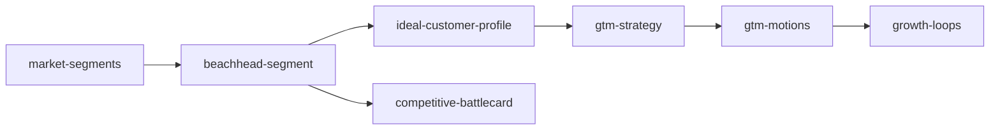
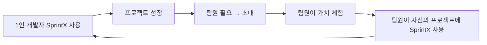

# 시장 진입 전략 (Go-to-Market)

## 카테고리 소개

제품을 만드는 것과 시장에 내놓는 것은 완전히 다른 문제이다. 훌륭한 제품이라도 잘못된 세그먼트에 잘못된 메시지로 진입하면 실패한다. Go-to-Market 카테고리는 "어떤 고객에게, 어떤 채널로, 어떤 메시지를 전달할 것인가"를 체계적으로 설계하는 6개 스킬을 제공한다.

비개발자 PO에게 이 카테고리가 중요한 이유는, 기술적으로 완성된 MVP가 있더라도 "첫 100명의 사용자를 어떻게 확보하는가"에 대한 전략이 없으면 제품이 사장되기 때문이다. 특히 1인 PO + AI 에이전트라는 제한된 리소스 환경에서는, 가장 이길 확률이 높은 세그먼트 하나에 집중하는 것이 핵심이다.

이 카테고리의 스킬들은 Market Research 카테고리의 산출물을 받아, 실행 가능한 시장 진입 계획으로 전환한다.



## 이 카테고리의 스킬 한눈에 보기

| 스킬명 | 한 줄 설명 | 난이도 | 예상 소요 시간 |
|--------|-----------|--------|--------------|
| Beachhead 세그먼트 (beachhead-segment) | 4가지 기준으로 첫 번째 공략 시장 세그먼트 선정 | 초급 | 20-25분 |
| 이상적 고객 프로필 ICP (ideal-customer-profile) | 리서치 데이터로 최적 고객 프로필을 인구통계/행동/JTBD로 정의 | 중급 | 25-35분 |
| GTM 전략 (gtm-strategy) | 마케팅 채널/메시지/성공 지표/런칭 타임라인을 포함한 진입 전략 수립 | 중급 | 30-40분 |
| GTM 모션 평가 (gtm-motions) | 7가지 GTM 모션(Inbound/Outbound/PLG 등)의 적합도를 평가 | 중급 | 25-35분 |
| 성장 루프 설계 (growth-loops) | 5가지 성장 루프(Viral/Usage/Collaboration 등)를 평가하고 설계 | 고급 | 30-40분 |
| 경쟁 배틀카드 (competitive-battlecard) | 특정 경쟁자 대비 포지셔닝/기능 비교/반박 논리를 담은 영업용 문서 생성 | 고급 | 25-35분 |

## 추천 실행 순서

Go-to-Market 스킬은 "타겟 선정 -> 전략 수립 -> 실행 최적화"의 순서로 실행한다.

1. **Beachhead 세그먼트** (beachhead-segment) -- 가장 먼저 공략할 세그먼트를 선택한다. Market Research의 `market-segments` 직후에 실행한다.
2. **이상적 고객 프로필** (ideal-customer-profile) -- Beachhead 세그먼트 내에서 가장 이상적인 고객의 상세 프로필을 정의한다.
3. **GTM 전략** (gtm-strategy) -- Beachhead + ICP를 기반으로 채널/메시지/타임라인을 포함한 종합 전략을 수립한다.
4. **GTM 모션 평가** (gtm-motions) -- 7가지 GTM 모션 중 자사에 가장 적합한 2-4개를 선택한다.
5. **성장 루프 설계** (growth-loops) -- 유료 광고에 의존하지 않는 제품 내장형 성장 메커니즘을 설계한다.
6. **경쟁 배틀카드** (competitive-battlecard) -- 주요 경쟁자별 영업/마케팅 대응 자료를 만든다.

> 1-3번은 Phase 2(Week 3-4)에 집중 실행하고, 4-6번은 초기 사용자 확보 후에 점진적으로 실행한다.

## 관련 카테고리

- **Market Research**: Go-to-Market의 입력을 제공한다. `market-segments` -> `beachhead-segment`, `competitor-analysis` -> `competitive-battlecard`의 직접적인 흐름이 있다.
- **Marketing & Growth**: GTM 전략의 메시지를 구체적인 마케팅 자산으로 전환한다. `gtm-strategy`의 포지셔닝을 `value-prop-statements`와 `positioning-ideas`로 구체화한다.
- **Data Analytics**: GTM 전략의 성과를 측정한다. `gtm-strategy`의 KPI를 `sql-queries`로 추적하고, `ab-test-analysis`로 채널별 효과를 비교한다.

---

## 스킬 상세

### 1. Beachhead 세그먼트 (beachhead-segment)

> **난이도**: 초급 | **소요 시간**: 20-25분 | **명령어**: `/pm-go-to-market:beachhead-segment`

4가지 기준(Burning Pain / Willingness to Pay / Winnable Share / Referral Potential)으로 세그먼트를 점수화해 첫 번째 공략 시장을 결정한다.

#### 실행 전 체크리스트
- [ ] `market-segments` 결과에서 후보 세그먼트 3-5개 목록 준비
- [ ] 각 세그먼트에 대한 최소한의 리서치 데이터 (인터뷰, 설문, 경쟁 분석) 보유
- [ ] 제약 조건 명확화: 팀 규모, 마케팅 예산, 출시 목표 시점

#### Step-by-Step 실행 가이드

**Step 1 — 명령어 실행**
```
/pm-go-to-market:beachhead-segment SprintX - AI 에이전트 기반 스프린트 관리 SaaS.
후보 세그먼트:
1) AI 코딩 에이전트를 쓰는 사이드 프로젝트 개발자
2) AI를 활용하는 프리랜서 개발자
3) 소규모 스타트업 CTO (1-3명 팀)
제약: 1인 PO + AI 에이전트. 마케팅 예산 제한적.
기존 자산: Waitlist API 운영 중, 13개 분석 이벤트 구현됨.
```

**Step 2 — Claude의 질문과 답변 가이드**

---
**질문 1: [고통의 절박성] 각 세그먼트에서 "지금 당장 해결해야 하는" 문제가 있나요?**
> Claude: "사이드 프로젝트 개발자와 프리랜서 개발자 모두 AI 코딩 에이전트를 사용한다고 하셨는데, 두 그룹 중 어느 쪽이 'AI가 만든 코드를 관리하지 못해서 프로젝트가 지연된다'는 고통을 더 강하게 느끼고 있나요? 구체적인 사례가 있으면 공유해 주세요."

**✅ 좋은 답변 예시:**
```
사이드 프로젝트 개발자가 훨씬 심각합니다.
- 인터뷰한 개발자 5명 중 4명이 "AI가 만든 코드를 어디에 저장해야 할지 모르겠다"고 함
- 프리랜서는 클라이언트 보고용 도구를 이미 갖고 있어서 덜 급박함
- 사이드 프로젝트 개발자는 "지금 당장 SprintX가 없으면 프로젝트가 죽는다"는 반응이 있었음
```
**💡 팁:** 고통의 절박성은 "없으면 어떻게 됩니까?" 질문으로 측정한다. "불편하다"와 "못 살겠다"는 완전히 다른 점수이다.

---
**질문 2: [지불 의향] 각 세그먼트는 얼마까지 지불할 의향이 있나요?**
> Claude: "$5/월이라는 가격을 제시했을 때 세 세그먼트의 반응이 어떻게 달랐나요? '비싸다', '적당하다', '싸다' 중 어느 반응이 많았나요?"

**✅ 좋은 답변 예시:**
```
사이드 프로젝트 개발자: "무료는 써볼게요, $5는 고민됩니다" (약한 WTP)
프리랜서 개발자: "$5면 쓸 것 같아요, 업무 효율 생각하면" (중간 WTP)
스타트업 CTO: "$5는 아무것도 아닌데요, $20도 가능합니다" (높은 WTP)
```
**💡 팁:** WTP가 높다고 좋은 세그먼트가 아니다. WTP × 획득 가능성이 진짜 기회 크기이다.

---
**질문 3: [획득 가능성] 어느 세그먼트에 가장 쉽게 접근할 수 있나요?**
> Claude: "세 세그먼트를 각각 찾으려면 어디에 가야 하나요? Reddit, Hacker News, LinkedIn 등 구체적인 채널로 설명해 주세요."

**✅ 좋은 답변 예시:**
```
사이드 프로젝트 개발자: r/sideproject, r/programming, X에서 #buildinpublic → 접근 용이
프리랜서 개발자: 분산되어 있음, 특정 커뮤니티 없음 → 접근 어려움
스타트업 CTO: LinkedIn, 스타트업 커뮤니티 → 접근 가능하나 노이즈 높음
```
**💡 팁:** PO 자신이 이미 속해 있는 커뮤니티라면 Winnable Share 점수 +2점을 더하라.

---
**질문 4: [추천 가능성] 어느 세그먼트가 주변에 가장 많이 소문을 낼까요?**
> Claude: "사이드 프로젝트 개발자들은 자신이 쓰는 도구를 얼마나 자주 공유하나요? GitHub README, 블로그 포스트, X 트윗 등으로 도구를 추천하는 문화가 있나요?"

**✅ 좋은 답변 예시:**
```
사이드 프로젝트 개발자: "빌드인퍼블릭" 문화가 강해서 사용하는 도구를 자주 공유함.
실제로 인터뷰한 개발자 중 2명이 "X에서 스택 공개할 때 SprintX 언급하겠다"고 함.
프리랜서는 클라이언트에게 도구를 추천하기 어려운 환경.
```
**💡 팁:** 개발자 커뮤니티에서 추천은 "돈 한 푼 안 쓰는 마케팅"이다. 이 점수가 낮은 세그먼트는 CAC가 영원히 높다.

---

**Step 3 — 산출물 검토**

Claude가 세그먼트 비교 표와 권고안을 생성한다. 다음을 확인한다:
- 4가지 기준 점수가 근거와 함께 제시되었는가
- 선택한 세그먼트의 90일 고객 확보 계획이 구체적인가
- 인접 시장 확장 경로가 논리적인가

#### 산출물 실제 예시
```markdown
## Beachhead 세그먼트 평가

| 기준 | 사이드 프로젝트 | 프리랜서 | 스타트업 CTO |
|------|--------------|---------|-------------|
| Burning Pain (고통의 절박성) | 8/10 | 7/10 | 6/10 |
| Willingness to Pay (지불 의향) | 5/10 | 8/10 | 9/10 |
| Winnable Share (획득 가능성) | 9/10 | 6/10 | 4/10 |
| Referral Potential (추천 가능성) | 8/10 | 5/10 | 7/10 |
| **합계** | **30** | **26** | **26** |

## 권고: 사이드 프로젝트 개발자

**선택 근거**:
- PO 자신이 이 세그먼트에 속해 있어 deep understanding 보유
- 개발자 커뮤니티(Reddit, HN, X)를 통한 접근이 용이
- $5/월 가격에 대한 저항이 낮음
- 커뮤니티 내 입소문 확산 가능성 높음

**90일 고객 확보 계획**:
- Month 1: Waitlist 등록자 대상 beta 초대 (30명 목표)
- Month 2: 개발자 커뮤니티 포스팅 + 피드백 수집
- Month 3: 만족 사용자의 추천을 통한 유기적 성장

**인접 시장 확장 경로**:

사이드 프로젝트 → 프리랜서 → 소규모 팀 → 스타트업
```

#### 다음 단계
- **ideal-customer-profile**: Beachhead 세그먼트 내에서 가장 이상적인 고객의 세부 프로필을 정의한다
- **gtm-strategy**: Beachhead를 공략하는 채널/메시지/타임라인 전략을 수립한다

---

### 2. 이상적 고객 프로필 ICP (ideal-customer-profile)

> **난이도**: 중급 | **소요 시간**: 25-35분 | **명령어**: `/pm-go-to-market:ideal-customer-profile`

Beachhead 세그먼트 안에서 인구통계, 행동 패턴, JTBD, Pain Point, 부적합 기준까지 포함한 완성된 고객 프로필을 만든다.

#### 실행 전 체크리스트
- [ ] `beachhead-segment` 결과 준비 (선택한 세그먼트 명확화)
- [ ] 사용자 인터뷰 최소 3건 이상의 노트 또는 요약
- [ ] Waitlist 등록자 분석 데이터 (있으면 첨부)
- [ ] 온보딩 완료/이탈 사용자 행동 데이터 (있으면 첨부)

#### Step-by-Step 실행 가이드

**Step 1 — 명령어 실행**
```
/pm-go-to-market:ideal-customer-profile SprintX ICP 정의.
Beachhead: AI 코딩 에이전트를 쓰는 사이드 프로젝트 개발자.
데이터: 사용자 인터뷰 5건, Waitlist 등록자 분석,
온보딩 완료 사용자 행동 데이터.

인터뷰 주요 발견:
- "AI가 만든 코드를 어디에 저장해야 할지 모르겠다" (5명 중 4명)
- Claude Code 사용자는 세션이 끊기면 컨텍스트를 잃음
- 기존 PM 도구(Linear, Notion)는 "팀용이라 혼자 쓰기엔 과하다"
```

**Step 2 — Claude의 질문과 답변 가이드**

---
**질문 1: [인구통계] 이상적인 고객의 경력과 기술 수준은?**
> Claude: "인터뷰에서 가장 만족도가 높았던 사용자들의 공통점이 있었나요? 경력 연수, 주로 사용하는 기술 스택, AI 도구 사용 빈도 등을 설명해 주세요."

**✅ 좋은 답변 예시:**
```
가장 반응이 좋았던 사용자 3명의 공통점:
- 개발 경력 2-5년 (주니어보다 높지만 테크리드 아님)
- TypeScript/Python 메인 스택
- Claude Code 또는 Cursor를 하루 2시간 이상 사용
- 사이드 프로젝트 2개 이상 동시 진행 중
- GitHub에서 주 5+ 커밋 활동
```
**💡 팁:** "모든 개발자"를 ICP로 설정하면 메시지가 희석된다. 가장 만족도 높은 사용자 3명의 공통점이 ICP의 출발점이다.

---
**질문 2: [행동 패턴] 이상적인 고객은 어떤 워크플로우로 일하나요?**
> Claude: "ICP에 해당하는 사용자가 SprintX를 사용하지 않을 때 하루를 어떻게 보내나요? AI 에이전트에게 작업을 지시하는 방식, 결과물을 관리하는 방식을 구체적으로 설명해 주세요."

**✅ 좋은 답변 예시:**
```
SprintX 이전의 하루:
1. Notion에 할 일 목록 작성 (느슨한 형태)
2. Claude Code에서 프롬프트로 기능 구현 요청
3. AI가 만든 코드를 직접 리뷰 (체크리스트 없음)
4. 다음 세션에서 "어디까지 했더라?" 기억에 의존
5. 여러 프로젝트가 섞이면 컨텍스트 혼란

SprintX로 해결되는 부분: 2-4번
```
**💡 팁:** 행동 패턴은 제품의 온보딩 플로우와 직결된다. ICP가 "이미 하고 있는" 행동에 SprintX를 자연스럽게 끼워 넣어야 활성화율이 높다.

---
**질문 3: [JTBD] 이 고객이 SprintX를 "고용"하는 진짜 이유는?**
> Claude: "사용자가 SprintX를 사용하기 시작할 때 '이걸 쓰면 이런 게 가능해진다'는 기대가 무엇인가요? 기능적/감정적/사회적 세 가지 측면에서 설명해 주세요."

**✅ 좋은 답변 예시:**
```
기능적 JTBD: "AI가 만든 코드 결과를 체계적으로 추적하고 검토하고 싶다"
감정적 JTBD: "내가 프로젝트를 컨트롤하고 있다는 느낌"
사회적 JTBD: "체계적으로 일하는 개발자라는 인식"
  → X에서 SprintX 스크린샷을 공유하면서 "나는 이렇게 관리한다"는 자기표현
```
**💡 팁:** 사회적 JTBD가 강할수록 바이럴 가능성이 높다. SprintX 스크린샷이 X에서 공유될 때 "나도 저렇게 하고 싶다"는 반응이 온다면 Viral Loop의 씨앗이 된다.

---
**질문 4: [Pain Points] 가장 자주 들은 불편함 TOP 5는?**
> Claude: "인터뷰 5건에서 공통으로 반복된 불편함이 있었나요? 각 불편함을 듣게 된 빈도와 함께 우선순위를 매겨 주세요."

**✅ 좋은 답변 예시:**
```
Pain #1 (5/5명): AI 세션이 끊기면 컨텍스트 재설정이 너무 번거롭다
Pain #2 (4/5명): 여러 프로젝트의 진행 상황을 한 곳에서 파악하기 어렵다
Pain #3 (4/5명): 기존 PM 도구는 팀용이라 1인 개발자에겐 과도하다
Pain #4 (3/5명): "지난주에 뭘 했는지" 기억에 의존한다
Pain #5 (3/5명): AI 에이전트에게 다음 작업을 지시하려면 컨텍스트 정리가 필요하다
```
**💡 팁:** 5명 중 5명이 말한 Pain은 랜딩 페이지 첫 문장의 후보이다.

---
**질문 5: [부적합 고객] 절대 맞지 않는 고객 유형은?**
> Claude: "SprintX를 써봤지만 가치를 못 느끼고 이탈한 사용자들의 공통점이 있었나요? 또는 처음부터 이 제품이 맞지 않을 것 같은 유형을 설명해 주세요."

**✅ 좋은 답변 예시:**
```
부적합 고객:
- AI 코딩 도구를 전혀 사용하지 않는 개발자 (핵심 Pain이 없음)
- 10명 이상 팀의 PM 도구를 찾는 관리자 (권한 관리, 보고 기능 필요)
- Jira/Linear에 이미 익숙하고 만족하는 사용자 (전환 비용 > 이익)
- 프로그래밍 자체가 낯선 비개발자 (온보딩 장벽 너무 높음)
```
**💡 팁:** 부적합 고객을 명확히 하면 온보딩 이탈률이 줄어든다. 처음부터 "이 제품은 당신을 위한 것이 아닙니다"라고 말하는 것이 장기 LTV를 높인다.

---

**Step 3 — 산출물 검토**

Claude가 완성된 ICP 문서를 생성한다. 다음을 확인한다:
- Firmographic / Behavioral / JTBD / Pain Points / Disqualification 5개 섹션이 모두 있는가
- "누구를 위한 것인가"와 "누구를 위한 것이 아닌가" 모두 명시되었는가
- 구체적인 숫자와 인용이 포함되었는가

#### 산출물 실제 예시
```markdown
## SprintX 이상적 고객 프로필 (ICP)

### Firmographic Profile
- 개인 / 1인 스타트업
- 사이드 프로젝트 2-5개 동시 진행
- AI 코딩 도구 주 3회 이상 사용 (Claude Code, Cursor, GitHub Copilot)
- 소프트웨어 개발 경력 2-5년

### Behavioral Profile
- GitHub에서 활발히 활동 (주 5+ commits)
- AI 코딩 에이전트로 코드 생성 → 직접 리뷰하는 패턴
- "생성된 코드를 정리/검토/관리할 도구"를 찾고 있음
- 기존 PM 도구(Linear, Notion)를 사용해봤으나 "과하다"고 느낌
- X, GitHub, 개발자 커뮤니티에서 사용 도구를 공유하는 문화

### Jobs-to-be-Done
- **기능적**: "AI가 만든 코드 결과를 체계적으로 추적하고 검토하고 싶다"
- **감정적**: "내가 프로젝트를 컨트롤하고 있다는 느낌"
- **사회적**: "체계적으로 일하는 개발자라는 인식 — SprintX 스크린샷을 X에 공유"

### Top 5 Pain Points
1. AI 세션이 끊기면 컨텍스트 재설정이 너무 번거롭다 (5/5명)
2. 여러 프로젝트의 진행 상황을 한 곳에서 파악하기 어렵다 (4/5명)
3. 기존 PM 도구는 팀용이라 1인 개발자에겐 과도하다 (4/5명)
4. "지난주에 뭘 했는지" 기억에 의존한다 (3/5명)
5. AI 에이전트에게 다음 작업을 지시하려면 컨텍스트 정리가 필요하다 (3/5명)

### 비적합 고객 (Disqualification Criteria)
- AI 코딩 도구를 전혀 사용하지 않는 개발자
- 10명 이상 팀의 PM 도구를 찾는 관리자
- Jira/Linear에 만족하고 있는 사용자
- 프로그래밍 자체가 낯선 비개발자
```

#### 다음 단계
- **gtm-strategy**: ICP 기반으로 채널/메시지/KPI를 포함한 GTM 전략을 수립한다
- **user-personas** (Market Research): ICP의 구체적 페르소나 버전(이름, 시나리오)을 만든다

---

### 3. GTM 전략 (gtm-strategy)

> **난이도**: 중급 | **소요 시간**: 30-40분 | **명령어**: `/pm-go-to-market:gtm-strategy`

Beachhead 세그먼트와 ICP를 기반으로 채널, 핵심 메시지, 런칭 타임라인, KPI 목표를 포함한 90일 시장 진입 계획을 수립한다.

#### 실행 전 체크리스트
- [ ] `beachhead-segment` 결과 (선택한 세그먼트)
- [ ] `ideal-customer-profile` 결과 (ICP 상세 프로필)
- [ ] 제품 가격 정책 확정 (Free/Pro 구조 등)
- [ ] 현재 보유한 자산 목록 (Waitlist, 분석 도구, 기존 채널)
- [ ] 런칭 목표 시점과 예산 제약

#### Step-by-Step 실행 가이드

**Step 1 — 명령어 실행**
```
/pm-go-to-market:gtm-strategy SprintX GTM 전략 수립.
제품: AI 에이전트 기반 스프린트 관리 SaaS (Free/Pro $5/월).
Beachhead: AI 코딩 에이전트를 쓰는 사이드 프로젝트 개발자.
ICP 핵심 Pain: AI 세션 컨텍스트 유실, 1인 개발자용 PM 도구 부재.
기존 채널: Waitlist API (등록자 N명), 13개 분석 이벤트.
제약: 1인 PO, 마케팅 예산 월 $50 이하, 타임라인: 90일.
목표: 첫 100명 유료 사용자 확보.
```

**Step 2 — Claude의 질문과 답변 가이드**

---
**질문 1: [포지셔닝] SprintX를 한 문장으로 소개한다면?**
> Claude: "ICP인 사이드 프로젝트 개발자에게 SprintX를 15초 안에 설명해야 한다면 어떤 문장을 쓰시겠어요? '우리는 [무엇]을 하는 [누구]를 위한 [어떤] 도구다'의 형태로 먼저 작성해 보세요."

**✅ 좋은 답변 예시:**
```
초안: "SprintX는 AI 코딩 에이전트를 쓰는 사이드 프로젝트 개발자를 위한
스프린트 관리 도구다."

강화: "AI 코딩 에이전트가 만든 코드를 체계적으로 추적하고 싶은 개발자를 위한,
Goal → Task → AI 실행 → 리뷰 워크플로우."
```
**💡 팁:** 포지셔닝 문장은 랜딩 페이지 H1의 기초이다. "AI 에이전트"와 "사이드 프로젝트"를 명시하면 타겟 고객이 즉시 "나 얘기네"라고 느낀다.

---
**질문 2: [채널 우선순위] 첫 100명을 어디서 찾을 수 있나요?**
> Claude: "Waitlist 등록자 외에, SprintX의 ICP인 사이드 프로젝트 개발자가 온라인에서 어디에 모여 있나요? 각 채널의 예상 접근 비용(돈/시간)과 전환 가능성을 비교해 주세요."

**✅ 좋은 답변 예시:**
```
채널 1: Waitlist 등록자 (이미 보유)
  - 비용: $0, 전환 가능성: 높음 (이미 관심 표현)
  - 액션: beta 초대 이메일 발송

채널 2: X #buildinpublic 커뮤니티
  - 비용: 시간 30분/일, 전환 가능성: 중간
  - 액션: SprintX 개발 과정을 일기처럼 공유

채널 3: Hacker News "Show HN"
  - 비용: 게시물 작성 1-2시간
  - 전환 가능성: 높음 (단기 스파이크, 200-500명 유입 가능)

채널 4: r/sideproject, r/webdev
  - 비용: 시간 20분/포스트
  - 전환 가능성: 중간 (커뮤니티 규칙 준수 필요)
```
**💡 팁:** 1인 PO는 2개 채널 이상을 동시에 운영하면 분산된다. 처음 30일은 Waitlist + HN/Reddit 하나만 집중한다.

---
**질문 3: [핵심 메시지] ICP의 Pain을 직접 타격하는 카피는?**
> Claude: "ICP의 Top Pain이 'AI 세션 컨텍스트 유실'이라면, 이 고통을 가장 직접적으로 건드리는 랜딩 페이지 헤드라인은 무엇일까요? 3가지 버전을 제안해 주세요."

**✅ 좋은 답변 예시:**
```
버전 A (Pain 직격): "AI 세션이 끊길 때마다 컨텍스트를 다시 설명하고 있나요?"
버전 B (Solution 포커스): "Goal → Task → AI 실행 → 리뷰. 하나의 워크플로우로."
버전 C (Outcome 포커스): "사이드 프로젝트가 있어요? AI 에이전트가 만든 코드, 이제 체계적으로 관리하세요."

선택: 버전 A를 H1, 버전 B를 H2로 조합
```
**💡 팁:** A/B 테스트할 시간이 없다면 Pain 직격형(A)을 먼저 쓴다. 고객이 "이거 내 얘기잖아"라고 느끼면 나머지는 알아서 읽는다.

---
**질문 4: [런칭 타임라인] 90일을 어떻게 나눌까요?**
> Claude: "첫 30일, 31-60일, 61-90일에 각각 어떤 GTM 활동에 집중할지 우선순위를 정해 주세요. SprintX의 현재 상태(Waitlist, 분석 이벤트 구현 완료)를 고려해서요."

**✅ 좋은 답변 예시:**
```
0-30일: 검증 (Waitlist 30명에게 beta 초대, NPS/피드백 수집)
31-60일: 확산 (HN Show HN 게시, Reddit 포스트, X 빌드 일기 시작)
61-90일: 가속 (Product Hunt 런칭, 기술 블로그 2편 발행, 사용자 추천 프로그램 시작)
```
**💡 팁:** Product Hunt는 준비 없이 런칭하면 효과가 반감된다. 61-90일에 넣는 것이 맞다. 그때쯤이면 피드백을 반영한 개선 버전과 사용자 추천사가 준비된다.

---
**질문 5: [KPI 설정] 30/60/90일 성공을 어떻게 측정하나요?**
> Claude: "GTM 전략의 성공을 측정하는 지표를 30일, 60일, 90일 체크포인트로 나눠서 정해 주세요. 이미 구현된 13개 분석 이벤트로 측정 가능한 지표를 우선으로 하세요."

**✅ 좋은 답변 예시:**
```
30일 체크포인트:
- 가입자 50명 (측정: signups 이벤트)
- WAU 15명 (측정: weekly_active 이벤트)
- beta 피드백 수집 20건

60일 체크포인트:
- 가입자 150명
- WAU 50명
- Pro 전환 10명 (측정: subscription_created 이벤트)

90일 체크포인트:
- 가입자 500명
- WAU 150명
- Pro 전환 30명 (MRR $150)
```
**💡 팁:** KPI를 설정할 때 "측정 가능한가"를 먼저 확인한다. 13개 이벤트에 없는 지표는 이벤트를 먼저 추가하고 GTM을 시작한다.

---

**Step 3 — 산출물 검토**

Claude가 종합 GTM 전략 문서를 생성한다. 다음을 확인한다:
- 채널별 우선순위와 예상 비용이 명시되었는가
- 핵심 메시지가 ICP의 Pain과 직결되는가
- 타임라인이 현실적이고 실행 가능한가
- KPI가 측정 가능한 지표로 되어 있는가

#### 산출물 실제 예시
```markdown
## SprintX GTM 전략

### 포지셔닝 문장
"AI 코딩 에이전트를 쓰는 사이드 프로젝트 개발자를 위한
Goal → Task → AI 실행 → 리뷰 워크플로우."

### 추천 마케팅 채널
| 채널 | 우선순위 | 예상 비용 | 기대 효과 |
|------|---------|----------|----------|
| Waitlist 등록자 초대 | 1순위 | $0 | 검증된 관심층 전환 |
| Hacker News Show HN | 2순위 | 시간 2시간 | 200-500명 단기 유입 |
| X #buildinpublic | 3순위 | 시간 30분/일 | 입소문 + 팔로워 형성 |
| r/sideproject | 4순위 | 시간 20분/포스트 | 커뮤니티 신뢰 구축 |
| Product Hunt | 5순위 | 준비 10시간 | 60-90일차 런칭 |

### 핵심 메시지
H1: "AI 세션이 끊길 때마다 컨텍스트를 다시 설명하고 있나요?"
H2: "Goal → Task → AI 실행 → 리뷰. 하나의 워크플로우로."

### 런칭 타임라인 (90일)
- Day 1-30: Waitlist 30명 beta 초대 + NPS/피드백 수집
- Day 31-60: HN Show HN + Reddit 포스트 + X 빌드 일기 시작
- Day 61-90: Product Hunt 런칭 + 기술 블로그 2편 + 추천 프로그램

### KPI 목표
| 지표 | 30일 | 60일 | 90일 |
|------|------|------|------|
| 가입자 | 50명 | 150명 | 500명 |
| WAU | 15명 | 50명 | 150명 |
| Pro 전환 | 2명 | 10명 | 30명 |
| MRR | $10 | $50 | $150 |
```

#### 다음 단계
- **gtm-motions**: GTM 전략의 채널을 7가지 모션 프레임워크로 정밀화한다
- **value-prop-statements** (Marketing & Growth): 핵심 메시지를 다양한 맥락의 카피로 전환한다

---

### 4. GTM 모션 평가 (gtm-motions)

> **난이도**: 중급 | **소요 시간**: 25-35분 | **명령어**: `/pm-go-to-market:gtm-motions`

7가지 GTM 모션(PLG, Inbound, Outbound, Community, Paid, Partner, ABM)의 적합도를 제품 특성에 맞게 평가하고, 최적 모션 스택과 실행 도구를 결정한다.

#### 실행 전 체크리스트
- [ ] `gtm-strategy` 결과 준비 (채널 방향이 잡혀 있는 상태)
- [ ] 가격 정책과 ACV(연간 고객 가치) 확인
- [ ] 팀 규모와 마케팅 전담 인력 유무 확인
- [ ] 현재 운영 중인 채널과 도구 목록

#### Step-by-Step 실행 가이드

**Step 1 — 명령어 실행**
```
/pm-go-to-market:gtm-motions SprintX GTM 모션 평가.
제품: AI 에이전트 기반 스프린트 관리 SaaS.
가격: Free / Pro $5/월 (ACV $60).
판매 주기: 짧음 (셀프 서비스, 신용카드 즉시 결제).
팀: 1인 PO (마케팅 전담 인력 없음).
예산: 월 $50 이하.
현재 채널: Waitlist만 운영 중.
Free 플랜: 있음 (3개 프로젝트, 기본 기능).
```

**Step 2 — Claude의 질문과 답변 가이드**

---
**질문 1: [PLG 적합성] 제품이 스스로 사용자를 데려올 수 있나요?**
> Claude: "SprintX의 Free 플랜 사용자가 Pro로 업그레이드하는 자연스러운 계기가 있나요? 또는 Free 사용자가 다른 사람을 SprintX로 데려오는 상황이 제품 내에서 발생하나요?"

**✅ 좋은 답변 예시:**
```
PLG 트리거 1 — Free → Pro 전환:
- Free: 3개 프로젝트 한도 → 4번째 프로젝트 생성 시 "Pro 업그레이드" 팝업
- 이 순간이 자연스러운 결제 전환점

PLG 트리거 2 — 팀원 초대:
- 프로젝트가 성장하면 팀원 초대 필요
- 팀원이 SprintX를 처음 접하는 접점

PLG 트리거 3 — 공개 프로젝트 링크:
- 진행 중인 사이드 프로젝트 페이지를 X에 공유
- 방문자가 "나도 써봐야지" → 바이럴 요소
```
**💡 팁:** PLG가 작동하려면 "가치 체험 → 결제 전환 트리거"가 제품 안에 내장되어야 한다. 트리거가 없으면 Free 플랜은 그냥 무료 도구로 끝난다.

---
**질문 2: [Community 모션] 어떤 커뮤니티에서 신뢰를 쌓을 수 있나요?**
> Claude: "SprintX의 ICP인 사이드 프로젝트 개발자들이 모이는 커뮤니티에서 PO가 직접 활동하고 있나요? 어떤 형태의 콘텐츠가 이 커뮤니티에서 가장 환영받나요?"

**✅ 좋은 답변 예시:**
```
활동 중인 커뮤니티: r/sideproject (팔로워 89K), X #buildinpublic
환영받는 콘텐츠 유형:
1. 빌드 과정 공개 (솔직한 수치 포함) → "30일 만에 50명 달성" 류
2. AI 코딩 에이전트 사용 팁 (도구 설명이 아닌 워크플로우)
3. 실패 경험 공유 → 개발자 커뮤니티에서 신뢰 높음

PO 자신의 활동 이력:
- X: 팔로워 230명, 개발 관련 트윗 20+건
- Reddit: 기여 이력 있음
```
**💡 팁:** Community 모션에서 "스팸"과 "기여"의 차이는 자기 제품 홍보 없이 먼저 가치를 주는 것이다. 20개 포스트를 가치 기여로 쓰고, 그다음에 SprintX를 언급하라.

---
**질문 3: [Inbound 적합성] SEO 콘텐츠로 검색 트래픽을 만들 수 있나요?**
> Claude: "SprintX의 ICP가 Google에서 어떤 키워드로 검색할까요? 'AI 코딩 에이전트 관리', '사이드 프로젝트 PM 도구' 같은 키워드의 검색량이 어느 정도인지 예상되나요?"

**✅ 좋은 답변 예시:**
```
고검색량 키워드 (경쟁 높음):
- "project management for developers" → 경쟁 심함, 초기엔 부적합
- "AI coding workflow" → 신규 키워드, 경쟁 적음

틈새 키워드 (초기 적합):
- "Claude Code project management" → 경쟁 거의 없음
- "AI agent sprint planning" → 미개척
- "side project workflow AI" → 검색량 적지만 정확한 타겟

SEO 전략: 단기에 기대하지 않고 61-90일부터 월 2편 시작
```
**💡 팁:** Inbound/SEO는 6-12개월 장기 게임이다. 초기에는 Community + PLG로 사용자를 확보하고, SEO는 병행 투자한다.

---
**질문 4: [모션 제외 기준] 어떤 모션은 명확히 맞지 않나요?**
> Claude: "Outbound Sales(콜드 이메일, 콜드 콜)와 Account-Based Marketing(특정 기업 타겟)이 SprintX에 맞지 않는 이유를 설명해 주세요. 예산과 팀 규모 관점에서 분석해 주세요."

**✅ 좋은 답변 예시:**
```
Outbound Sales 불가 이유:
- ACV $60/년이면 CAC를 $10 이하로 맞춰야 함
- 콜드 이메일 한 건당 시간 비용 > $10
- 1인 PO가 영업 활동에 쓸 시간 없음

ABM 불가 이유:
- ABM은 기업 고객(엔터프라이즈) 대상
- SprintX ICP는 개인 개발자 → ABM 타겟 없음

Paid Digital 비추 이유:
- ACV $60이면 CLV $120 가정 시 CAC $24 한도
- Meta/Google Ads CPC $2-5 → 전환율 10%면 CAC $20-50 → 손익분기 불투명
```
**💡 팁:** 모션 제외는 나쁜 결정이 아니다. 맞지 않는 모션에 리소스를 쓰지 않는 것이 올바른 집중이다.

---

**Step 3 — 산출물 검토**

Claude가 7가지 모션 평가와 권장 모션 스택을 생성한다. 다음을 확인한다:
- 점수에 "왜"가 포함되었는가
- 권장 모션별 구체적인 도구가 제시되었는가
- 30-60-90일 실행 계획이 있는가

#### 산출물 실제 예시
```markdown
## 7가지 GTM 모션 적합도 평가

| 모션 | 점수 | 적합 근거 |
|------|------|----------|
| **PLG (Product-Led Growth)** | **9/10** | 셀프서비스, Free 플랜 존재, 낮은 ACV |
| **Community Marketing** | **8/10** | 개발자 커뮤니티 접근 용이, 비용 $0 |
| **Inbound Marketing** | 7/10 | 기술 콘텐츠로 SEO 가능, 장기 투자 필요 |
| Paid Digital | 4/10 | ACV $60이면 CAC 맞추기 어려움 |
| Outbound Sales | 3/10 | 1인 팀 + 낮은 ACV → ROI 없음 |
| Partner Marketing | 3/10 | 초기 단계에서 파트너 확보 어려움 |
| ABM | 2/10 | 개인 사용자 대상 → ABM 불필요 |

## 권장 모션 스택

**Primary: PLG**
- Free 플랜으로 진입 장벽 제거
- Pro 업그레이드 트리거: 3개 프로젝트 한도
- 도구: PostHog (분석), Paddle/Stripe (결제)

**Secondary: Community Marketing**
- r/sideproject, X #buildinpublic에서 빌드 과정 공개
- 도구: 없음 (직접 활동)

**30-60-90일 실행 계획**:
- 30일: Free → Pro 전환 플로우 최적화 (PLG)
- 60일: 커뮤니티 포스트 3건 + 피드백 반영 (Community)
- 90일: 기술 블로그 시작 (Inbound 추가)
```

#### 다음 단계
- **growth-loops**: 선택한 모션 위에 제품 내장형 성장 메커니즘을 추가한다
- **marketing-ideas** (Marketing & Growth): 선택한 모션 내에서 구체적 마케팅 아이디어를 생성한다

---

### 5. 성장 루프 설계 (growth-loops)

> **난이도**: 고급 | **소요 시간**: 30-40분 | **명령어**: `/pm-go-to-market:growth-loops`

유료 광고에 의존하지 않고 제품 사용 자체가 신규 사용자를 데려오는 성장 메커니즘을 설계한다. 5가지 루프 유형(Viral, Usage, Collaboration, Referral, UGC)을 평가하고 SprintX에 맞는 Primary Loop를 구현 계획까지 도출한다.

#### 실행 전 체크리스트
- [ ] `gtm-motions` 결과 준비 (PLG 모션이 1순위로 선택된 상태)
- [ ] 제품의 핵심 사용자 행동 흐름 정의 (예: Goal → Task → AI 실행 → 리뷰)
- [ ] 현재 제품에 공유/초대/협업 기능이 있는지 확인
- [ ] 사용자 행동 데이터: 어떤 기능에서 가장 많은 시간을 쓰나

#### Step-by-Step 실행 가이드

**Step 1 — 명령어 실행**
```
/pm-go-to-market:growth-loops SprintX 성장 루프 설계.
제품: AI 에이전트 기반 스프린트 관리 SaaS.
핵심 사용자 행동: Goal 생성 → Task 분해 → AI 실행 → 결과 리뷰.
현재 성장 채널: Community(초기) + PLG 구축 중.
사용자 특성: 개발자, 빌드인퍼블릭 문화, 도구 공유 활발.
기존 공유 기능: 없음 (구현 예정).
```

**Step 2 — Claude의 질문과 답변 가이드**

---
**질문 1: [루프 후보 탐색] 제품 사용이 자연스럽게 다른 사람을 데려오는 상황이 있나요?**
> Claude: "SprintX를 사용하는 사이드 프로젝트 개발자가 다른 사람에게 SprintX를 소개하게 되는 자연스러운 상황은 언제인가요? 강요나 인센티브 없이 일어나는 상황을 먼저 찾아봅시다."

**✅ 좋은 답변 예시:**
```
자연 발생 상황 1: X에 사이드 프로젝트 진행 상황 공유
  → SprintX 대시보드 스크린샷 포함 → "이거 뭐에요?" 질문 유발

자연 발생 상황 2: 사이드 프로젝트가 팀 규모로 성장
  → 공동 개발자를 SprintX에 초대 → 팀원이 신규 사용자로 전환

자연 발생 상황 3: AI 코딩 에이전트 워크플로우 블로그/유튜브
  → "나는 이렇게 SprintX를 쓴다" 소개 → 구독자가 가입
```
**💡 팁:** "자연 발생 상황"이 없으면 루프를 만들어도 억지스럽다. 먼저 이 상황을 제품 기능으로 촉진할 수 있는지 확인한다.

---
**질문 2: [루프 계수 추정] 사용자 1명이 몇 명을 데려올 수 있나요?**
> Claude: "Collaboration Loop를 가정해 봅시다. SprintX 사용자가 팀원을 초대하는 비율과 초대받은 팀원의 가입 전환율을 추정해 주세요. 데이터가 없으면 합리적인 가정으로 계산해 주세요."

**✅ 좋은 답변 예시:**
```
루프 계수 계산 (Collaboration Loop):
- 사이드 프로젝트가 팀으로 성장하는 비율: 30% (6개월 내)
- 팀 전환 시 평균 초대 인원: 1.5명
- 초대 → 가입 전환율: 60%
- 신규 가입자의 활성화율: 40%

순 루프 계수: 1 × 0.3 × 1.5 × 0.6 × 0.4 = 0.108/사용자/6개월

해석: 루프 계수 < 1이므로 이 루프 단독으로는 지수 성장 불가.
PLG + Community와 결합하면 보완 가능.
```
**💡 팁:** 루프 계수 > 1.0이면 바이럴 성장이 가능하다. 0.1-0.5는 성장을 보완하는 루프다. 어떤 숫자여도 없는 것보다 낫다.

---
**질문 3: [루프 구현 장벽] 이 루프를 만들기 위해 무엇을 개발해야 하나요?**
> Claude: "Collaboration Loop 구현에 필요한 기능 목록을 만들어 주세요. 각 기능의 개발 난이도(1-5점)와 루프에 미치는 영향력(1-5점)을 함께 평가해 주세요."

**✅ 좋은 답변 예시:**
```
기능 1: 팀원 초대 이메일 시스템
  - 난이도: 3/5 (이메일 발송 인프라 필요)
  - 영향력: 5/5 (루프의 핵심 입력)
  - 우선순위: 1순위

기능 2: 초대받은 사용자 전용 온보딩
  - 난이도: 2/5 (플로우 분기 추가)
  - 영향력: 4/5 (전환율 직결)
  - 우선순위: 2순위

기능 3: 공개 프로젝트 공유 링크
  - 난이도: 2/5 (읽기 전용 뷰)
  - 영향력: 3/5 (Viral 루프 보완)
  - 우선순위: 3순위
```
**💡 팁:** 루프 구현은 한 번에 다 만들 필요 없다. 가장 영향력 높고 난이도 낮은 기능부터 시작해서 루프를 조금씩 강화한다.

---
**질문 4: [루프 측정] 루프가 작동하는지 어떻게 알 수 있나요?**
> Claude: "SprintX의 Collaboration Loop가 실제로 작동하고 있는지 측정하기 위해 어떤 이벤트를 추적해야 하나요? 이미 구현된 13개 이벤트와 연결해서 설명해 주세요."

**✅ 좋은 답변 예시:**
```
추가로 필요한 이벤트:
- invite_sent: 팀원 초대 버튼 클릭
- invite_accepted: 초대 링크로 가입 완료
- invited_user_activated: 초대받은 사용자 7일 내 재방문

루프 계수 추적 대시보드 (PostHog):
- 주별 invite_sent / WAU 비율
- invite_accepted / invite_sent 전환율
- invited_user_activated / invite_accepted 전환율

목표 지표:
- 30일: invite_sent 10건/주
- 60일: 초대 전환율 50% 이상
```
**💡 팁:** 측정하지 않으면 루프가 작동하는지 알 수 없다. 이벤트 3개만 추가해도 루프의 건강 상태를 파악할 수 있다.

---

**Step 3 — 산출물 검토**

Claude가 5가지 루프 평가와 Primary Loop 설계 문서를 생성한다. 다음을 확인한다:
- 루프 계수 추정이 근거와 함께 제시되었는가
- 구현 계획이 30-60-90일로 나뉘어 있는가
- 측정 이벤트가 명시되었는가

#### 산출물 실제 예시
```markdown
## 5가지 성장 루프 적합도 평가

| 루프 유형 | 적합도 | 근거 |
|----------|--------|------|
| **Collaboration Loop** | **9/10** | 팀 확장 시 자연스러운 초대 구조 |
| Viral Loop | 7/10 | 공개 프로젝트 링크로 바이럴 가능 |
| Referral Loop | 6/10 | 개발자 추천 문화와 부합 |
| Usage Loop | 5/10 | 결과물이 외부 공유에 적합하지 않음 |
| User-Generated Loop | 3/10 | UGC 생성 구조 약함 |

## Primary Loop: Collaboration Loop

**메커니즘**:



**루프 계수 추정**:
- 사용자당 순 신규 유입: 0.108명/6개월 (보완 루프)

**구현 계획**:
- 30일: 팀원 초대 기능 + 초대 온보딩 분기
- 60일: 초대 이메일 최적화 + 전환율 측정
- 90일: 공개 프로젝트 링크 추가 (Viral 루프 시작)
```

#### 다음 단계
- **north-star-metric** (Marketing & Growth): 성장 루프의 핵심 지표를 North Star와 연결한다
- **ab-test-analysis** (Data Analytics): 루프의 각 단계 전환율을 A/B 테스트로 최적화한다

---

### 6. 경쟁 배틀카드 (competitive-battlecard)

> **난이도**: 고급 | **소요 시간**: 25-35분 | **명령어**: `/pm-go-to-market:competitive-battlecard`

특정 경쟁자 대비 포지셔닝, 기능 비교, 반박 논리를 담은 영업/마케팅용 1페이지 문서를 만든다. 경쟁사 홈페이지/기능 페이지를 자동 수집해 최신 정보를 반영한다.

#### 실행 전 체크리스트
- [ ] `competitor-analysis` (Market Research) 결과 준비
- [ ] 우리 제품의 차별화 포인트 Top 3 정리
- [ ] 고객이 실제로 경쟁사와 비교한 사례나 발언 수집
- [ ] 경쟁사 가격 페이지 URL 보유 (최신 가격 확인용)

#### Step-by-Step 실행 가이드

**Step 1 — 명령어 실행**
```
/pm-go-to-market:competitive-battlecard SprintX vs Linear 배틀카드.
우리 제품: SprintX - AI 에이전트 기반 스프린트 관리.
경쟁자: Linear - 소프트웨어 팀을 위한 이슈 트래커.
우리 차별점: AI 에이전트 실행/리뷰 워크플로우, Goal-Task 계층, 1인 개발자 최적화.
실제 비교 사례: Waitlist 사용자 2명이 "Linear 쓰다가 왔다"고 언급.
고객 발언: "Linear는 팀용이라 나한테는 과하다"
```

**Step 2 — Claude의 질문과 답변 가이드**

---
**질문 1: [우리가 이기는 영역] SprintX가 Linear보다 명확히 우월한 것은?**
> Claude: "1인 개발자 사이드 프로젝트 사용 케이스에서 SprintX가 Linear를 능가하는 구체적인 기능이나 경험이 있나요? '더 좋다'가 아니라 'Linear에는 없고 SprintX에만 있는 것'을 찾아봅시다."

**✅ 좋은 답변 예시:**
```
Linear에 없고 SprintX에만 있는 것:
1. AI 에이전트 실행 결과 리뷰 플로우 (Goal → Task → AI 실행 → 리뷰)
2. AI 코딩 에이전트와의 컨텍스트 연결 (Claude Code 세션과 동기화 예정)
3. 1인 개발자용 온보딩 (팀 셋업 단계 없음)

Linear보다 SprintX가 더 잘하는 것:
- 가격: Free 플랜 관대함, Pro $5 vs Linear $8
- 1인 개발자 UX: 팀 관리 기능 없어서 더 단순
```
**💡 팁:** "없고 있는 것"이 가장 강한 무기이다. "더 잘하는 것"은 주관적이지만, "없는 것"은 사실이다.

---
**질문 2: [우리가 지는 영역] Linear가 SprintX보다 나은 것은?**
> Claude: "솔직하게 말해서 Linear가 현재 SprintX보다 더 잘하는 영역은 무엇인가요? 이걸 배틀카드에 포함시키는 이유는 영업/마케팅 담당자가 고객의 반론에 미리 준비하기 위해서입니다."

**✅ 좋은 답변 예시:**
```
Linear가 SprintX보다 나은 영역:
- UI/UX 완성도: 5년차 제품, 업계 최고 수준의 속도와 디자인
- 팀 협업: 권한 관리, 리뷰 사이클, 워크스페이스 공유
- 통합 생태계: GitHub, Figma, Slack 등 100+ 통합
- 안정성/신뢰: $52M 펀딩, 고가용성

배틀카드에서 이 부분을 다루는 방법:
"맞습니다, Linear는 [장점]에서 훌륭합니다.
하지만 AI 에이전트 워크플로우 관리가 필요하시다면
현재 그것은 SprintX에만 있습니다."
```
**💡 팁:** 경쟁자의 강점을 인정하는 것이 신뢰를 높인다. "Linear가 나쁘다"고 말하면 역효과이다. "Linear가 좋지만, 우리가 해결하는 문제가 다르다"가 올바른 접근이다.

---
**질문 3: [반론 대응] 가장 많이 들을 반론은?**
> Claude: "영업/마케팅 상황에서 고객이 'Linear가 더 낫지 않나요?'라고 물을 때, 가장 설득력 있는 대응을 3가지 시나리오로 만들어 주세요. 각 시나리오는 고객의 Pain과 연결되어야 합니다."

**✅ 좋은 답변 예시:**
```
시나리오 1: "Linear가 더 빠르고 깔끔한데요"
→ "맞습니다. Linear UI는 업계 최고입니다.
   AI 코딩 에이전트 관리가 필요 없다면 Linear가 좋은 선택입니다.
   AI 에이전트 결과를 추적/리뷰하는 워크플로우가 필요하다면
   그 기능은 SprintX에만 있습니다. 어떤 게 더 중요하신가요?"

시나리오 2: "Linear가 더 안정적이잖아요"
→ "5년 vs 신생 제품 비교라면 맞는 말씀입니다.
   이슈 트래킹은 Linear가 검증됐습니다.
   AI 에이전트 워크플로우 관리는 새로운 문제이고,
   SprintX는 그것을 위해 설계된 유일한 도구입니다."

시나리오 3: "이미 Linear를 쓰고 있는데 전환하기 귀찮아요"
→ "이해합니다. 전환 비용이 큽니다.
   먼저 SprintX Free 플랜으로 AI 에이전트 작업만 병행해 보세요.
   LinearA에서 하던 팀 협업은 유지하고,
   AI 코딩 결과 관리만 SprintX로 해보시면 됩니다."
```
**💡 팁:** 반론 대응의 핵심은 경쟁자를 부정하지 않고, 고객의 Pain으로 대화를 전환하는 것이다.

---
**질문 4: [탐지 질문] 고객이 SprintX에 맞는지 알아내는 질문은?**
> Claude: "영업/마케팅 초기 단계에서 '이 고객이 SprintX ICP인가, 아니면 Linear가 맞는 고객인가'를 빠르게 판단할 수 있는 질문 2-3개를 만들어 주세요."

**✅ 좋은 답변 예시:**
```
탐지 질문 1: "AI 코딩 에이전트(Claude Code, Cursor 등)를 사용하고 계신가요?"
→ YES: SprintX ICP 가능성 높음
→ NO: Linear가 더 적합할 수 있음

탐지 질문 2: "AI가 만든 코드를 어떻게 추적하고 리뷰하고 계세요?"
→ "체계가 없다" / "기억에 의존": SprintX의 핵심 Pain 보유
→ "Linear로 잘 관리 중": SprintX 불필요

탐지 질문 3: "지금 팀이 몇 명이에요?"
→ 1명 또는 2-3명 소규모: SprintX 적합
→ 10명 이상 팀: Linear 권장
```
**💡 팁:** 탐지 질문은 랜딩 페이지 FAQ, 온보딩 설문, 영업 이메일에서도 사용한다. "당신이 이런 상황이라면 우리가 맞습니다"라는 필터링 역할을 한다.

---

**Step 3 — 산출물 검토**

Claude가 완성된 배틀카드를 생성한다. 다음을 확인한다:
- 빠른 비교 표가 객관적 사실 중심인가
- 반론 대응이 경쟁자 비하 없이 Pain 중심으로 작성되었는가
- 탐지 질문이 실제로 쓸 수 있는 형태인가

#### 산출물 실제 예시
```markdown
## 경쟁 배틀카드: SprintX vs Linear

### 회사 개요
Linear: 2019 설립, $52M 펀딩, "소프트웨어 팀을 위한 이슈 트래커"
SprintX: 2024 설립, 1인 PO, "AI 에이전트 워크플로우 관리"

### 빠른 비교
| 기능 영역 | SprintX | Linear | 우위 |
|----------|---------|--------|------|
| AI 에이전트 관리 | Goal→Task→실행→리뷰 | 없음 | SprintX |
| UI/UX 완성도 | 양호 | 업계 최고 | Linear |
| 가격 (개인) | Free / $5/월 | Free 제한 / $8/월 | SprintX |
| 팀 협업 | 기본 | 고급 | Linear |
| 1인 개발자 최적화 | 최적화 | 팀 중심 | SprintX |

### 우리가 이기는 지점
- **AI 워크플로우**: Linear에는 AI 에이전트 실행/리뷰 기능 없음 (SprintX 독점)
- **가격**: Free 플랜 더 관대, Pro $3/월 저렴
- **1인 개발자 UX**: 팀 관리 기능 없어 복잡도 낮음

### 흔한 반론과 대응

| 고객 발언 | 대응 |
|----------|------|
| "Linear가 더 빠르고 깔끔한데" | "Linear UI는 업계 최고입니다. AI 에이전트 결과 추적/리뷰 워크플로우가 필요하다면 그 기능은 SprintX에만 있습니다." |
| "Linear가 더 안정적이잖아" | "이슈 트래킹은 Linear가 검증됐습니다. AI 에이전트 워크플로우 관리는 SprintX가 유일합니다." |
| "이미 Linear 쓰고 있어요" | "AI 코딩 작업만 SprintX Free로 병행해 보세요. Linear의 팀 협업은 유지하면 됩니다." |

### 탐지 질문 (Landmines)
1. "AI 코딩 에이전트(Claude Code, Cursor)를 사용하고 계신가요?"
2. "AI가 만든 코드를 어떻게 추적하고 리뷰하고 계세요?"
3. "지금 팀이 몇 명이에요?"
```

#### 다음 단계
- **positioning-ideas** (Marketing & Growth): 배틀카드의 포지셔닝을 더 다양한 각도로 탐색한다
- **value-prop-statements** (Marketing & Growth): 배틀카드의 차별점을 마케팅 카피로 전환한다
