# 시장 조사 (Market Research)

## 카테고리 소개

제품을 만들기 전에 "누구를 위한 제품인가"를 명확히 하는 것이 시장 조사의 핵심이다. 아무리 뛰어난 기술을 가지고 있어도, 사용자가 실제로 겪는 문제를 해결하지 않으면 제품은 실패한다. 시장 조사 카테고리는 사용자를 이해하고, 시장 기회를 발견하고, 경쟁 환경을 파악하는 데 필요한 스킬 7개를 제공한다.

비개발자 PO에게 이 카테고리가 특히 중요한 이유는, 개발 이전 단계에서 "만들어야 할 것"과 "만들지 말아야 할 것"을 구분하는 판단 근거를 제공하기 때문이다. PRD에 "1인 개발자"라고만 적혀 있다면, 그 안에 어떤 세그먼트가 있는지, 각 세그먼트가 어떤 여정을 거치는지, 경쟁자 대비 어디서 이길 수 있는지를 파악하는 것이 첫걸음이다.

이 카테고리의 스킬들은 데이터 기반 의사결정의 출발점이 된다. 설문, 인터뷰, 리뷰, 사용 로그 등 다양한 소스에서 패턴을 발견하고, 이를 구조화된 전략 문서로 만들어준다.

## 이 카테고리의 스킬 한눈에 보기

| 스킬명 | 한 줄 설명 | 난이도 | 예상 소요 시간 |
|--------|-----------|--------|--------------|
| 사용자 페르소나 (user-personas) | 리서치 데이터로 3개 페르소나를 JTBD/고통/이득과 함께 생성 | 초급 | 15-20분 |
| 시장 세그먼트 (market-segments) | 3-5개 고객 세그먼트를 인구통계/JTBD/제품 적합도로 분석 | 초급 | 15-20분 |
| 사용자 세분화 (user-segmentation) | 피드백 데이터에서 행동/JTBD/니즈 기반으로 3개 이상 세그먼트 식별 | 중급 | 25-35분 |
| 고객 여정 맵 (customer-journey-map) | 인지~옹호까지 단계별 터치포인트/감정/기회 매핑 | 초급 | 20-30분 |
| 시장 규모 추정 (market-sizing) | TAM/SAM/SOM을 Top-down/Bottom-up 방식으로 추정 | 중급 | 30-40분 |
| 경쟁 분석 (competitor-analysis) | 5개 직접 경쟁자의 강점/약점/차별화 기회 분석 | 초급 | 20-30분 |
| 감성 분석 (sentiment-analysis) | 대규모 사용자 피드백에서 세그먼트별 만족도와 개선 기회 도출 | 고급 | 35-45분 |

## 추천 실행 순서

시장 조사 스킬은 "넓은 시각 -> 좁은 초점"의 순서로 실행하는 것이 효과적이다.



> 1-5번(A~E)은 제품 출시 전/초기에 실행하고, 6-7번(F~G)은 사용자 데이터가 쌓인 후에 실행한다.

## 관련 카테고리

- **Go-to-Market**: 시장 조사 결과를 바탕으로 "어떻게 시장에 진입할 것인가"를 설계한다. 특히 `market-segments` -> `beachhead-segment` -> `gtm-strategy`의 흐름이 자연스럽다.
- **Marketing & Growth**: 시장 조사에서 발견한 가치 제안을 마케팅 메시지로 전환한다. `competitor-analysis`의 차별화 포인트가 `positioning-ideas`와 `value-prop-statements`의 입력이 된다.
- **Data Analytics**: 정성적 시장 조사를 정량적 데이터로 보완한다. `customer-journey-map`의 퍼널 단계를 `sql-queries`로 측정하고, `cohort-analysis`로 세그먼트별 리텐션을 추적한다.

---

## 스킬 상세

### 1. 사용자 페르소나 (user-personas)

> **난이도**: 초급 | **소요 시간**: 15-20분 | **명령어**: `/pm-market-research:user-personas`

리서치 데이터에서 3개 페르소나를 JTBD/고통/이득 구조로 생성해 팀 공유 가능한 사용자 프로필 문서를 만든다.

#### 실행 전 체크리스트
- [ ] 사용자 인터뷰 기록, 설문 응답, Waitlist 데이터 중 하나 이상 준비
- [ ] 대상 세그먼트(또는 제품 타겟)를 한 문장으로 정리
- [ ] 이미 `market-segments`를 실행했다면 그 결과 첨부

#### Step-by-Step 실행 가이드

**Step 1 — 명령어 실행**
```
/pm-market-research:user-personas SprintX - AI 에이전트 기반 스프린트 관리 SaaS.
타겟: 1인 개발자 및 소규모 팀.
기존 데이터: 사용자 인터뷰 3건, Waitlist 등록자 정보.
```

데이터 파일(CSV, 설문 응답, 인터뷰 기록)이 있다면 함께 제공하면 더 정확한 페르소나를 생성한다.

**Step 2 — Claude의 질문과 답변 가이드**

---
**질문 1: 현재 확보한 리서치 데이터의 종류와 양**
> Claude: "페르소나 생성에 활용할 데이터가 어떤 형태로 있나요? 인터뷰 기록, 설문 응답, 사용 로그 중 무엇이 있으며 몇 건 정도인가요?"

**✅ 좋은 답변 예시:**
```
사용자 인터뷰 3건 (각 30-45분, 녹취 요약 있음),
Waitlist 등록자 42명의 직업/사용 목적 폼 응답,
초기 베타 사용자 8명의 온보딩 완료 여부 및 첫 Task 생성 데이터.
```
**💡 팁:** 데이터가 적더라도 괜찮다. 3건의 깊이 있는 인터뷰가 100건의 얕은 설문보다 페르소나 품질에 기여한다.

---
**질문 2: 사용자들이 SprintX를 사용하려는 핵심 목적**
> Claude: "인터뷰나 설문에서 가장 자주 언급된 '왜 이 제품을 쓰려 하는가'는 무엇이었나요?"

**✅ 좋은 답변 예시:**
```
공통 응답 1: "AI 코딩 에이전트(Claude Code, Cursor)가 한 작업을
추적하고 싶다" - 12명 언급
공통 응답 2: "사이드 프로젝트가 어디까지 왔는지 까먹지 않으려고" - 9명 언급
공통 응답 3: "팀 없이 혼자 스프린트 방식으로 일하고 싶다" - 7명 언급
```
**💡 팁:** JTBD 형식("나는 [상황]에서 [목표]를 달성하고 싶다")으로 정리하면 Claude가 더 날카로운 페르소나를 만든다.

---
**질문 3: 현재 사용하는 대안 도구와 그 한계**
> Claude: "SprintX 이전에 사용자들이 쓰던 도구나 방법은 무엇이었고, 거기서 어떤 불만이 있었나요?"

**✅ 좋은 답변 예시:**
```
Notion: "자유도는 좋은데 AI 작업 추적이 안 됨, 매번 수동 업데이트"
Linear: "팀용이라 1인에게 너무 무거움, 가격도 부담"
메모장/노션 간단 목록: "체계가 없어서 뭘 했는지 기억 못함"
```

---
**질문 4: 페르소나 수와 세그먼트 구분 기준**
> Claude: "몇 개의 페르소나를 만들어드릴까요? 구분 기준으로 직업군/사용 빈도/AI 도구 활용도 중 어떤 것이 중요한가요?"

**✅ 좋은 답변 예시:**
```
3개 페르소나. 구분 기준: AI 도구 활용 수준 + 시간 투자 패턴.
- Heavy AI user (매일 Claude Code/Cursor 사용)
- Occasional AI user (주 2-3회)
- AI 도구 탐색 중 (막 시작)
```

---
**질문 5: 각 페르소나의 성공 기준(Success Metric)**
> Claude: "페르소나별로 '이 제품이 성공했다'고 느끼는 순간이 무엇인지 인터뷰에서 언급됐나요?"

**✅ 좋은 답변 예시:**
```
민수(Heavy AI user): "오늘 Claude Code가 뭘 했고 내가 뭘 더 해야
하는지 5분 안에 파악할 수 있을 때"
지은(Occasional): "이번 주 사이드 프로젝트 진행률이 한눈에 보일 때"
태호(탐색중): "첫 스프린트를 끝까지 완료했을 때"
```

---
**질문 6: 인구통계보다 중요한 맥락 정보**
> Claude: "나이/직업 외에 행동 패턴(언제, 어디서, 얼마나 자주 작업하는가)을 알려주시면 더 입체적인 페르소나를 만들 수 있습니다."

**✅ 좋은 답변 예시:**
```
주로 퇴근 후 밤 10시-12시 사이 2시간 집중 작업.
카페보다 집에서 작업. 주말에 3-4시간 몰아서 하는 패턴도 있음.
스마트폰으로 진행 상황 확인 (모바일 접근성 중요).
```

---

**Step 3 — 산출물 검토**

페르소나당 확인할 항목:
- JTBD가 "행동 + 목표 + 맥락" 구조로 작성됐는가
- Pain Point 3개 이상, 심각도 표시 포함 여부
- Unexpected Insight (예상 못한 발견) 섹션 존재 여부
- Product Fit Assessment가 SprintX 현재 기능 기준으로 현실적인가

#### 산출물 실제 예시
```markdown
## 페르소나 1: 민수 (AI-Heavy 사이드 프로젝트 개발자)

**나이/역할**: 28세, 프론트엔드 개발자 (회사원 겸 사이드 프로젝트)
**작업 패턴**: 주 4-5회, 퇴근 후 밤 10시-12시 집에서 2시간

**Primary Job-to-be-Done**:
AI 코딩 에이전트(Claude Code)가 한 작업을 추적하고, 내가 다음에
무엇을 해야 하는지 5분 안에 파악하고 싶다.

**Top 3 Pain Points**:
1. Claude Code가 완료한 작업과 내가 해야 할 리뷰를 별도로 기록
   (심각도: 높음 - 매일 발생)
2. 사이드 프로젝트가 어느 단계까지 왔는지 맥락 파악에 매번 10분 소요
   (심각도: 높음)
3. 진행 상황을 시각적으로 보기 어려워 동기 유지가 힘듦
   (심각도: 중간)

**Unexpected Insight**:
프로젝트 관리 도구보다 "AI가 한 일 리뷰" 기능에 더 관심을 보임.
SprintX 포지셔닝에서 "AI 작업 리뷰" 강조 검토 필요.

**Product Fit Assessment**:
Goal -> Task -> AI 실행 계층 구조가 이 페르소나의 워크플로우와 정확히 일치.
AI 실행 엔진 완성 후 핵심 가치 제공 가능. 현재는 수동 Task 관리만 지원.

**전환 조건**: AI 에이전트 실행 기능 런칭 시 즉시 Pro 전환 의향 표현.

---

## 페르소나 2: 지은 (Occasional AI 사이드 개발자)

**나이/역할**: 32세, 백엔드 개발자 (주 2-3회 사이드 프로젝트)
**작업 패턴**: 주말 오전 3-4시간, 평일 1-2회 점심시간 30분 확인

**Primary Job-to-be-Done**:
이번 주 사이드 프로젝트에서 뭘 했고 다음 주에 뭘 해야 하는지
회의 전 5분 안에 요약해서 파악하고 싶다.

**Top 3 Pain Points**:
1. 작업 간격이 길어 매번 "어디까지 했더라" 파악에 시간 소요
   (심각도: 높음)
2. AI 도구를 간헐적으로 써서 산출물 관리 체계가 없음
   (심각도: 중간)
3. 진행 상황 공유할 수단이 없어 피드백 받기 어려움
   (심각도: 낮음)

**Unexpected Insight**:
"스프린트 회고"보다 "다음 세션 준비" 기능에 더 큰 관심.
세션 재개 시 "지난번에 여기까지 했어요" 컨텍스트 요약 기능 요구.

**Product Fit Assessment**:
Sprint 단위 관리가 작업 간격 문제를 해소할 수 있음.
모바일 진행 확인 기능 없으면 점심시간 체크 습관 형성 불가.
```

#### 다음 단계



- **[customer-journey-map]**: 생성된 페르소나가 SprintX를 발견하고 사용하는 전체 여정을 매핑한다
- **[user-segmentation]**: 실제 사용자 데이터가 쌓이면 페르소나를 행동 기반으로 검증한다

---

### 2. 시장 세그먼트 (market-segments)

> **난이도**: 초급 | **소요 시간**: 15-20분 | **명령어**: `/pm-market-research:market-segments`

제품의 잠재 고객 그룹을 인구통계/JTBD/제품 적합도 기준으로 3-5개 세그먼트로 분류해 "어떤 고객을 먼저 공략할까" 의사결정 근거를 만든다.

#### 실행 전 체크리스트
- [ ] 제품의 핵심 기능과 가격 정책 정리
- [ ] 제품이 해결하는 문제를 한 문장으로 정의
- [ ] 기존 고객/Waitlist 데이터가 있다면 준비 (없어도 실행 가능)

#### Step-by-Step 실행 가이드

**Step 1 — 명령어 실행**
```
/pm-market-research:market-segments SprintX - AI 에이전트 기반 스프린트 관리 도구.
현재 타겟: 1인 개발자.
기능: Goal-Task 계층 관리, AI 에이전트 실행, 코드 리뷰 플로우.
가격: Free/Pro($5/월).
```

시장 조사 보고서, 고객 데이터베이스, 기존 세그먼트 문서가 있다면 함께 제공한다.

**Step 2 — Claude의 질문과 답변 가이드**

---
**질문 1: 현재 타겟 고객의 범위와 제외 기준**
> Claude: "'1인 개발자'라는 타겟 내에서 SprintX가 가치를 제공하기 어려운 유형이 있나요? 어떤 사람은 확실히 아니라고 판단하시나요?"

**✅ 좋은 답변 예시:**
```
제외: 팀(3인 이상) 협업 중심 프로젝트 - 현재 다중 사용자 기능 없음.
제외: PM/기획자 - 코딩 없는 업무 관리는 Notion/Asana가 더 적합.
포함: 코드를 직접 쓰거나 AI에게 시키는 개발자.
```
**💡 팁:** 포함 기준보다 제외 기준이 더 날카로운 세그먼트를 만든다. "우리 제품이 아닌 사람"을 먼저 정의하면 핵심 세그먼트가 선명해진다.

---
**질문 2: 세그먼트 구분에 가장 중요한 변수**
> Claude: "개발자 타겟 내에서 행동이나 니즈가 크게 갈리는 기준이 있나요? AI 도구 활용도, 프로젝트 수, 수익화 목표 등 중 무엇이 가장 중요한 차이를 만드나요?"

**✅ 좋은 답변 예시:**
```
가장 중요한 변수: AI 코딩 에이전트 활용 빈도.
- 매일 사용 (Heavy): 에이전트 작업 추적이 핵심 니즈
- 주 2-3회 (Occasional): 진행 상황 파악이 핵심 니즈
- 막 시작 (Explorer): 가이드와 구조 제공이 핵심 니즈
두 번째 변수: 수익화 목표 (사이드 프로젝트 vs 창업 준비)
```

---
**질문 3: 각 세그먼트의 지불 의향**
> Claude: "세그먼트별로 유료 전환 의향이 어떻게 다를 것 같으신가요? 어떤 조건에서 $5/월을 낼 것 같나요?"

**✅ 좋은 답변 예시:**
```
Heavy AI user: AI 실행 기능 런칭 즉시 유료 전환 예상.
              시간 절약 가치 > $5/월.
Occasional: 무료로 1개월 사용 후, Pro 기능 가치 확인 시 전환.
Explorer: 무료 플랜으로 진입, 프로젝트 수 증가 시 전환.
창업 준비자: 팀 기능 추가 시 전환 (현재 유료화 가능성 낮음).
```

---
**질문 4: 세그먼트별 접근 채널**
> Claude: "각 세그먼트에 접근하기 위한 최적의 채널이 다를 것 같습니다. 어떤 커뮤니티나 플랫폼에 있을 것 같으신가요?"

**✅ 좋은 답변 예시:**
```
Heavy AI user: Claude Code 커뮤니티, AI 개발자 Discord/Slack, X(Twitter)
Occasional: 인디해커, ProductHunt, 개발 블로그 독자
Explorer: YouTube 개발 채널, 부스트캠프, 개발 관련 뉴스레터
창업 준비자: 스타트업 커뮤니티, 팁스타운, 스파크랩 네트워크
```

---
**질문 5: Beachhead 세그먼트 후보**
> Claude: "3-5개 세그먼트 중 첫 번째로 집중할 세그먼트를 선택한다면 어떤 기준으로 판단하시겠어요? 시장 크기, 접근 용이성, 지불 의향 중 무엇이 더 중요한가요?"

**✅ 좋은 답변 예시:**
```
현 단계 우선순위: 지불 의향 > 접근 용이성 > 시장 크기.
이유: 초기 수익 없이는 제품 개발 지속이 어렵고,
Heavy AI user는 이미 AI 도구에 비용 지불 경험 있어 전환 마찰 낮음.
따라서 Heavy AI user (AI-First 사이드 프로젝트 개발자)가 Beachhead 후보.
```

---
**질문 6: 세그먼트 크기 추정 데이터**
> Claude: "각 세그먼트의 대략적인 규모를 추정하기 위해 참조할 만한 데이터나 리포트가 있나요? 없다면 어떤 가정으로 추정할 수 있을까요?"

**✅ 좋은 답변 예시:**
```
참조: Stack Overflow Developer Survey 2024 - AI 도구 사용률 76%.
GitHub 활성 개발자 약 1억 명 중 한국어/영어권 사이드 프로젝트 개발자 추정.
Heavy AI user (매일 AI 코딩): 전체 AI 도구 사용자의 약 20% 가정.
이 가정들은 market-sizing 스킬에서 검증 예정.
```

---

**Step 3 — 산출물 검토**

세그먼트당 확인할 항목:
- Measurable(측정 가능), Accessible(접근 가능), Distinct(구별 가능) 기준 충족 여부
- JTBD가 각 세그먼트마다 다르게 작성됐는가
- Product Fit Analysis에 SprintX 현재 기능 수준 반영 여부
- 세그먼트별 우선순위 권고 포함 여부

#### 산출물 실제 예시
```markdown
## 세그먼트 1: AI-First 사이드 프로젝트 개발자 ⭐ Beachhead 후보

**규모**: 전체 개발자 시장의 약 15% / 글로벌 약 150만 명 (성장세)
**성장 궤도**: AI 코딩 도구 채택률 증가와 함께 연 40% 성장 중

**Key Demographics**:
- 25-35세, 소프트웨어 엔지니어 (풀타임 직장 + 사이드 프로젝트)
- Claude Code, GitHub Copilot, Cursor 등 AI 코딩 도구 매일 사용
- 개인 프로젝트 1-3개 동시 진행

**Jobs-to-be-Done**:
AI가 생성한 코드를 효율적으로 추적하고, 다음 작업 컨텍스트를
잃지 않고 프로젝트를 지속하고 싶다. 주 4-5회, 프로젝트당 주 8-12시간 투자.

**Product Fit Analysis**:
SprintX의 "Goal -> Task -> AI 실행 -> 리뷰" 플로우가
이 세그먼트의 핵심 워크플로우와 정확히 일치함.
Free 플랜으로 진입, AI 실행 기능 런칭 시 즉시 Pro 전환 기대.

**접근 채널**: Claude Code Discord, X(Twitter) AI 개발자 커뮤니티

---

## 세그먼트 2: 체계적 사이드 프로젝트 관리자

**규모**: 전체 개발자 시장의 약 25% / 글로벌 약 250만 명
**성장 궤도**: 안정적 (AI 도구 활용도와 무관하게 꾸준히 존재)

**Key Demographics**:
- 28-40세, 다양한 직군 개발자 (회사원 겸 사이드 프로젝트)
- AI 도구 간헐적 사용, Notion/Trello 경험 있음
- 주 1-2개 프로젝트 관리

**Jobs-to-be-Done**:
이번 주 어디까지 했고 다음에 무엇을 해야 할지 빠르게 파악해
제한된 시간을 낭비 없이 쓰고 싶다.

**Product Fit Analysis**:
Sprint 단위 계획 기능이 이 세그먼트에 적합.
AI 실행 기능보다 시각화/대시보드 기능이 더 중요.
현재 기능으로도 부분 충족 가능.

**접근 채널**: 인디해커, ProductHunt, 개발 블로그
```

#### 다음 단계



- **[user-personas]**: 선택한 세그먼트 내에서 구체적인 사용자 프로필을 만든다
- **[beachhead-segment (Go-to-Market)]**: 식별한 세그먼트 중 1차 타겟을 선택한다

---

### 3. 사용자 세분화 (user-segmentation)

> **난이도**: 중급 | **소요 시간**: 25-35분 | **명령어**: `/pm-market-research:user-segmentation`

실제 사용자 피드백 데이터에서 인구통계가 아닌 행동/동기/JTBD 기반으로 3개 이상 세그먼트를 식별하고 각 세그먼트의 제품 적합도와 투자 우선순위를 평가한다.

#### 실행 전 체크리스트
- [ ] 설문 응답, 지원 티켓, 사용 로그 중 최소 30건 이상의 실제 데이터
- [ ] 데이터를 CSV 또는 텍스트 파일로 준비
- [ ] `market-segments` 결과가 있다면 참조용으로 준비
- [ ] 세분화 목적(우선순위 결정, 메시지 차별화, 기능 로드맵 등) 명시

#### Step-by-Step 실행 가이드

**Step 1 — 명령어 실행**
```
/pm-market-research:user-segmentation SprintX 사용자 피드백 분석.
데이터: 설문 응답 50건, 지원 티켓 30건, 제품 사용 로그 요약.
목표: 행동 기반 세그먼트 식별 + 각 세그먼트의 제품 적합도 평가.
```

CSV, 설문 응답, 인터뷰 기록, 지원 티켓, 사용 로그 파일을 함께 제공하면 데이터 기반 세분화가 가능하다.

**Step 2 — Claude의 질문과 답변 가이드**

---
**질문 1: 데이터 소스별 신뢰도와 편향 가능성**
> Claude: "제공해주신 설문 응답 50건의 수집 방법은 어떻게 됐나요? 특정 사용자 그룹이 과대/과소 대표됐을 가능성이 있나요?"

**✅ 좋은 답변 예시:**
```
설문: 온보딩 완료 후 팝업으로 수집 -> 완료 사용자 편향 있음
지원 티켓: 문제를 겪은 사용자 편향 (만족 사용자 없음)
사용 로그: Supabase의 events 테이블, 지난 30일 활성 사용자 전체
편향 인지하고 있으며, 세분화 시 각 소스의 특성 반영 요청.
```
**💡 팁:** 편향을 숨기지 말고 명시하라. Claude가 편향을 알면 더 균형 잡힌 세분화를 수행한다.

---
**질문 2: 세분화 기준이 될 행동 변수 선택**
> Claude: "사용 로그에서 어떤 행동 변수를 세분화 기준으로 삼아야 할까요? 사용 빈도, 기능 활용 패턴, 세션 길이 중 어떤 것이 비즈니스적으로 가장 의미 있나요?"

**✅ 좋은 답변 예시:**
```
가장 중요한 변수: Goal -> Sprint -> Task 계층 활용 깊이.
이유: 이 계층을 깊이 쓰는 사람일수록 리텐션이 높다는 가설.
두 번째: AI 에이전트 실행 시도 여부 (Coming Soon 버튼 클릭 포함).
세 번째: 세션당 Task 생성 수 (적극적 사용 지표).
```

---
**질문 3: 세그먼트별 비즈니스 가치 평가 기준**
> Claude: "발견된 세그먼트들을 어떤 기준으로 우선순위 매길까요? 성장 잠재력, 수익 기여도, 제품 비전 정렬도 중 무엇이 가장 중요한가요?"

**✅ 좋은 답변 예시:**
```
1순위: 제품 비전 정렬도 (AI 에이전트 관리 핵심 사용자인가)
2순위: Pro 전환 의향 (피드백에서 유료 기능 요청 빈도)
3순위: 성장 잠재력 (AI 코딩 도구 사용자 증가율 연동)
비용만 높고 비전 안 맞는 세그먼트는 과감히 낮은 우선순위로.
```

---
**질문 4: 현재 세그먼트와 초기 가설(market-segments)의 차이**
> Claude: "출시 전 가정했던 세그먼트와 실제 사용자 데이터에서 발견된 패턴이 다른 점이 있나요?"

**✅ 좋은 답변 예시:**
```
가설: AI-First 개발자가 최대 세그먼트일 것.
실제: 체계적 관리를 원하는 개발자가 40%로 가장 큰 그룹.
AI 에이전트 관련 요청보다 "진행 상황 시각화" 요청이 2배 많음.
-> 초기 포지셔닝 재검토 필요 신호.
```
**💡 팁:** 가설과 현실의 차이가 가장 중요한 인사이트다. 예상과 같은 결과는 확인일 뿐이고, 다른 결과가 실제 발견이다.

---
**질문 5: 세그먼트별 이탈 패턴**
> Claude: "각 세그먼트에서 이탈한 사용자들의 공통 패턴이 있나요? 어떤 단계에서, 어떤 이유로 이탈했는지 데이터가 있나요?"

**✅ 좋은 답변 예시:**
```
이탈 패턴 1: 가입 후 프로젝트 미생성 (7일 내 이탈, 전체의 35%)
이탈 패턴 2: Task 생성 후 AI 실행 시도 -> Coming Soon -> 이탈
이탈 패턴 3: 1주일 후 복귀 없음 (알림 없어서)
세그먼트별 이탈 시점이 다름 -> 세그먼트별 온보딩 플로우 차별화 필요.
```

---

**Step 3 — 산출물 검토**

세그먼트당 확인할 항목:
- 행동 특성이 인구통계가 아닌 실제 사용 패턴으로 작성됐는가
- JTBD가 세그먼트별로 명확히 구별되는가
- 우선순위 권고(투자/유지/보류)에 근거가 제시됐는가
- 각 세그먼트의 차별화된 가치 제안이 포함됐는가

#### 산출물 실제 예시
```markdown
## 세그먼트 A: "체계적 관리자" (전체의 약 40%) — 투자 권고

**행동 특성**:
- SprintX를 매일 사용, 평균 세션 15분
- Goal -> Sprint -> Task 계층을 3단계 모두 활용
- Task를 세분화하여 AI에게 위임하는 패턴 (수동 완료도 꼼꼼히 기록)

**JTBD & 동기**:
핵심 과업: 여러 프로젝트의 진행 상황을 한눈에 파악하고 싶다
동기: 통제감, 예측 가능성
성공 기준: "이번 주에 뭘 했고 다음 주에 뭘 할지 5분 안에 답할 수 있다"

**차별화된 가치 제안**:
"프로젝트 대시보드 + 진행률 시각화"를 강조하면 이 세그먼트의
전환율과 리텐션이 가장 높을 것으로 예상.

**세그먼트 우선순위**:
전략적 중요도: 높음 (성장 잠재력, 수익 영향, 비전 정렬)
구현 난이도: 중간 (기존 기능으로 부분 충족)
권고: **투자** — 핵심 세그먼트로 집중

---

## 세그먼트 B: "AI 에이전트 탐색자" (전체의 약 25%) — 미래 핵심 세그먼트

**행동 특성**:
- 가입 후 AI 실행 관련 기능 먼저 탐색
- Coming Soon 버튼 클릭 후 이탈 패턴 두드러짐
- 재방문 시 AI 기능 업데이트 여부 확인이 주 목적

**JTBD & 동기**:
핵심 과업: AI 코딩 에이전트가 작업한 내용을 추적하고 다음 지시를 준비
동기: 생산성, AI 활용 극대화
성공 기준: "AI가 한 것과 내가 한 것을 명확히 구분하고 리뷰할 수 있다"

**차별화된 가치 제안**:
AI 실행 엔진 완성 시 이 세그먼트에서 가장 강한 반응 예상.
현재는 정직한 로드맵 공개로 기대 관리가 핵심.

**세그먼트 우선순위**:
전략적 중요도: 매우 높음 (제품 비전의 핵심 사용자)
구현 난이도: 높음 (AI 실행 엔진 필요)
권고: **투자** — AI 기능 완성 후 집중 공략
```

#### 다음 단계



- **[sentiment-analysis]**: 각 세그먼트의 만족도를 정량적으로 측정한다
- **[cohort-analysis (Data Analytics)]**: 세그먼트별 리텐션 추적으로 가치 검증을 수행한다

---

### 4. 고객 여정 맵 (customer-journey-map)

> **난이도**: 초급 | **소요 시간**: 20-30분 | **명령어**: `/pm-market-research:customer-journey-map`

사용자가 제품을 인지하고, 가입하고, 활성화되고, 유지/이탈하는 전체 여정을 터치포인트/감정/기회 관점에서 매핑해 Aha Moment와 이탈 지점을 식별한다.

#### 실행 전 체크리스트
- [ ] 대상 페르소나 1개 선정 (`user-personas` 결과 또는 핵심 타겟 정의)
- [ ] 현재 온보딩 퍼널 단계 목록 (있다면)
- [ ] 인터뷰 기록, 설문 데이터, 지원 티켓 중 하나 이상
- [ ] 분석 이벤트 목록 (있다면 — 여정 정량화에 사용)

#### Step-by-Step 실행 가이드

**Step 1 — 명령어 실행**
```
/pm-market-research:customer-journey-map SprintX 사용자 여정 분석.
페르소나: AI 코딩 에이전트를 쓰는 1인 개발자.
기존 퍼널 데이터: landing_visited -> login_started -> onboarding_completed
-> dashboard_entered -> project_created -> first_sprint_created
-> first_goal_created -> first_task_created
```

인터뷰 기록, 설문 데이터, 분석 로그, 지원 티켓, 기존 여정 맵 파일이 있다면 함께 제공한다.

**Step 2 — Claude의 질문과 답변 가이드**

---
**질문 1: 여정의 시작점과 끝점 정의**
> Claude: "여정 맵의 범위를 어떻게 설정할까요? '처음 SprintX를 들은 시점'부터 시작할까요, 아니면 '랜딩 페이지 방문'부터 시작할까요? 끝점은 이탈인가요, 적극적 추천인가요?"

**✅ 좋은 답변 예시:**
```
시작점: 개발 커뮤니티/SNS에서 SprintX 언급을 처음 접하는 순간.
(랜딩 방문 전 인지 단계 포함이 더 완전한 그림)
끝점: 옹호자(Advocate) - 다른 개발자에게 추천하는 순간.
이탈 경로도 별도 branch로 포함해 주세요.
```
**💡 팁:** 여정은 제품 안에서만 일어나지 않는다. 제품을 알게 되는 순간부터 이탈 후 경쟁사로 가는 순간까지를 포함하면 더 많은 개선 기회가 보인다.

---
**질문 2: 각 단계별 사용자 감정 파악**
> Claude: "인터뷰나 피드백에서 각 단계에서 사용자가 어떤 감정을 느꼈는지 언급이 있었나요? 특히 기대가 높은 순간과 실망하는 순간이 어디인가요?"

**✅ 좋은 답변 예시:**
```
기대 최고점: 랜딩 페이지에서 "AI 에이전트로 실행" 문구 읽을 때.
실망 지점 1: 온보딩 후 대시보드 진입 - "뭘 해야 하지?" 혼란.
실망 지점 2: AI 실행 버튼 클릭 - "Coming Soon" 확인 시 실망.
만족 지점: 첫 Task 계층 완성 후 "정리된 느낌" 성취감.
```

---
**질문 3: 현재 가장 큰 이탈 단계**
> Claude: "퍼널 데이터를 보면 어느 단계에서 사용자 이탈이 가장 많이 발생하나요? 그 이유에 대한 가설이 있나요?"

**✅ 좋은 답변 예시:**
```
최대 이탈: onboarding_completed -> project_created (전환율 약 45%)
이유 가설 1: "프로젝트를 어떻게 만들어야 하는지" 가이드 없음.
이유 가설 2: "AI 기능 없으면 굳이?" 심리적 장벽.
두 번째 이탈: first_task_created 후 7일 내 재방문 없음 (알림 부재).
```
**💡 팁:** 전환율이 낮은 단계를 찾는 것보다, 왜 그 단계에서 이탈하는지 가설을 세우는 것이 더 중요하다. 여정 맵은 가설 생성 도구다.

---
**질문 4: Aha Moment 가설**
> Claude: "사용자가 '이 제품이 나한테 맞다'고 느끼는 결정적 순간이 언제라고 생각하시나요? 인터뷰나 피드백에서 그 순간에 대한 언급이 있었나요?"

**✅ 좋은 답변 예시:**
```
Aha Moment 가설: Goal -> Sprint -> Task 계층을 처음 완성하고
전체 프로젝트 구조가 한눈에 보이는 순간.
인터뷰 인용: "와, 이렇게 정리되는구나. 드디어 제대로 된 계획이 생겼어요."
측정 방법: first_task_created 완료 사용자의 7일 리텐션 vs 미완료 비교.
```

---
**질문 5: 터치포인트별 개선 기회 우선순위**
> Claude: "여정에서 발견된 개선 기회 중 즉시 실행 가능한 것과 장기 과제로 분류해주시겠어요?"

**✅ 좋은 답변 예시:**
```
즉시 (이번 스프린트):
- 랜딩의 "AI 실행" 메시지를 "AI 실행 준비 중" 으로 정직하게 수정
- 온보딩에 "첫 프로젝트 만들기" 가이드 투어 추가

단기 (1-2개월):
- 7일 비활성 사용자 이메일 알림
- AI 실행 기능 Coming Soon -> 출시 예정일 표시

장기 (AI 엔진 완성 후):
- AI 실행 후 자동 리뷰 플로우 구현
```

---

**Step 3 — 산출물 검토**

여정 단계당 확인할 항목:
- 터치포인트, 사용자 행동, 감정, 고통점, 기회가 모두 포함됐는가
- 감정 곡선이 현실적으로 작성됐는가 (너무 긍정적으로 편향 없는지)
- Critical Moments (Aha, Churn Trigger) 명확히 식별됐는가
- 개선 기회가 즉시/단기/장기로 분류됐는가

#### 산출물 실제 예시
```markdown
## 고객 여정 맵: AI-First 개발자 (민수 페르소나)

### 여정 단계 요약

| 단계 | 터치포인트 | 사용자 행동 | 감정 | 고통점 | 기회 |
|------|-----------|------------|------|--------|------|
| 인지 | X(Twitter), 개발 Discord | "AI 프로젝트 관리 도구?" 검색 | 호기심 | 비슷한 도구가 많아 구별 어려움 | 차별화된 한 줄 메시지 |
| 관심 | 랜딩 페이지 | "AI 에이전트로 실행" 문구 확인 | 기대 상승 | AI 실행이 실제로 되는지 불확실 | 데모 GIF/영상 |
| 가입 | 회원가입 폼 | Google OAuth로 가입 시도 | 기대 | 이메일 검증 단계 불필요하게 느낌 | 원클릭 OAuth |
| 온보딩 | 온보딩 위자드 | 첫 프로젝트 생성 시도 | 집중 -> 혼란 | "어떤 프로젝트를 만들어야 하지?" | 예시 프로젝트 템플릿 |
| 활성화 | 대시보드 | 첫 Task 생성 완료 | 성취감 | AI 실행 버튼 = Coming Soon 실망 | 로드맵 투명 공개 |
| 유지 | 대시보드, 이메일 없음 | 주 3-4회 Task 업데이트 | 만족 -> 권태 | 업데이트 알림 없어 잊어버림 | 주간 요약 이메일 |
| 옹호 | 커뮤니티 | 다른 개발자에게 추천 | 자부심 | AI 기능 아직 없어 추천 망설임 | AI 기능 출시 후 추천 캠페인 |

### 핵심 순간 (Critical Moments)

**Aha Moment**: 첫 Goal -> Sprint -> Task 계층 완성 후 전체 구조 확인
"드디어 제대로 된 계획이 생겼어요" (인터뷰 인용)

**Moment of Truth**: AI 실행 기능 시도 시점 (현재 Coming Soon)
이 순간이 유지 또는 이탈을 결정하는 가장 중요한 분기점.

**Churn Trigger**: AI 실행 없이 수동 완료만 3회 반복 후 동기 하락
"그냥 Notion 쓰는 거랑 뭐가 달라요?"

### 즉시 개선 권고
1. 랜딩의 AI 메시지 정직하게 수정 (기대 관리)
2. 온보딩에 예시 프로젝트 템플릿 제공
3. AI Coming Soon -> 출시 예정 날짜 표시
```

#### 다음 단계



- **[sql-queries (Data Analytics)]**: 여정 각 단계의 전환율을 쿼리로 측정한다
- **[north-star-metric (Marketing & Growth)]**: 여정에서 가장 중요한 순간을 핵심 지표로 선정한다

---

### 5. 시장 규모 추정 (market-sizing)

> **난이도**: 중급 | **소요 시간**: 30-40분 | **명령어**: `/pm-market-research:market-sizing`

TAM/SAM/SOM을 Top-down과 Bottom-up 두 가지 방식으로 추정하고 핵심 가정을 명시해 투자 유치, 사업 계획, Beachhead 선택의 정량적 근거를 제공한다.

#### 실행 전 체크리스트
- [ ] 타겟 세그먼트와 지역 범위 정의 (글로벌 vs 한국)
- [ ] 제품 가격 구조 확정 (Free/Pro 금액)
- [ ] `market-segments` 또는 `competitor-analysis` 결과 준비 (참조용)
- [ ] 추정 목적 명시 (투자 유치 자료, 내부 계획, Go-to-Market 전략)

#### Step-by-Step 실행 가이드

**Step 1 — 명령어 실행**
```
/pm-market-research:market-sizing SprintX - AI 에이전트 기반 스프린트 관리 SaaS.
시장: 글로벌 프로젝트 관리 소프트웨어 시장 중 AI 코딩 에이전트 사용 개발자.
가격: Free / Pro $5/월.
지역: 글로벌 (한국어/영어 지원).
```

산업 보고서, 시장 조사 자료, 경쟁사 재무 데이터를 함께 제공하면 더 정확한 추정이 가능하다. 웹 검색으로 최신 시장 데이터를 자동 수집한다.

**Step 2 — Claude의 질문과 답변 가이드**

---
**질문 1: 시장 정의와 경계 설정**
> Claude: "SprintX의 시장을 '프로젝트 관리 소프트웨어'로 볼 건지, 'AI 개발 도구'로 볼 건지에 따라 TAM이 크게 달라집니다. 어떤 범주가 더 적합한가요?"

**✅ 좋은 답변 예시:**
```
주 시장: "AI 코딩 어시스턴트 사용 개발자를 위한 프로젝트 관리"
-> 기존 PM 소프트웨어와 AI 개발 도구의 교집합.
참조 시장:
- 글로벌 PM 소프트웨어: $12.5B (2026)
- AI 코딩 도구: $8.4B (2026, 빠른 성장)
SprintX는 두 시장의 교집합을 새로 만드는 포지션.
```
**💡 팁:** 시장 범위를 너무 넓게 잡으면 숫자는 커지지만 설득력이 떨어진다. 투자자나 내부 의사결정자에게 "왜 우리가 이 시장의 X%를 가져올 수 있는가"를 설명할 수 있는 범위로 좁혀라.

---
**질문 2: Bottom-up 추정을 위한 핵심 가정**
> Claude: "Bottom-up 방식으로 추정하면 '총 잠재 고객 수 x 전환율 x 가격'이 됩니다. 각 변수에 대한 가정이 필요합니다. AI 코딩 에이전트를 매일 쓰는 개발자 수를 어떻게 추정하시겠어요?"

**✅ 좋은 답변 예시:**
```
추정 근거:
- GitHub 활성 개발자: 약 1억 명 (GitHub 발표)
- AI 코딩 도구 사용률: 76% (Stack Overflow 2024)
- 그 중 매일 사용 (Heavy user): 약 25% 추정
- = 약 1,900만 명이 Heavy AI 코딩 유저
- SprintX 타겟 (사이드 프로젝트 보유): 약 15% = 285만 명
- 유료 PM 도구 전환율: 10-15% 가정 = 28-43만 명
- Pro $60/년 = SOM $17-26M (3년 목표)
```

---
**질문 3: Top-down 추정 검증 데이터**
> Claude: "Top-down으로 접근하면 전체 PM 소프트웨어 시장에서 AI 개발자 세그먼트 비율을 추정해야 합니다. 어떤 보고서나 데이터를 참조할 수 있을까요?"

**✅ 좋은 답변 예시:**
```
참조 가능한 데이터:
- Gartner Magic Quadrant for PPM (2025): PM SW 시장 규모
- Statista: 글로벌 개발자 수, AI 도구 채택률
- Stack Overflow Annual Developer Survey 2024
- GitHub Octoverse 2024: AI 도구 사용 통계
직접 수집: G2 Crowd의 PM 도구 리뷰 수로 상대적 시장 점유율 추정.
```

---
**질문 4: SOM(실현 가능 시장) 달성 경로**
> Claude: "SOM을 '3년 내 $4-12M ARR'로 설정한다면, 이를 달성하기 위해 필요한 고객 수와 전환 경로는 어떻게 되나요?"

**✅ 좋은 답변 예시:**
```
목표: $4M ARR (보수적) = Pro 사용자 약 66,000명 ($60/년)
경로:
Year 1: Free 1만 명 -> Pro 3% 전환 = 300명 = $18K ARR
Year 2: Free 5만 명 -> Pro 5% 전환 = 2,500명 = $150K ARR
Year 3: Free 20만 명 -> Pro 8% 전환 = 16,000명 = $960K ARR
$4M 달성: 팀 플랜($20/월) 추가 또는 가격 인상 필요.
현실적 목표: Year 3 $500K-1M ARR 재설정 권고.
```
**💡 팁:** SOM을 현실적으로 재설정하는 것이 중요하다. 너무 낙관적인 SOM은 신뢰를 잃는다. 보수적 추정으로 시작해 가정이 검증되면 상향하라.

---
**질문 5: 시장 성장률과 외부 촉진 요인**
> Claude: "AI 코딩 에이전트 시장이 성장하면 SprintX의 SAM도 확대됩니다. 어떤 외부 요인이 성장을 촉진하거나 저해할 수 있나요?"

**✅ 좋은 답변 예시:**
```
성장 촉진 요인:
- AI 코딩 도구 대중화 (Claude Code, Cursor 무료화 추세)
- AI 에이전트 작업의 복잡도 증가 -> 관리 도구 필요성 증가
저해 요인:
- GitHub Copilot, Linear의 AI 관리 기능 직접 통합
- 경기 침체 시 사이드 프로젝트 활동 감소
- AI 도구 비용 증가로 개발자 AI 사용 축소
```

---

**Step 3 — 산출물 검토**

확인할 항목:
- Top-down과 Bottom-up 두 가지 방법론 모두 포함됐는가
- 각 추정의 핵심 가정이 명시됐는가
- 가정별 신뢰도(높음/중간/낮음)가 표시됐는가
- SOM이 비현실적으로 크지 않은가 (TAM의 1-5% 수준이 일반적)

#### 산출물 실제 예시
```markdown
## SprintX 시장 규모 추정 (2026 기준)

### 요약 테이블

| 지표 | 현재 추정 | 2-3년 후 전망 | 추정 방법 |
|------|----------|-------------|---------|
| TAM | $12.5B | $18B | Top-down: 글로벌 PM SW 시장 |
| SAM | $850M | $2.1B | AI 코딩 도구 사용 개발자 세그먼트 |
| SOM | $1M | $5M | Bottom-up: 현실적 전환 경로 |

### Top-down 추정
글로벌 프로젝트 관리 소프트웨어 시장 $12.5B (2026)
x AI 코딩 도구 활발히 사용하는 개발자 비율 약 6.8%
= SAM $850M

### Bottom-up 추정
AI 코딩 에이전트 사용 개발자 약 285만 명 (사이드 프로젝트 보유)
x PM 도구 유료 전환율 10% (보수적)
x Pro $60/년
= SAM $171M (하한선) ~ $250M (상한선)

### 핵심 가정 (검증 필요)

| 가정 | 값 | 신뢰도 | 검증 방법 |
|------|-----|--------|---------|
| AI 코딩 도구 매일 사용 개발자 수 | 1,900만 명 | 중간 | Stack Overflow Survey |
| 사이드 프로젝트 보유 비율 | 15% | 낮음 | 베타 설문 검증 필요 |
| PM 도구 유료 전환율 | 10% | 낮음 | 경쟁사 사례 조사 필요 |
| Pro 플랜 가격 $5/월 유지 | $5 | 높음 | 현재 가격 정책 |

### 비즈니스 시사점
Year 3 현실적 목표: $500K-1M ARR (Pro 8,000-17,000명)
달성 경로: AI 실행 기능 출시 후 Heavy AI user 집중 전환
팀 플랜 추가 시 ARR 3-5배 상향 가능
```

#### 다음 단계


- **[beachhead-segment (Go-to-Market)]**: 시장 규모를 기준으로 Beachhead를 최종 선택한다
- **[gtm-strategy (Go-to-Market)]**: SOM 달성을 위한 구체적 전략 수립에 활용된다

---

### 6. 경쟁 분석 (competitor-analysis)

> **난이도**: 초급 | **소요 시간**: 20-30분 | **명령어**: `/pm-market-research:competitor-analysis`

직접/간접 경쟁자 5개의 강점/약점/포지셔닝을 분석하고 SprintX만의 차별화 기회를 도출해 가치 제안과 가격 전략 수립의 근거를 만든다.

#### 실행 전 체크리스트
- [ ] 알려진 경쟁자 목록 (3개 이상)
- [ ] 분석 목적 명시 (포지셔닝 전략, 가격 벤치마크, 기능 갭 분석)
- [ ] 기존 경쟁 분석 문서가 있다면 준비 (cold-start 방지)

#### Step-by-Step 실행 가이드

**Step 1 — 명령어 실행**
```
/pm-market-research:competitor-analysis SprintX - AI 에이전트 기반 스프린트 관리 SaaS.
시장: AI 코딩 에이전트 관리 + 프로젝트 관리.
알려진 경쟁자: Linear, Jira, GitHub Projects.
AI 에이전트 관리: Devin, SWE-Agent, Sweep.
기존 분석: SYMPHONY-vs-SPRINTX-GAP.md 참조.
```

시장 조사 자료, 경쟁사 데이터, 가격 시트, 기능 비교표, 고객 피드백을 함께 제공하면 더 깊은 분석이 가능하다. 웹 검색으로 경쟁자 최신 정보를 자동 수집한다.

**Step 2 — Claude의 질문과 답변 가이드**

---
**질문 1: 경쟁자 범주 정의**
> Claude: "SprintX의 경쟁자를 '프로젝트 관리 도구(Linear, Jira)'로 볼지 'AI 에이전트 관리 도구(Devin, Sweep)'로 볼지에 따라 분석의 방향이 달라집니다. 어떤 범주를 주요 경쟁 영역으로 보시나요?"

**✅ 좋은 답변 예시:**
```
주요 경쟁 영역 1 (직접): 1인 개발자 대상 PM 도구 - Linear, GitHub Projects
주요 경쟁 영역 2 (간접): AI 코딩 에이전트 관리 - Devin, Cursor Background Agents
주요 경쟁 영역 3 (대체재): Notion + 수동 관리, 메모장 + 기억
SprintX의 차별화는 두 영역의 교집합에 있음.
```
**💡 팁:** "대체재"를 경쟁자 목록에 포함하라. 고객이 SprintX 대신 "아무것도 안 하거나" "Notion으로 하는" 경우도 경쟁이다.

---
**질문 2: 각 경쟁자의 핵심 고객 세그먼트**
> Claude: "각 경쟁자가 타겟으로 하는 핵심 고객 세그먼트가 SprintX와 어떻게 다른가요? 직접 충돌하는 세그먼트와 겹치지 않는 세그먼트를 구분해 주세요."

**✅ 좋은 답변 예시:**
```
Linear: 3-50인 스타트업 개발팀 -> SprintX와 세그먼트 일부 겹침
Jira: 100인+ 엔터프라이즈 -> 거의 안 겹침
GitHub Projects: 오픈소스 기여자, 개인 개발자 -> 직접 경쟁
Devin: AI 대체형 (에이전트가 직접 개발) -> 보완 관계 가능
Cursor Background: AI 도구 내 통합 관리 -> 미래 경쟁 위협
```

---
**질문 3: 경쟁자의 약점이 드러나는 리뷰/불만**
> Claude: "G2, Capterra, Reddit, Product Hunt에서 각 경쟁자에 대한 부정적 리뷰나 불만을 찾아주세요. 특히 1인 개발자들이 어떤 점을 불편해하나요?"

**✅ 좋은 답변 예시:**
```
Linear 불만 (Reddit r/SideProject):
"팀 기능이 너무 많아서 혼자 쓰면 오버킬"
"개인 무료 플랜이 너무 제한적"
"AI 통합 전혀 없음"

GitHub Projects 불만:
"UI가 너무 단순해서 스프린트 관리 안 됨"
"Goal-Task 계층 없음, 그냥 이슈 리스트"

Jira 불만:
"설정이 너무 복잡, 혼자 쓰기엔 오버"
```
**💡 팁:** 경쟁자 리뷰의 부정 피드백이 SprintX의 기회다. "Linear에서 이탈한 이유"가 "SprintX를 선택하는 이유"가 될 수 있다.

---
**질문 4: 가격 벤치마크**
> Claude: "경쟁자들의 가격 구조(Free/Pro/Team 플랜, 가격대)를 비교해서 SprintX의 $5/월 Pro 플랜이 경쟁력 있는 위치인지 평가해 주세요."

**✅ 좋은 답변 예시:**
```
Linear: Free(제한) / Pro $8/월 / Business $16/월
GitHub Projects: 무료 (GitHub 계정 기반)
Jira: Free(10인) / Standard $8.15/월/인
Notion: Free / Plus $8/월

SprintX $5/월:
- 가격 경쟁력: 높음 (Linear, Notion보다 저렴)
- 리스크: 너무 저렴하면 "저급" 인식 가능
- 권고: AI 실행 기능 출시 후 $8-10/월로 인상 검토
```

---
**질문 5: SprintX 고유의 차별화 포인트 확인**
> Claude: "경쟁자 분석 결과, SprintX가 현재 또는 앞으로 유일하게 제공할 수 있는 차별화 포인트는 무엇인가요?"

**✅ 좋은 답변 예시:**
```
현재 차별화:
1. Goal -> Sprint -> Task 계층 구조 (1인 개발자에 최적화된 구조)
2. AI 에이전트 실행 플로우 설계 (경쟁자 없음)

미래 차별화 (AI 실행 엔진 완성 후):
1. "AI가 한 것 vs 내가 한 것" 명확 분리 기능 (업계 최초)
2. AI 에이전트 결과물 자동 리뷰 플로우
3. Goal 기반 AI 태스크 자동 생성

방어 가능한 해자: AI 에이전트 관리 전문화 + 1인 개발자 최적화 UX
```

---

**Step 3 — 산출물 검토**

경쟁자당 확인할 항목:
- 단순 기능 비교표가 아닌 "고객이 왜 선택/이탈하는가" 관점 포함 여부
- 차별화 기회가 SprintX 현재 기능과 연결됐는가
- 가격 벤치마크가 포함됐는가
- 웹 검색으로 최신 경쟁자 정보 반영됐는가

#### 산출물 실제 예시
```markdown
## 경쟁자 프로필 1: Linear

**기본 정보**: Linear, 2019년 설립, $52M 펀딩, 2만+ 기업 고객
**포지셔닝**: "소프트웨어 팀을 위한 이슈 트래커"
**타겟**: 스타트업/중소 개발팀 (3-100인)
**가격**: Free(제한) / Pro $8/월 / Business $16/월

**핵심 강점**:
- 업계 최고 수준의 빠른 UI (키보드 단축키 중심)
- GitHub/GitLab/Slack 강력한 통합
- 이슈 추적과 스프린트 플래닝 통합

**핵심 약점**:
- AI 에이전트 실행/관리 기능 전무
- 1인 개발자에게 과도한 팀 기능 (오버킬)
- 무료 플랜 제한적 (멤버 수, 이슈 수)

**고객 이탈 이유** (G2/Reddit 분석):
"혼자 쓰기엔 너무 비싸고 복잡함" (빈출)
"AI 통합이 없어서 Cursor/Claude Code와 별개로 관리해야 함"

**SprintX 차별화 기회**:
Linear가 "팀을 위한 이슈 트래커"라면,
SprintX는 "AI와 일하는 1인 개발자를 위한 프로젝트 관리"로 포지셔닝.
Linear에서 이탈하는 1인 개발자가 SprintX의 핵심 유입 경로.

---

## 경쟁자 프로필 2: GitHub Projects

**기본 정보**: GitHub 제공, 무료, GitHub 사용자 전체 접근 가능
**포지셔닝**: "GitHub 이슈와 연동된 간단한 프로젝트 보드"
**타겟**: 오픈소스 기여자, 개인 개발자, GitHub 사용 팀

**핵심 강점**:
- 완전 무료, GitHub과 네이티브 통합
- 낮은 진입 장벽 (별도 가입 불필요)
- Pull Request와 이슈 직접 연동

**핵심 약점**:
- Goal-Task 계층 구조 없음 (단순 칸반/리스트)
- AI 에이전트 관리 기능 전무
- 스프린트 개념 약함, 장기 로드맵 관리 불편

**SprintX 차별화 기회**:
"GitHub Projects를 써봤는데 체계적 관리가 안 됨"을 느끼는
사용자가 SprintX의 자연스러운 업그레이드 대상.
Goal -> Sprint -> Task 계층이 핵심 차별점.

---

## 경쟁 환경 요약

### 포지셔닝 맵

| 구분 | AI 에이전트 관리 강함 | AI 에이전트 관리 약함 |
|------|---------------------|---------------------|
| 1인 개발자 최적화 | **SprintX** (목표 포지션) | GitHub Projects |
| 팀 중심 | Devin, SWE-Agent | Linear, Jira |

SprintX는 현재 비어있는 "1인 개발자 + AI 에이전트 관리" 포지션을 선점할 기회.

### 가격 벤치마크
SprintX Pro $5/월은 경쟁자 대비 저렴. AI 실행 기능 출시 후 $8-10/월 인상 검토 권고.
```

#### 다음 단계



- **[competitive-battlecard (Go-to-Market)]**: 경쟁 분석을 영업/마케팅용 배틀카드로 전환한다
- **[positioning-ideas (Marketing & Growth)]**: 차별화 포인트를 포지셔닝 전략으로 발전시킨다

---

### 7. 감성 분석 (sentiment-analysis)

> **난이도**: 고급 | **소요 시간**: 35-45분 | **명령어**: `/pm-market-research:sentiment-analysis`

50건 이상의 사용자 피드백(리뷰, 설문, 지원 티켓)을 세그먼트별로 분류하고 만족도 점수, 주요 테마, 원문 인용을 추출해 백로그 우선순위와 OKR 체크인의 정량적 근거를 만든다.

#### 실행 전 체크리스트
- [ ] 최소 50건 이상의 피드백 데이터 (CSV, 텍스트 파일)
- [ ] 피드백 소스별 분리 (설문/지원티켓/리뷰/소셜 등)
- [ ] `user-segmentation` 결과가 있다면 준비 (세그먼트별 분석에 활용)
- [ ] 분석 목적 명시 (백로그 우선순위, 세그먼트별 만족도 비교, 경쟁사 비교 등)

#### Step-by-Step 실행 가이드

**Step 1 — 명령어 실행**
```
/pm-market-research:sentiment-analysis SprintX 사용자 피드백 감성 분석.
데이터: 사용자 리뷰 100건 (CSV 첨부),
Waitlist 피드백 30건, 지원 티켓 50건.
목표: 세그먼트별 만족도 점수와 개선 우선순위 도출.
```

CSV, PDF, 설문 응답, 리뷰 데이터, 소셜 리스닝 보고서 등 피드백 소스 파일을 반드시 함께 제공해야 한다.

**Step 2 — Claude의 질문과 답변 가이드**

---
**질문 1: 피드백 데이터의 수집 맥락과 편향**
> Claude: "제공해주신 180건의 피드백 중 온보딩 팝업 설문, 지원 티켓, 리뷰는 각각 어떤 사용자 상태에서 수집됐나요? 각 소스의 편향 방향이 다를 수 있어서요."

**✅ 좋은 답변 예시:**
```
온보딩 팝업 설문 (100건): 온보딩 완료 직후 수집 -> 완료 사용자 편향,
                          긍정 편향 가능성 높음
지원 티켓 (50건): 문제를 겪은 사용자만 제출 -> 부정 편향
Waitlist 피드백 (30건): 제품 사용 전 기대 피드백 -> 기대치 과장 가능
분석 시 각 소스 가중치 조정 필요. 지원 티켓의 불만이 과대 대표되지 않도록.
```
**💡 팁:** 감성 분석의 신뢰도는 데이터 품질에 달려 있다. 편향을 인정하고 명시하는 것이 결과를 더 신뢰할 수 있게 만든다.

---
**질문 2: 감성 분류 기준 설정**
> Claude: "감성을 긍정/부정/중립으로만 분류할지, 더 세분화(매우 긍정, 약간 긍정, 중립, 약간 부정, 매우 부정)할지 결정해주세요. 또한 특정 기능이나 주제별로 분류가 필요한가요?"

**✅ 좋은 답변 예시:**
```
분류 방법: 5단계 (매우 긍정~매우 부정) + 주제별 태깅.
주제 태그: UI/UX, AI 기능, 온보딩, 가격, 성능, 기능 요청.
이유: 전체 감성보다 "어떤 주제에 대해 어떻게 느끼는가"가
백로그 우선순위에 더 유용함.
세그먼트별 분류: user-segmentation의 A(체계적 관리자), B(AI 탐색자) 기준.
```

---
**질문 3: 가장 긴급한 개선 신호 찾기**
> Claude: "지원 티켓에서 반복적으로 등장하는 키워드나 불만 패턴이 있나요? 특히 '더 이상 쓰지 않겠다'거나 '환불'과 같은 강한 이탈 신호는 없나요?"

**✅ 좋은 답변 예시:**
```
긴급 신호 (5회 이상 반복):
1. "AI 실행이 안 됨" - 15회 (Coming Soon에 대한 배신감)
2. "알림이 없어서 깜빡 잊음" - 9회
3. "모바일에서 접근이 안 됨" - 7회

이탈 언급: "다른 도구로 옮기겠다" 3회 (모두 AI 실행 관련)
환불 요청: 0건 (무료 플랜이라 없음)
즉시 대응 권고: AI 실행 메시지 수정 + 기대치 재설정.
```
**💡 팁:** 감성 분석에서 원문 인용(verbatim quote)은 데이터보다 설득력 있다. 경영진이나 개발팀에게 "왜 이걸 고쳐야 하는가"를 설득할 때 숫자 하나보다 진짜 사용자 목소리 하나가 더 효과적이다.

---
**질문 4: 세그먼트별 만족도 차이**
> Claude: "체계적 관리자 세그먼트와 AI 탐색자 세그먼트의 피드백 톤이 다른가요? 어떤 세그먼트가 더 만족하고, 어떤 세그먼트가 더 불만족스러워 하나요?"

**✅ 좋은 답변 예시:**
```
체계적 관리자: 전반적으로 긍정. Goal-Task 계층에 만족.
"정리가 잘 된다"는 반응 많음. AI 없어도 현재 기능에 만족.

AI 탐색자: 기대 대비 실망. "AI 에이전트 관리 도구라더니..."
Coming Soon에 강한 불만. 대기 의향은 있으나 재방문 패턴 약함.

시사점: 두 세그먼트에 다른 메시지 필요.
체계적 관리자: 현재 기능 가치 강조.
AI 탐색자: 로드맵 투명 공개 + AI 기능 출시 알림 등록 유도.
```

---
**질문 5: 긍정 피드백에서 발견하는 강점**
> Claude: "긍정적인 피드백 중 SprintX만의 독특한 강점으로 발전시킬 수 있는 것이 있나요? 사용자들이 예상 외로 좋아하는 부분은 무엇인가요?"

**✅ 좋은 답변 예시:**
```
예상 외 강점 발견:
1. "Goal 계층이 다른 도구와 달리 명확함" - 8회 언급
   (포지셔닝에서 더 강조 필요)
2. "온보딩이 깔끔함" - 6회
   (경쟁 우위 유지 중요)
3. "로딩이 빠름" - 5회
   (성능 유지 필수)
예상과 달리 칸반 보드 자체에 대한 언급은 적음.
-> Goal 계층 구조가 SprintX의 진짜 차별점임을 데이터가 확인.
```

---
**질문 6: NPS 근사치 계산**
> Claude: "설문 데이터에 '이 제품을 추천하겠느냐'는 질문이 있나요? 없다면 긍정/부정 비율로 NPS를 근사할 수 있을까요?"

**✅ 좋은 답변 예시:**
```
직접 NPS 문항 없음. 감성 점수로 근사:
Promoter 기준 (9-10점 상당 긍정): 전체의 42%
Detractor 기준 (0-6점 상당 부정): 전체의 18%
근사 NPS: 42 - 18 = +24 (업계 평균 SaaS NPS 약 30-40 대비 양호한 초기 수치)
개선 목표: AI 실행 기능 출시 후 NPS +40 목표.
```

---
**질문 7: 경쟁사 피드백과 비교**
> Claude: "G2나 ProductHunt에서 경쟁사(Linear, GitHub Projects)의 최근 리뷰 감성과 SprintX를 비교하면 어떤 차이가 있나요?"

**✅ 좋은 답변 예시:**
```
Linear G2 평균: 4.7/5 (강점: 속도/UI, 약점: 가격/복잡성)
GitHub Projects: 리뷰 수 적음, 전반적 중립
SprintX: 아직 G2 없음, ProductHunt 비공개

비교 시사점:
Linear 불만("너무 복잡, 1인에게 과도")이 SprintX 기회.
G2 등록 및 리뷰 수집 시작 권고 (사회적 증명 구축).
```

---
**질문 8: 개선 우선순위 매트릭스**
> Claude: "발견된 불만 사항들을 '사용자 영향도 x 구현 난이도' 매트릭스로 정리해 즉시/단기/장기 우선순위를 제안해주세요."

**✅ 좋은 답변 예시:**
```
즉시 (이번 스프린트, 쉬움 + 임팩트 높음):
- AI 실행 메시지 정직하게 수정 (기대 관리)
- Coming Soon -> "2026 Q2 출시 예정" 표시

단기 (1-2개월, 보통 난이도):
- 7일 비활성 알림 이메일
- 모바일 반응형 개선

장기 (AI 엔진 완성 후):
- AI 에이전트 실행 기능 실제 구현
- AI 작업 리뷰 플로우
```

---

**Step 3 — 산출물 검토**

확인할 항목:
- 세그먼트별 만족도 점수가 수치로 표시됐는가
- 원문 인용(verbatim quote) 포함 여부 (최소 3-5개)
- 개선 권고가 즉시/단기/장기로 분류됐는가
- NPS 또는 감성 점수 추세 분석 포함 여부

#### 산출물 실제 예시
```markdown
## 세그먼트별 감성 분석 결과 (총 180건)

### 세그먼트 A: 체계적 관리자 (76건)
**감성 점수**: +0.62 (긍정)
**만족 요인**: Goal-Task 계층 구조, 직관적 UI, 빠른 로딩
**불만 요인**: AI 실행 기능 미구현, 알림 부재
**근사 NPS**: +35 (양호)

**긍정 피드백 주요 테마**:
- "할 일을 체계적으로 정리할 수 있어서 좋다" (12회 언급)
- "Goal 계층이 다른 도구와 달리 명확하게 구조화됨" (8회)
- "온보딩이 깔끔하고 빠름" (6회)

**부정 피드백 주요 테마**:
- "알림이 없어서 확인을 잊는다" (9회 — 단기 개선 필요)
- "AI 실행이 Coming Soon이라 아쉬움" (7회 — 기대 관리 필요)

**원문 인용**:
> "드디어 사이드 프로젝트 관리가 체계적이 됐어요. Goal 하나 만들었는데
> 전체 그림이 한눈에 보여서 좋습니다." — Waitlist 베타 사용자

---

### 세그먼트 B: AI 에이전트 탐색자 (54건)
**감성 점수**: -0.15 (약간 부정)
**만족 요인**: 깔끔한 UI, 빠른 로딩, 빠른 온보딩
**불만 요인**: AI 실행 기능 미구현 (핵심 기대 불충족)
**근사 NPS**: +8 (낮음 — 개선 필요)

**긍정 피드백 주요 테마**:
- "UI가 깔끔하고 빠름" (8회)
- "나중에 AI 기능 되면 다시 올게요" (6회 — 잠재 복귀 의향)

**부정 피드백 주요 테마**:
- "AI가 실행해준다더니 안 되더라" (15회 — 최우선 개선 필요)
- "Coming Soon이 언제인지 모름" (8회 — 로드맵 공개 필요)

**원문 인용**:
> "AI 실행이 핵심인 줄 알고 가입했는데 Coming Soon이라니...
> 기대를 너무 크게 했나봐요. 기능 나오면 알려주세요." — 지원 티켓

---

### 우선 조치 권고

| 조치 | 영향도 | 난이도 | 시기 |
|------|--------|--------|------|
| AI 실행 메시지 정직하게 수정 | 높음 | 낮음 | 즉시 |
| "2026 Q2 출시" 예정 날짜 표시 | 높음 | 낮음 | 즉시 |
| 7일 비활성 알림 이메일 | 중간 | 중간 | 1개월 내 |
| 모바일 반응형 개선 | 중간 | 높음 | 2개월 내 |
| AI 에이전트 실행 기능 구현 | 매우 높음 | 매우 높음 | 장기 |
```

#### 다음 단계



- **[cohort-analysis (Data Analytics)]**: 감성 점수와 리텐션의 상관관계를 분석한다
- **[competitor-analysis]**: 경쟁자 리뷰의 감성 분석으로 비교 우위를 파악한다
