<!-- GENERATED BY build_obsidian_vaults.py -->
# 02 Learning Paths

[[pm skills Guide - MOC]]

> [!info]
> source: `01-learning-paths.md`  
> role: `learning-paths`

## Why this note exists

**PM 스킬을 최대 효과로 실행하기 위한 순서와 연결 관계**

## Source-adapted content

# 학습 경로 가이드

**PM 스킬을 최대 효과로 실행하기 위한 순서와 연결 관계**

---

## 왜 학습 순서가 중요한가

PM 스킬은 개별적으로도 가치가 있지만, **올바른 순서로 연결할 때 진짜 힘이 발휘**됩니다. 그 이유는 세 가지입니다:

1. **산출물 연쇄**: 앞선 스킬의 결과물이 뒤 스킬의 입력이 됩니다. 예를 들어 `product-strategy`에서 정리한 타겟 고객 정보가 `market-segments`의 출발점이 되고, 세그먼트 분석 결과가 `beachhead-segment`의 선택 기준이 됩니다. 순서를 건너뛰면 앞선 맥락 없이 질문에 답해야 하므로 산출물의 깊이가 얕아집니다.

2. **의사결정 해제**: 제품 관리에서 많은 결정은 이전 결정에 의존합니다. "어떤 기능을 먼저 만들까"는 "누가 우리 고객인가"가 정해져야 답할 수 있고, "어떤 가격을 매길까"는 "경쟁자 대비 우리 위치가 어디인가"를 알아야 판단할 수 있습니다. 올바른 순서는 이런 의존 관계를 자연스럽게 풀어줍니다.

3. **반복 비용 절감**: 순서를 무시하고 PRD부터 작성하면, 나중에 고객 정의가 바뀔 때 PRD를 처음부터 다시 써야 합니다. 기초(전략 캔버스, 세그먼트, 가치 제안)를 먼저 확정하면 이후 문서의 수정 범위가 줄어듭니다.

이 가이드는 SprintX PO 가이드의 Phase 0~3 실행 순서를 기반으로, 각 PM 스킬 간의 입력-산출물 관계를 상세히 설명합니다.

---

## 초급 경로: 첫 2주 필수 스킬

> **목표**: "누구에게, 어떤 가치를, 어떤 가격으로" 한 문장으로 답할 수 있는 상태를 만든다.
>
> **기간**: Week 1~2 (집중 모드)
>
> **대상**: PM 경험이 없는 Product Owner가 반드시 거쳐야 할 기초 스킬


### 스킬 1: product-strategy (제품 전략 캔버스)

| 항목 | 내용 |
|------|------|
| **명령어** | `/pm-product-strategy:product-strategy` |
| **왜 첫 번째인가** | 모든 후속 스킬의 기초가 되는 "큰 그림"을 그리기 때문입니다. 비전, 타겟 고객, 핵심 문제, 차별화 요소를 한 곳에 정리하면 이후 스킬에서 반복적으로 참조할 기준점이 생깁니다. |
| **입력** | 기존 자산이 있다면 활용 (포지셔닝 문서, PRD, 경쟁 분석 등). 없다면 PO의 머릿속 아이디어로 충분합니다. |
| **산출물** | 9-Section 제품 전략 캔버스 (비전, 타겟 고객, 핵심 문제, 해결 방안, 차별화, 비즈니스 모델, 핵심 지표, 경쟁 환경, 리스크/가정) |
| **다음 스킬에 전달** | 타겟 고객 정의 -> `market-segments` 세그먼트 분류 기준 / 경쟁 환경 초안 -> `competitor-analysis` seed 데이터 |
| **예상 소요 시간** | 1~2시간 |

### 스킬 2: market-segments (시장 세그먼트)

| 항목 | 내용 |
|------|------|
| **명령어** | `/pm-market-research:market-segments` |
| **왜 이 순서인가** | 전략 캔버스에서 정의한 "타겟 고객"은 보통 넓습니다 (예: "개발자"). 이 스킬은 그 안의 세부 그룹을 식별하여 "정확히 누구인가"를 명확히 합니다. |
| **이전 산출물 활용** | `product-strategy`의 타겟 고객 정의, 핵심 문제를 세그먼트 분류 기준으로 사용 |
| **산출물** | 3~5개 시장 세그먼트 맵 (각 세그먼트의 크기, 접근 난이도, 예상 지불 의향, 특성) |
| **다음 스킬에 전달** | 세그먼트 목록과 각 그룹의 크기/접근성/고통 강도 -> `beachhead-segment` 1차 타겟 선택의 후보군 |
| **예상 소요 시간** | 1시간 |

### 스킬 3: beachhead-segment (Beachhead 세그먼트)

| 항목 | 내용 |
|------|------|
| **명령어** | `/pm-go-to-market:beachhead-segment` |
| **왜 이 순서인가** | 세그먼트를 식별한 직후, "어떤 세그먼트를 먼저 공략할 것인가"를 결정해야 합니다. 모든 세그먼트를 동시에 공략하는 것은 리소스 낭비입니다. 가장 접근하기 쉽고, 가장 큰 고통을 겪는 그룹 하나를 선택합니다. |
| **이전 산출물 활용** | `market-segments`의 세그먼트 맵에서 각 그룹의 크기, 접근성, 고통 강도를 비교하여 선택 |
| **산출물** | Beachhead 세그먼트 정의서 (선택한 1차 타겟, 선택 근거, 구체적 페르소나, 접근 채널) |
| **다음 스킬에 전달** | 1차 타겟 정의 -> `competitor-analysis`에서 "이 세그먼트의 경쟁자"로 범위 한정 / 타겟 고통과 지불 의향 -> `value-proposition`, `pricing-strategy` 입력 |
| **예상 소요 시간** | 45분 |

### 스킬 4: competitor-analysis (경쟁 분석)

| 항목 | 내용 |
|------|------|
| **명령어** | `/pm-market-research:competitor-analysis` |
| **왜 이 순서인가** | Beachhead 세그먼트가 정해졌으므로, "이 세그먼트가 현재 사용하는 대안이 무엇인가"를 파악합니다. 경쟁자를 모르면 차별화를 정의할 수 없습니다. |
| **이전 산출물 활용** | `beachhead-segment`의 타겟 정의로 경쟁 분석 범위를 한정, `product-strategy`의 경쟁 환경 초안을 seed 데이터로 활용 |
| **산출물** | 경쟁 지도 (경쟁자 매트릭스, 기능 비교표, 가격 벤치마크, 차별화 기회 영역) |
| **다음 스킬에 전달** | 경쟁자 대비 차별화 기회 -> `value-proposition`에서 "왜 우리인가"의 근거 / 가격 벤치마크 -> `pricing-strategy` 입력 |
| **예상 소요 시간** | 1~2시간 |

### 스킬 5: value-proposition (가치 제안)

| 항목 | 내용 |
|------|------|
| **명령어** | `/pm-product-strategy:value-proposition` |
| **왜 이 순서인가** | Beachhead의 고통을 알고, 경쟁자의 약점을 알았으므로, "우리 제품이 왜 선택되어야 하는가"를 한 문장으로 정리할 수 있습니다. 이것이 랜딩 페이지 히어로 메시지의 기초가 됩니다. |
| **이전 산출물 활용** | `beachhead-segment`의 고객 고통(Pains), `competitor-analysis`의 차별화 기회를 결합 |
| **산출물** | Value Proposition Canvas (JTBD 기반: Customer Job, Pains, Gains, 한 문장 가치 제안) |
| **다음 스킬에 전달** | 핵심 가치 제안 -> `north-star-metric`에서 "어떤 가치 전달을 측정할 것인가"의 기준 |
| **예상 소요 시간** | 1시간 |

### 스킬 6: north-star-metric (노스스타 메트릭)

| 항목 | 내용 |
|------|------|
| **명령어** | `/pm-marketing-growth:north-star-metric` |
| **왜 이 순서인가** | "누구에게 어떤 가치를"이 확정된 후에야 "무엇을 측정할지"가 의미를 갖습니다. Beachhead와 Value Proposition 없이 NSM을 정의하면 허공에 지표를 세우는 것과 같습니다. |
| **이전 산출물 활용** | `value-proposition`의 핵심 가치 -> "이 가치가 전달되었는지 어떻게 측정할 것인가", `beachhead-segment`의 타겟 행동 패턴 -> 지표의 주어(누구의 행동을 측정할 것인가) |
| **산출물** | North Star Metric 정의서 (핵심 지표 1개, 입력 지표 3~5개, 측정 주기, 목표 수치) |
| **다음 스킬에 전달** | 핵심 지표 -> `pricing-strategy`에서 "어떤 기능이 핵심 가치 전달에 필수인가"의 판단 기준 |
| **예상 소요 시간** | 45분 |

### 스킬 7: pricing-strategy (가격 전략)

| 항목 | 내용 |
|------|------|
| **명령어** | `/pm-product-strategy:pricing-strategy` |
| **왜 이 순서인가** | 경쟁자 가격 벤치마크(스킬 4), Beachhead의 지불 의향(스킬 3), 핵심 가치 지표(스킬 6)가 모두 확보된 상태이므로 전략적 근거를 가진 가격을 결정할 수 있습니다. |
| **이전 산출물 활용** | `competitor-analysis`의 가격 벤치마크, `beachhead-segment`의 지불 의향, `north-star-metric`의 핵심 지표로 Free/Pro 기능 경계 결정 |
| **산출물** | Pricing Strategy 문서 (Free vs Pro 기능 경계, 가격 근거, 가격 민감도 실험 설계 기초) |
| **다음 스킬에 전달** | 확정된 가격 구조 -> `customer-journey-map`에서 "수익화 단계"의 구체적 전환 조건 |
| **예상 소요 시간** | 1시간 |

### 스킬 8: customer-journey-map (고객 여정 맵)

| 항목 | 내용 |
|------|------|
| **명령어** | `/pm-market-research:customer-journey-map` |
| **왜 이 순서인가** | 타겟 고객, 가치 제안, 가격이 모두 확정되었으므로, 고객이 제품을 인지하고 사용하고 결제하기까지의 전체 여정을 그릴 수 있습니다. 기존 온보딩 퍼널 데이터가 있다면 골격으로 활용합니다. |
| **이전 산출물 활용** | 지금까지의 모든 산출물(Beachhead 페르소나, 가치 제안, 가격)을 여정의 각 단계에 매핑 |
| **산출물** | Customer Journey Map (인지 -> 가입 -> 활성화 -> 유지 -> 수익화, 각 단계별 현재 상태와 끊김 지점, 활성화 지표 정의) |
| **다음 스킬에 전달** | 각 단계의 끊김 지점과 미검증 가설 -> `brainstorm-experiments`에서 우선 실험 대상 |
| **예상 소요 시간** | 1~1.5시간 |

### 스킬 9: brainstorm-experiments-existing (실험 설계)

| 항목 | 내용 |
|------|------|
| **명령어** | `/pm-product-discovery:brainstorm-experiments-existing` |
| **왜 마지막인가** | 초급 경로의 마무리이자 중급 경로의 입력입니다. 여정 맵에서 발견한 끊김 지점과 검증이 필요한 가설을 실험으로 전환합니다. "무엇을 실험해야 하는가"는 앞선 8개 스킬의 결과물이 모두 있어야 정확하게 답할 수 있습니다. |
| **이전 산출물 활용** | `customer-journey-map`의 끊김 지점, `product-strategy`의 검증 필요 가정 목록, `value-proposition`의 핵심 가설 |
| **산출물** | Experiment Backlog (실험 목록, 우선순위, 성공 기준, 소요 시간, 필요 리소스) |
| **다음 스킬에 전달** | 실험 백로그 전체 -> 중급 경로 `prioritization-frameworks`에서 전략 정렬 우선순위 재배열의 입력 |
| **예상 소요 시간** | 1시간 |

### 초급 경로 실행 타임라인

```mermaid
gantt
    title 초급 경로 실행 타임라인 (2주)
    dateFormat D
    axisFormat %d일

    section Week 1 (시장 이해)
    product-strategy       :1, 2d
    market-segments        :3, 1d
    beachhead-segment      :4, 1d
    competitor-analysis    :5, 1d
    value-proposition      :5, 1d

    section Week 2 (전략 확정)
    north-star-metric      :8, 1d
    pricing-strategy       :9, 1d
    customer-journey-map   :10, 1d
    brainstorm-experiments :11, 1d
```



---

## 중급 경로: 전략 수립 스킬

> **목표**: 확정된 전략을 실행 가능한 로드맵과 PRD로 전환한다.
>
> **기간**: Week 3~4 (병행 모드 -- 전략 수립 + 실험 실행)
>
> **전제 조건**: 초급 경로 완료 (Beachhead, Value Proposition, NSM, 가격, 여정 맵, 실험 백로그가 있는 상태)


### 스킬 10: prioritization-frameworks (우선순위 프레임워크)

| 항목 | 내용 |
|------|------|
| **명령어** | `/pm-execution:prioritization-frameworks` |
| **초급 산출물과의 연결** | 초급 경로에서 만든 실험 백로그, NSM, Beachhead 정보를 입력으로 사용합니다. RICE, ICE, MoSCoW 등의 프레임워크를 적용해 "전략적으로 정렬된 우선순위"를 만듭니다. 기존에 직감으로 매겼던 P0~P3 우선순위를 데이터 기반으로 재배열합니다. |
| **SprintX 맥락 적용** | 25개 오픈 이슈를 NSM 기여도 기준으로 재정렬합니다. 예를 들어 Worker Daemon(#168)이 P0이었지만, Beachhead 세그먼트가 AI 실행보다 Goal-Task 관리를 더 원한다면 우선순위가 바뀔 수 있습니다. |
| **산출물** | Prioritized Backlog (전략 정렬된 우선순위 목록, 각 항목의 점수와 근거, "하지 않을 것" 목록) |
| **예상 소요 시간** | 1~1.5시간 |

### 스킬 11: brainstorm-okrs (OKR 브레인스토밍)

| 항목 | 내용 |
|------|------|
| **명령어** | `/pm-execution:brainstorm-okrs` |
| **초급 산출물과의 연결** | NSM(스킬 6)을 Objective의 방향으로 사용하고, 우선순위화된 백로그(스킬 10)에서 Key Result의 구체적 행동 항목을 도출합니다. |
| **SprintX 맥락 적용** | "첫 10명의 외부 사용자가 SprintX로 프로젝트를 관리한다"와 같은 Objective를 설정하고, "Beachhead 세그먼트에서 5명 인터뷰 완료", "활성화 지표 달성 사용자 3명" 등의 Key Result를 정의합니다. |
| **산출물** | 분기 OKR (Objective 1~2개, 각 Objective에 Key Result 2~3개, 담당 배분) |
| **예상 소요 시간** | 45분 |

### 스킬 12: gtm-strategy (GTM 전략)

| 항목 | 내용 |
|------|------|
| **명령어** | `/pm-go-to-market:gtm-strategy` |
| **초급 산출물과의 연결** | Beachhead 세그먼트(스킬 3)의 접근 채널, 가치 제안(스킬 5)의 메시지, 가격 전략(스킬 7)을 결합하여 "첫 100명 사용자를 어떻게 확보할 것인가"에 답합니다. 기존 Waitlist API가 있다면 이를 GTM의 첫 채널로 활용합니다. |
| **SprintX 맥락 적용** | Waitlist 등록자에게 이메일 아웃리치, 개발자 커뮤니티 활용, 콘텐츠 마케팅 전략 등을 구체화합니다. |
| **산출물** | GTM Plan (첫 100명 확보 전략, 채널별 실행 계획, 성과 측정 기준) |
| **예상 소요 시간** | 1~1.5시간 |

### 스킬 13: pre-mortem (사전 부검)

| 항목 | 내용 |
|------|------|
| **명령어** | `/pm-execution:pre-mortem` |
| **초급 산출물과의 연결** | 전략 캔버스(스킬 1)의 리스크/가정 섹션, 실험 백로그(스킬 9)의 미검증 가설을 입력으로 사용합니다. "6개월 후 이 프로젝트가 실패했다면, 가장 가능성 높은 원인은?"이라는 질문으로 사전에 리스크를 식별합니다. |
| **SprintX 맥락 적용** | "사용자 인터뷰 대상을 찾지 못함", "AI 실행 엔진 없이 차별화 불가", "1인 PO 번아웃" 등 SprintX 특유의 리스크를 구체적으로 다룹니다. |
| **산출물** | Pre-mortem 분석 (실패 시나리오 3~5개, 발생 확률, 영향도, 예방/대응 계획) |
| **예상 소요 시간** | 45분 |

### 스킬 14: outcome-roadmap (결과 로드맵)

| 항목 | 내용 |
|------|------|
| **명령어** | `/pm-execution:outcome-roadmap` |
| **초급 산출물과의 연결** | OKR(스킬 11)의 Key Results를 월별 목표로 분해하고, pre-mortem(스킬 13)의 리스크를 로드맵의 의존성/제약으로 반영합니다. "기능 목록"이 아니라 "달성할 결과"로 로드맵을 구성합니다. |
| **SprintX 맥락 적용** | "Month 1: Beachhead 세그먼트 5명 인터뷰 완료 + 첫 실험 결과 확보", "Month 2: 활성 사용자 3명 확보 + 핵심 기능 PRD 완성" 등 결과 중심으로 작성합니다. |
| **산출물** | Outcome Roadmap (3개월, 월별 목표 결과, 필요 기능/실험 매핑, 의존성/리스크) |
| **예상 소요 시간** | 1시간 |

### 스킬 15: create-prd (PRD 작성)

| 항목 | 내용 |
|------|------|
| **명령어** | `/pm-execution:create-prd` |
| **초급 산출물과의 연결** | 우선순위 백로그(스킬 10)에서 최우선 기능 1~2개를 선정하고, Beachhead 페르소나(스킬 3), 가치 제안(스킬 5), NSM(스킬 6)을 PRD에 반영합니다. "이것을 만들어줘"가 아니라 "이 사용자의 이 문제를 해결하면 이 지표가 움직인다"는 형태로 작성합니다. |
| **SprintX 맥락 적용** | AI 에이전트에게 전달할 수 있는 수준으로 구체적으로 작성합니다. 범위(In scope / Out of scope), 사용자 시나리오, 성공 지표를 명확히 합니다. |
| **산출물** | Feature PRD (문제 정의, 사용자 시나리오, 성공 지표, 범위, 구체적 요구사항) |
| **예상 소요 시간** | 1~2시간 |

### 중급 경로 실행 타임라인

```mermaid
gantt
    title 중급 경로 실행 타임라인 (2주)
    dateFormat D
    axisFormat %d일

    section Week 3 (전략 -> 실행 전환)
    prioritization-frameworks  :1, 2d
    brainstorm-okrs            :3, 1d
    gtm-strategy               :4, 2d

    section Week 4 (실행 계획 완성)
    pre-mortem                 :8, 1d
    outcome-roadmap            :9, 2d
    create-prd                 :11, 1d
```



---

## 고급 경로: 성장/최적화 스킬

> **목표**: 데이터 기반으로 제품 성장을 가속하고 비즈니스 모델을 정교화한다.
>
> **기간**: Week 5 이후 (격주 반복)
>
> **전제 조건**: 초급 + 중급 경로 완료, 실제 사용자 데이터가 축적되기 시작한 상태


### 스킬 16: growth-loops (성장 루프)

| 항목 | 내용 |
|------|------|
| **명령어** | `/pm-go-to-market:growth-loops` |
| **언제 사용하는가** | 첫 사용자를 확보한 후, "기존 사용자가 새 사용자를 데려오는 구조"를 설계할 때 사용합니다. GTM 전략(스킬 12)이 "첫 100명"이라면, 성장 루프는 "100명이 1000명이 되는 구조"입니다. |
| **필요한 데이터** | 활성 사용자 수, 사용자 획득 채널별 전환율, 공유/추천 행동 데이터 |
| **산출물** | 성장 루프 설계 (바이럴 루프, 콘텐츠 루프, 유료 루프 중 적합한 모델 선택, 각 루프의 핵심 지표) |
| **예상 소요 시간** | 1시간 |

### 스킬 17: cohort-analysis (코호트 분석)

| 항목 | 내용 |
|------|------|
| **명령어** | `/pm-data-analytics:cohort-analysis` |
| **언제 사용하는가** | 사용자 데이터가 최소 4주 이상 축적된 후, "가입 시기별로 사용자 행동이 어떻게 다른가"를 분석할 때 사용합니다. 리텐션 곡선, 활성화율 변화를 시각적으로 파악합니다. |
| **필요한 데이터** | 사용자별 가입일, 주요 행동 이벤트 로그 (최소 4주 분량), 분석하려는 지표 (리텐션, 활성화, 수익 등) |
| **산출물** | 코호트 분석 보고서 (코호트별 리텐션 테이블, 트렌드 분석, 개선 가설) |
| **예상 소요 시간** | 1~2시간 |

### 스킬 18: ab-test-analysis (A/B 테스트 분석)

| 항목 | 내용 |
|------|------|
| **명령어** | `/pm-data-analytics:ab-test-analysis` |
| **언제 사용하는가** | 실험(스킬 9에서 설계한 것)을 실행한 후, 결과를 통계적으로 검증할 때 사용합니다. "이 변화가 우연인가, 의미 있는 차이인가"를 판단합니다. |
| **필요한 데이터** | 대조군/실험군 각각의 샘플 크기, 전환율 또는 측정 지표, 실험 기간 |
| **산출물** | A/B 테스트 분석 보고서 (통계적 유의성 판정, 효과 크기, 권장 조치) |
| **예상 소요 시간** | 30분~1시간 |

### 스킬 19: lean-canvas (린 캔버스)

| 항목 | 내용 |
|------|------|
| **명령어** | `/pm-product-strategy:lean-canvas` |
| **언제 사용하는가** | 초기 전략(스킬 1)을 실행한 뒤 실제 데이터가 쌓이면, 1-page 형태로 비즈니스 모델을 재정리할 때 사용합니다. 전략 캔버스보다 간결하고, 핵심 가설에 집중합니다. 피봇을 검토할 때도 유용합니다. |
| **필요한 데이터** | 초급/중급 경로의 모든 산출물 + 실제 사용자 피드백/행동 데이터 |
| **산출물** | Lean Canvas (문제, 해결책, 핵심 지표, 고유 가치 제안, 채널, 수익원, 비용 구조, 불공정 우위) |
| **예상 소요 시간** | 45분 |

### 스킬 20: business-model (비즈니스 모델 캔버스)

| 항목 | 내용 |
|------|------|
| **명령어** | `/pm-product-strategy:business-model` |
| **언제 사용하는가** | 린 캔버스로 핵심을 정리한 후, 파트너십, 리소스, 비용 구조까지 포함한 전체 비즈니스 모델을 정교화할 때 사용합니다. 투자자 미팅이나 사업 계획서 작성 시에도 활용합니다. |
| **필요한 데이터** | 린 캔버스 산출물, 재무 데이터 (비용, 수익, 예상 성장률) |
| **산출물** | Business Model Canvas (9 블록: 핵심 파트너, 핵심 활동, 핵심 리소스, 가치 제안, 고객 관계, 채널, 고객 세그먼트, 비용 구조, 수익원) |
| **예상 소요 시간** | 1시간 |

### 스킬 21: ansoff-matrix (안소프 매트릭스)

| 항목 | 내용 |
|------|------|
| **명령어** | `/pm-product-strategy:ansoff-matrix` |
| **언제 사용하는가** | PMF를 달성한 후 성장 방향을 결정할 때 사용합니다. "기존 제품 x 기존 시장(침투)", "기존 제품 x 새 시장(시장 개발)", "새 제품 x 기존 시장(제품 개발)", "새 제품 x 새 시장(다각화)" 중 어떤 전략을 취할지 판단합니다. |
| **필요한 데이터** | 현재 시장 침투율, 잠재 시장 규모(TAM/SAM/SOM), 제품 확장 후보 목록 |
| **산출물** | Ansoff Matrix 분석 (4분면 매핑, 각 방향의 리스크/기회, 권장 성장 전략) |
| **예상 소요 시간** | 45분 |

---

## SprintX 맞춤 실행 순서

아래는 SprintX PO 가이드의 Phase 0~3에서 PM 스킬을 실행하는 전체 순서입니다. 각 Phase에서 어떤 스킬을 어떤 맥락으로 실행하는지 보여줍니다.

### Phase 0: 즉시 조치 (Day 1)

PM 스킬을 실행하기 전에, 제품의 신뢰를 깨뜨리는 문제를 먼저 해결합니다.

- [ ] 가격/기능 불일치 해소 (랜딩 페이지와 가격 페이지의 숫자를 통일)
- [ ] AI 실행 메시지 정직화 (미구현 기능에 "Coming Soon" 표시)
- [ ] 분석 인프라 가동 (GA 또는 Plausible 설정, 이벤트 수집 시작)
- [ ] 25개 오픈 이슈를 Active / Defer / Freeze로 분류

### Phase 0.5: 기존 자산 통합 (Day 1~2)

이미 만들어진 전략/분석 자산을 정리하고, 각 스킬 실행 시 입력으로 활용할 준비를 합니다.

- [ ] 포지셔닝 문서, PRD, 경쟁 분석 등 기존 자산 7개 점검
- [ ] 각 자산이 어느 Phase/스킬의 입력이 되는지 매핑

### Phase 1 Week 1: 시장 이해

```
Day 1-2:  product-strategy (전략 캔버스)
               |
               v
Day 2-3:  market-segments (세그먼트 맵)  +  beachhead-segment (1차 타겟 선택)
               |
               v
Day 4-5:  competitor-analysis (경쟁 지도)  +  value-proposition (JTBD 캔버스)

    [병행] 사용자 인터뷰 시작 (목표: Week 1-2에 3명)
```

### Phase 1 Week 2: 전략 확정

```
Day 1-2:  north-star-metric (핵심 지표 1개 정의)
               |
               v
Day 2-3:  pricing-strategy (Free/Pro 경계 확정, 가격 근거)
               |
               v
Day 4-5:  customer-journey-map (인지~수익화 여정)  +  brainstorm-experiments (실험 목록)
```

### Phase 2 Week 3: 전략을 실행으로 전환

```
Day 1-2:  prioritization-frameworks (RICE/ICE로 25개 이슈 재정렬)
               |
               v
Day 2-3:  brainstorm-okrs (Q2 OKR 설정)
               |
               v
Day 4-5:  gtm-strategy (첫 100명 확보 전략)  +  첫 실험 실행 시작
```

### Phase 2 Week 4: 실행 계획 완성

```
Day 1-2:  pre-mortem (실패 시나리오 3-5개 식별)
               |
               v
Day 2-3:  outcome-roadmap (3개월 결과 로드맵)
               |
               v
Day 4-5:  create-prd (최우선 기능 PRD)  -->  개발 시작
```

### Phase 3: 격주 반복 (Week 5 이후)

```
격주 반복 루프:
    실험 결과 리뷰 (수동)
         |
         v
    백로그 재정렬 (prioritization-frameworks 재실행)
         |
         v
    사용자 인터뷰 (매주 1명)
         |
         v
    OKR 체크인 (수동)
         |
         v  (격주마다 반복)

월 1회:
    outcome-roadmap 갱신

필요 시 (데이터 축적 후):
    growth-loops, cohort-analysis, ab-test-analysis
    lean-canvas, business-model, ansoff-matrix
```

---

## 완료 조건 체크리스트

### 초급 경로 완료 조건

- [ ] 제품 전략 캔버스 작성 완료 (9개 섹션)
- [ ] 시장 세그먼트 3~5개 식별 완료
- [ ] Beachhead 세그먼트 1개 선택 완료 (선택 근거 포함)
- [ ] 경쟁자 3개 이상 분석 완료 (기능 비교표 + 가격 벤치마크)
- [ ] 가치 제안 한 문장 확정 (JTBD 기반)
- [ ] North Star Metric 1개 정의 완료 (입력 지표 3~5개 포함)
- [ ] 가격 전략 확정 (Free/Pro 경계, 가격 근거)
- [ ] 고객 여정 맵 작성 완료 (끊김 지점 식별)
- [ ] 실험 백로그 작성 완료 (우선순위 + 성공 기준)
- [ ] 사용자 인터뷰 최소 3명 완료

### 중급 경로 완료 조건

- [ ] 전략 기반 우선순위 재정렬 완료 (RICE/ICE 점수 포함)
- [ ] 분기 OKR 설정 완료 (Objective 1~2개, Key Result 각 2~3개)
- [ ] GTM 전략 작성 완료 (첫 100명 확보 계획)
- [ ] Pre-mortem 분석 완료 (실패 시나리오 3~5개)
- [ ] 결과 로드맵 작성 완료 (3개월, 월별 목표 결과)
- [ ] 최우선 기능 PRD 1개 이상 작성 완료
- [ ] 첫 실험 1개 이상 실행 시작

### 고급 경로 완료 조건

- [ ] 성장 루프 1개 이상 설계 완료
- [ ] 코호트 분석 1회 이상 실행 (4주 이상 데이터)
- [ ] A/B 테스트 1회 이상 실행 및 분석
- [ ] 린 캔버스 또는 비즈니스 모델 캔버스 갱신 완료
- [ ] 성장 방향 검토 (안소프 매트릭스)

---

> 각 스킬의 상세 사용법, 질문 예시, 산출물 템플릿은 [categories/](categories/) 폴더의 카테고리별 문서를 참조하세요.
